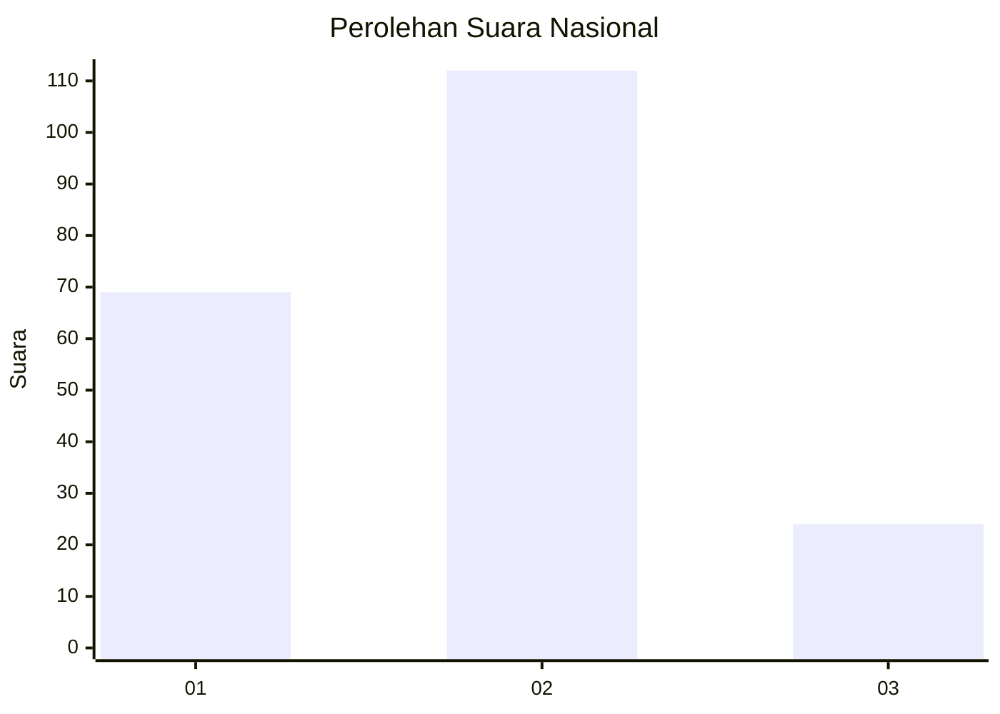
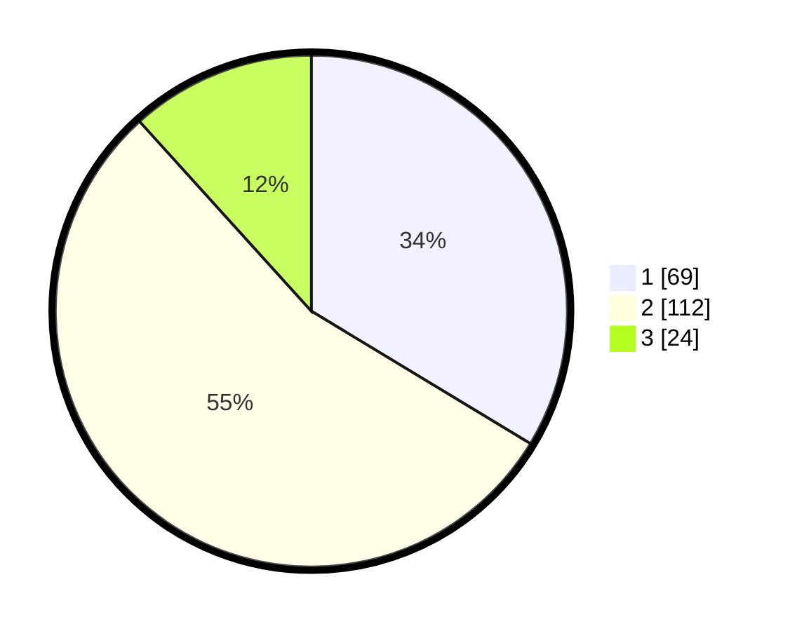

# Hasil

## Grafik

## Tabel

| No.    | Nama Paslon    | Suara | Suara (raw) | Persentase |
|:------ |:-------------- | -----:| -----------:| ----------:|
| 100025 | ANIES MUHAIMIN | 69    | [69][p-1]   | 33,66      |
| 100026 | PRABOWO GIBRAN | 112   | [112][p-2]  | 54,63      |
| 100027 | GANJAR MAHFUD  | 24    | [24][p-3]   | 11,71      |

[p-1]: https://github.com/gigit-pemilu/pemilu-2024/blob/main/pilpres/hitung-suara/sub/31-dki-jakarta/sub/72-jakarta-utara/sub/04-cilincing/sub/1003-marunda/sub/076-tps/sub/paslon-1.txt
[p-2]: https://github.com/gigit-pemilu/pemilu-2024/blob/main/pilpres/hitung-suara/sub/31-dki-jakarta/sub/72-jakarta-utara/sub/04-cilincing/sub/1003-marunda/sub/076-tps/sub/paslon-2.txt
[p-3]: https://github.com/gigit-pemilu/pemilu-2024/blob/main/pilpres/hitung-suara/sub/31-dki-jakarta/sub/72-jakarta-utara/sub/04-cilincing/sub/1003-marunda/sub/076-tps/sub/paslon-3.txt

## Foto C Plano

https://sirekap-obj-formc.kpu.go.id/99fd/pemilu/ppwp/31/72/04/10/03/3172041003076-20240214-212126--2389726b-e6d1-41bc-9a50-fd5c2c17273c.jpg

https://sirekap-obj-formc.kpu.go.id/99fd/pemilu/ppwp/31/72/04/10/03/3172041003076-20240214-222539--f83fcf4e-5820-49a5-b14b-5633bf9768cd.jpg

https://sirekap-obj-formc.kpu.go.id/99fd/pemilu/ppwp/31/72/04/10/03/3172041003076-20240214-211536--253611db-6e24-4d0a-97c6-cd38ecf47055.jpg

## Metadata

| Key        | Value               |
| ---------- | ------------------- |
| Time Stamp | 2024-02-15 09:00:24 |

