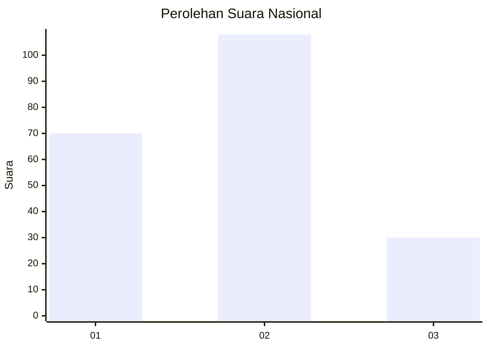
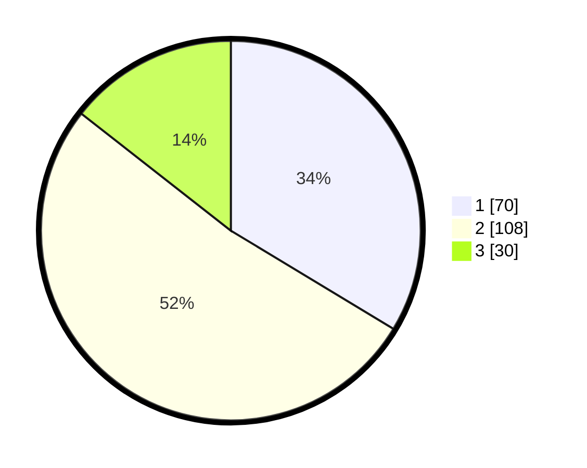

# Hasil

## Grafik

## Tabel

| No.    | Nama Paslon    | Suara | Suara (raw) | Persentase |
|:------ |:-------------- | -----:| -----------:| ----------:|
| 100025 | ANIES MUHAIMIN | 70    | [70][p-1]   | 33,65      |
| 100026 | PRABOWO GIBRAN | 108   | [108][p-2]  | 51,92      |
| 100027 | GANJAR MAHFUD  | 30    | [30][p-3]   | 14,42      |

[p-1]: https://github.com/gigit-pemilu/pemilu-2024/blob/main/pilpres/hitung-suara/sub/31-dki-jakarta/sub/72-jakarta-utara/sub/04-cilincing/sub/1003-marunda/sub/080-tps/sub/paslon-1.txt
[p-2]: https://github.com/gigit-pemilu/pemilu-2024/blob/main/pilpres/hitung-suara/sub/31-dki-jakarta/sub/72-jakarta-utara/sub/04-cilincing/sub/1003-marunda/sub/080-tps/sub/paslon-2.txt
[p-3]: https://github.com/gigit-pemilu/pemilu-2024/blob/main/pilpres/hitung-suara/sub/31-dki-jakarta/sub/72-jakarta-utara/sub/04-cilincing/sub/1003-marunda/sub/080-tps/sub/paslon-3.txt

## Foto C Plano

https://sirekap-obj-formc.kpu.go.id/bf78/pemilu/ppwp/31/72/04/10/03/3172041003080-20240214-211813--f2d91971-4fcd-4363-965d-e2430a18172e.jpg

https://sirekap-obj-formc.kpu.go.id/bf78/pemilu/ppwp/31/72/04/10/03/3172041003080-20240214-155831--f46ef093-3fc5-46f7-8f1c-c2193f93853e.jpg

https://sirekap-obj-formc.kpu.go.id/bf78/pemilu/ppwp/31/72/04/10/03/3172041003080-20240214-211946--4854fda6-2af4-4aaf-877e-f331c570d301.jpg

## Metadata

| Key        | Value               |
| ---------- | ------------------- |
| Time Stamp | 2024-02-15 01:47:43 |

