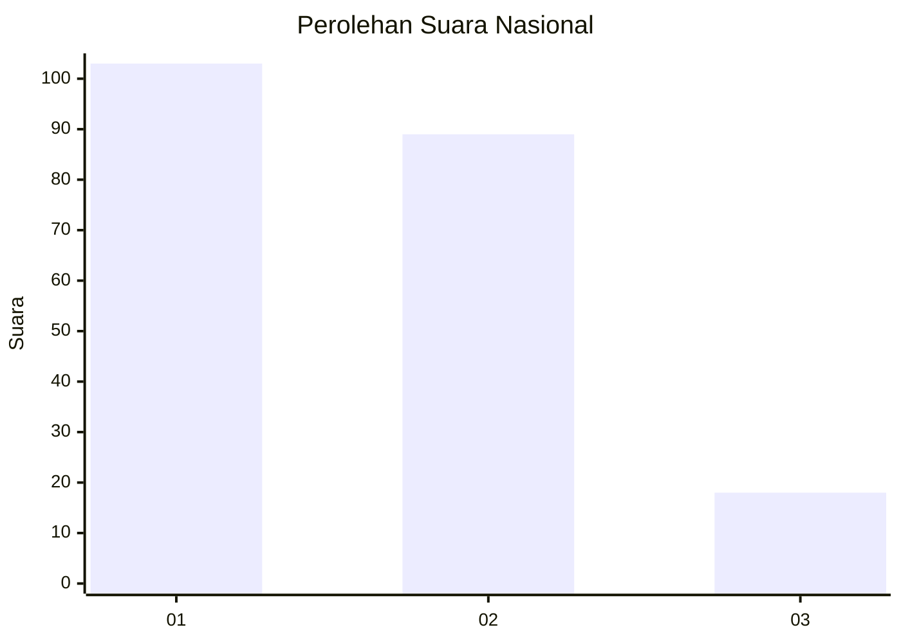
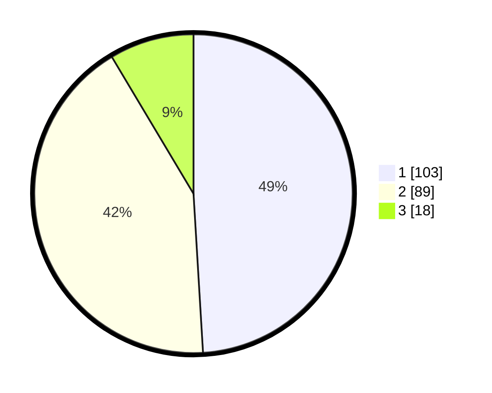

# Hasil

## Grafik

## Tabel

| No.    | Nama Paslon    | Suara | Suara (raw) | Persentase |
|:------ |:-------------- | -----:| -----------:| ----------:|
| 100025 | ANIES MUHAIMIN | 103   | [103][p-1]  | 49,05      |
| 100026 | PRABOWO GIBRAN | 89    | [89][p-2]   | 42,38      |
| 100027 | GANJAR MAHFUD  | 18    | [18][p-3]   | 8,57       |

[p-1]: https://github.com/gigit-pemilu/pemilu-2024/blob/main/pilpres/hitung-suara/sub/31-dki-jakarta/sub/72-jakarta-utara/sub/04-cilincing/sub/1004-kalibaru/sub/028-tps/sub/paslon-1.txt
[p-2]: https://github.com/gigit-pemilu/pemilu-2024/blob/main/pilpres/hitung-suara/sub/31-dki-jakarta/sub/72-jakarta-utara/sub/04-cilincing/sub/1004-kalibaru/sub/028-tps/sub/paslon-2.txt
[p-3]: https://github.com/gigit-pemilu/pemilu-2024/blob/main/pilpres/hitung-suara/sub/31-dki-jakarta/sub/72-jakarta-utara/sub/04-cilincing/sub/1004-kalibaru/sub/028-tps/sub/paslon-3.txt

## Foto C Plano

https://sirekap-obj-formc.kpu.go.id/b92e/pemilu/ppwp/31/72/04/10/04/3172041004028-20240214-231713--c8ff322f-ff6c-4053-8e9c-b131506e07f4.jpg

https://sirekap-obj-formc.kpu.go.id/b92e/pemilu/ppwp/31/72/04/10/04/3172041004028-20240214-231830--e796b7cb-1cac-4ad0-8aaf-2e861f42e29c.jpg

https://sirekap-obj-formc.kpu.go.id/b92e/pemilu/ppwp/31/72/04/10/04/3172041004028-20240214-231933--e969367d-f8d4-427d-b89e-abc0fafbddd4.jpg

## Metadata

| Key        | Value               |
| ---------- | ------------------- |
| Time Stamp | 2024-02-21 19:00:00 |

