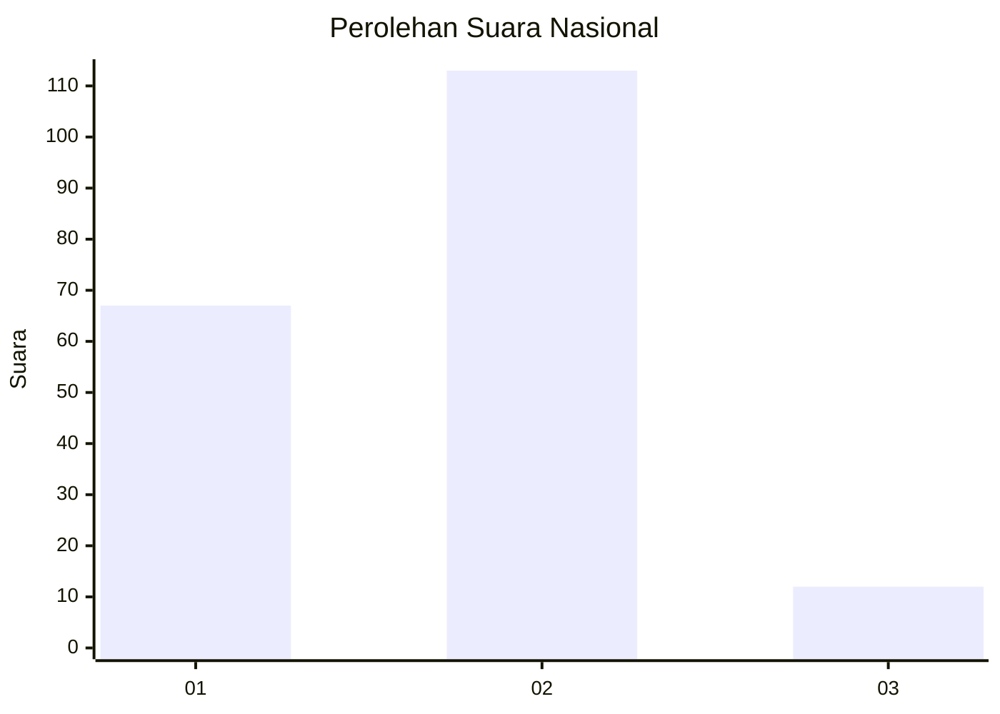
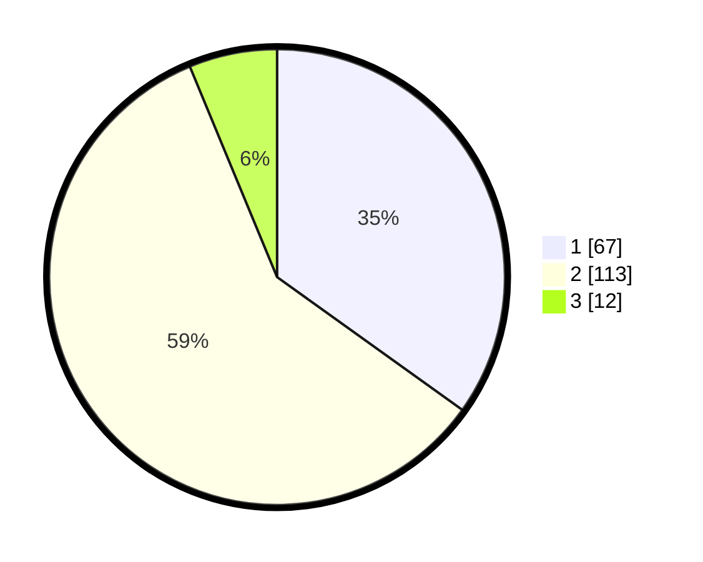

# Hasil

## Grafik

## Tabel

| No.    | Nama Paslon    | Suara | Suara (raw) | Persentase |
|:------ |:-------------- | -----:| -----------:| ----------:|
| 100025 | ANIES MUHAIMIN | 67    | [67][p-1]   | 34,90      |
| 100026 | PRABOWO GIBRAN | 113   | [113][p-2]  | 58,85      |
| 100027 | GANJAR MAHFUD  | 12    | [12][p-3]   | 6,25       |

[p-1]: https://github.com/gigit-pemilu/pemilu-2024/blob/main/pilpres/hitung-suara/sub/31-dki-jakarta/sub/72-jakarta-utara/sub/04-cilincing/sub/1004-kalibaru/sub/033-tps/sub/paslon-1.txt
[p-2]: https://github.com/gigit-pemilu/pemilu-2024/blob/main/pilpres/hitung-suara/sub/31-dki-jakarta/sub/72-jakarta-utara/sub/04-cilincing/sub/1004-kalibaru/sub/033-tps/sub/paslon-2.txt
[p-3]: https://github.com/gigit-pemilu/pemilu-2024/blob/main/pilpres/hitung-suara/sub/31-dki-jakarta/sub/72-jakarta-utara/sub/04-cilincing/sub/1004-kalibaru/sub/033-tps/sub/paslon-3.txt

## Foto C Plano

https://sirekap-obj-formc.kpu.go.id/2682/pemilu/ppwp/31/72/04/10/04/3172041004033-20240214-201419--7244a41f-1238-4351-8e22-8735e7950c6f.jpg

https://sirekap-obj-formc.kpu.go.id/2682/pemilu/ppwp/31/72/04/10/04/3172041004033-20240214-201758--1affdaf6-4237-448d-bd1f-bc271b22b433.jpg

https://sirekap-obj-formc.kpu.go.id/2682/pemilu/ppwp/31/72/04/10/04/3172041004033-20240214-223116--bd899441-7458-4c31-abf7-54b07d236ecb.jpg

## Metadata

| Key        | Value               |
| ---------- | ------------------- |
| Time Stamp | 2024-02-15 07:00:44 |

