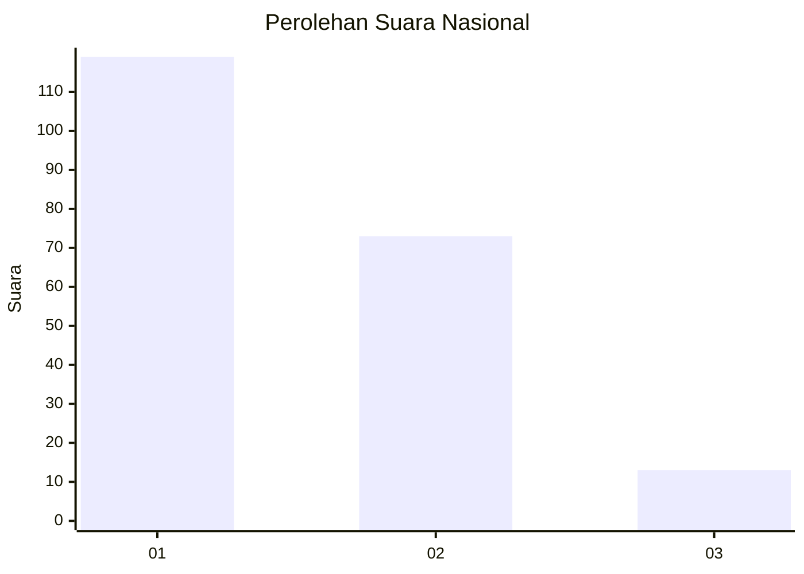
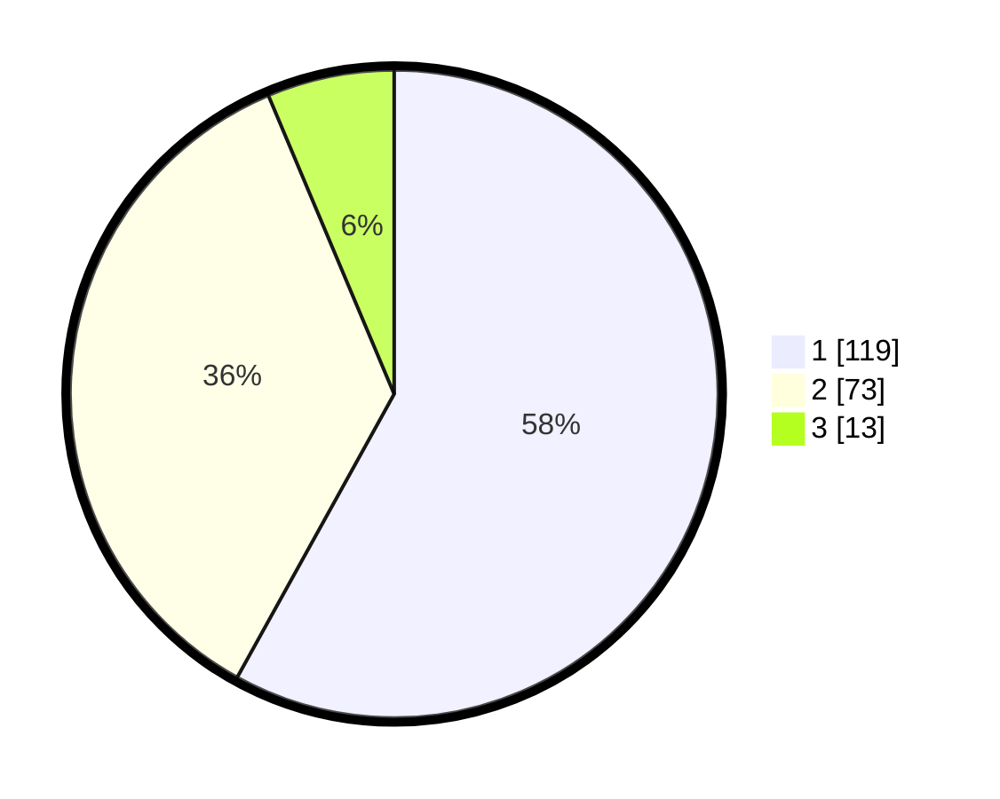

# Hasil

## Grafik

## Tabel

| No.    | Nama Paslon    | Suara | Suara (raw) | Persentase |
|:------ |:-------------- | -----:| -----------:| ----------:|
| 100025 | ANIES MUHAIMIN | 119   | [119][p-1]  | 58,05      |
| 100026 | PRABOWO GIBRAN | 73    | [73][p-2]   | 35,61      |
| 100027 | GANJAR MAHFUD  | 13    | [13][p-3]   | 6,34       |

[p-1]: https://github.com/gigit-pemilu/pemilu-2024/blob/main/pilpres/hitung-suara/sub/31-dki-jakarta/sub/72-jakarta-utara/sub/04-cilincing/sub/1004-kalibaru/sub/041-tps/sub/paslon-1.txt
[p-2]: https://github.com/gigit-pemilu/pemilu-2024/blob/main/pilpres/hitung-suara/sub/31-dki-jakarta/sub/72-jakarta-utara/sub/04-cilincing/sub/1004-kalibaru/sub/041-tps/sub/paslon-2.txt
[p-3]: https://github.com/gigit-pemilu/pemilu-2024/blob/main/pilpres/hitung-suara/sub/31-dki-jakarta/sub/72-jakarta-utara/sub/04-cilincing/sub/1004-kalibaru/sub/041-tps/sub/paslon-3.txt

## Foto C Plano

https://sirekap-obj-formc.kpu.go.id/4fb8/pemilu/ppwp/31/72/04/10/04/3172041004041-20240214-213009--0984a671-0fc3-440c-a729-fa24299a6844.jpg

https://sirekap-obj-formc.kpu.go.id/4fb8/pemilu/ppwp/31/72/04/10/04/3172041004041-20240214-213546--2513c847-33ac-4683-a478-7fb94c87ed2c.jpg

https://sirekap-obj-formc.kpu.go.id/4fb8/pemilu/ppwp/31/72/04/10/04/3172041004041-20240214-213934--6d3a44a6-009f-4036-b9d8-0ccf8cc1b66b.jpg

## Metadata

| Key        | Value               |
| ---------- | ------------------- |
| Time Stamp | 2024-02-21 13:00:00 |

