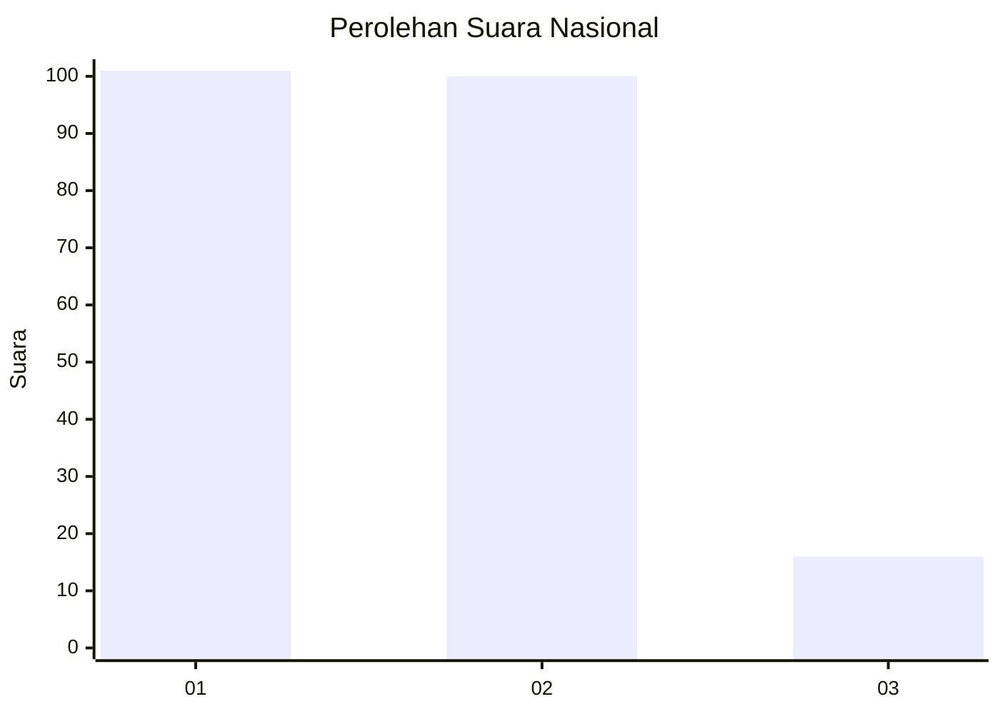
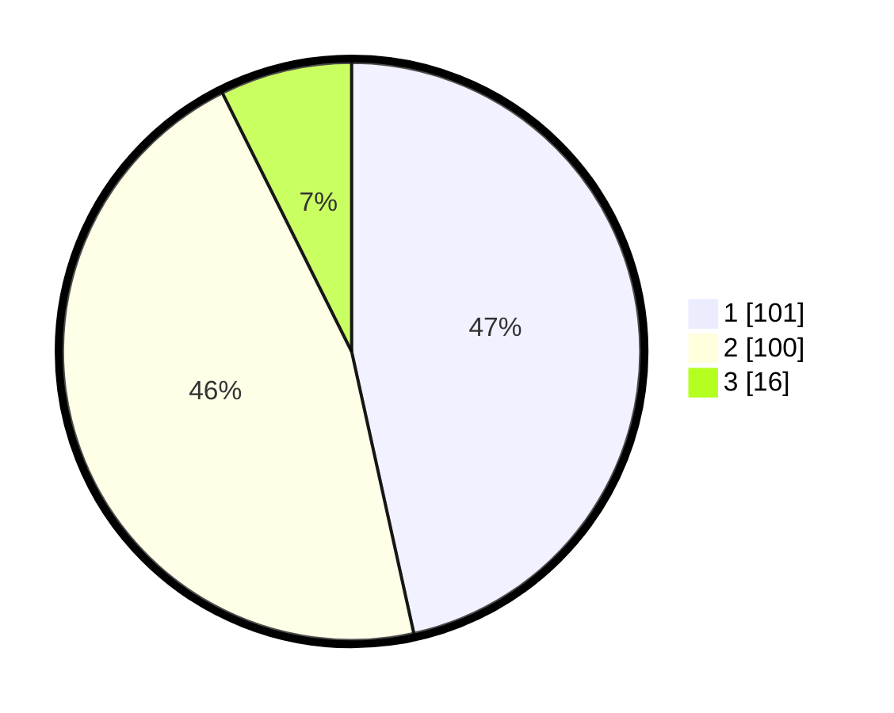

# Hasil

## Grafik

## Tabel

| No.    | Nama Paslon    | Suara | Suara (raw) | Persentase |
|:------ |:-------------- | -----:| -----------:| ----------:|
| 100025 | ANIES MUHAIMIN | 101   | [101][p-1]  | 46,54      |
| 100026 | PRABOWO GIBRAN | 100   | [100][p-2]  | 46,08      |
| 100027 | GANJAR MAHFUD  | 16    | [16][p-3]   | 7,37       |

[p-1]: https://github.com/gigit-pemilu/pemilu-2024/blob/main/pilpres/hitung-suara/sub/31-dki-jakarta/sub/72-jakarta-utara/sub/04-cilincing/sub/1004-kalibaru/sub/074-tps/sub/paslon-1.txt
[p-2]: https://github.com/gigit-pemilu/pemilu-2024/blob/main/pilpres/hitung-suara/sub/31-dki-jakarta/sub/72-jakarta-utara/sub/04-cilincing/sub/1004-kalibaru/sub/074-tps/sub/paslon-2.txt
[p-3]: https://github.com/gigit-pemilu/pemilu-2024/blob/main/pilpres/hitung-suara/sub/31-dki-jakarta/sub/72-jakarta-utara/sub/04-cilincing/sub/1004-kalibaru/sub/074-tps/sub/paslon-3.txt

## Foto C Plano

https://sirekap-obj-formc.kpu.go.id/8a00/pemilu/ppwp/31/72/04/10/04/3172041004074-20240215-031420--4420da74-ac69-4ac6-8cc9-5a45b53f3f96.jpg

https://sirekap-obj-formc.kpu.go.id/8a00/pemilu/ppwp/31/72/04/10/04/3172041004074-20240215-032952--44818fc3-a17c-41a0-afb4-1358b400c90f.jpg

https://sirekap-obj-formc.kpu.go.id/8a00/pemilu/ppwp/31/72/04/10/04/3172041004074-20240215-033110--b05ec39d-593d-468d-bddf-c0dc8ab46a4c.jpg

## Metadata

| Key        | Value               |
| ---------- | ------------------- |
| Time Stamp | 2024-02-21 15:00:00 |

