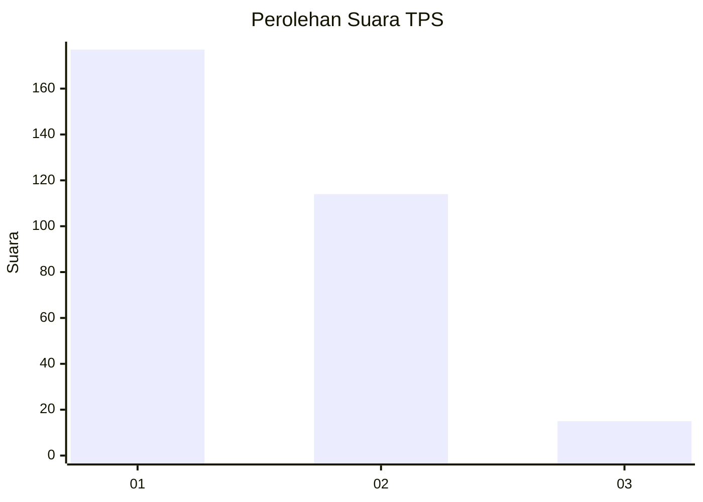
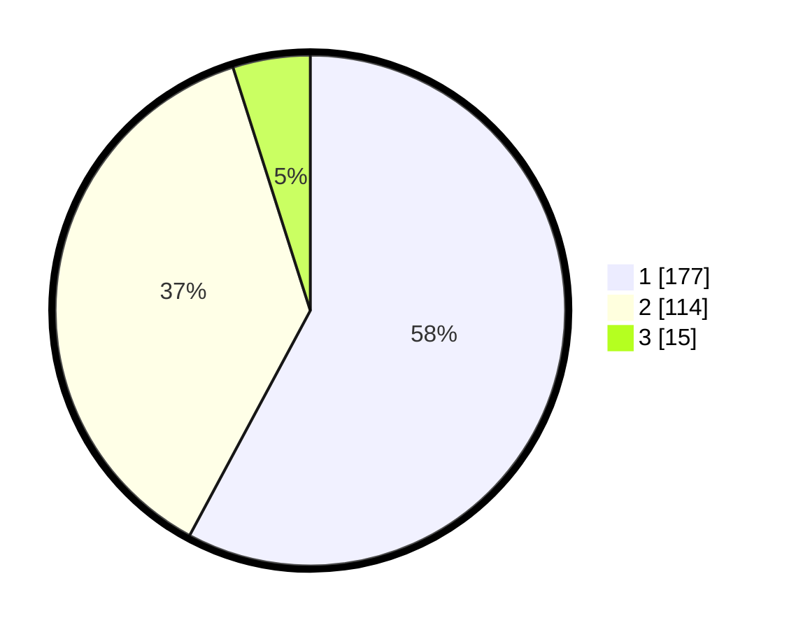

# Hasil

## Grafik

## Tabel

| No. | Nama Paslon    | Suara | Suara (raw) | Persentase |
|:--- |:-------------- | -----:| -----------:| ----------:|
| 1   | ANIES MUHAIMIN | 177   | [177][p-1]  | 57,84      |
| 2   | PRABOWO GIBRAN | 114   | [114][p-2]  | 37,25      |
| 3   | GANJAR MAHFUD  | 15    | [15][p-3]   | 4,90       |

[p-1]: https://github.com/gigit-pemilu/pemilu-2024-31-dki-jakarta/blob/main/pilpres/hitung-suara/sub/31-dki-jakarta/sub/72-jakarta-utara/sub/04-cilincing/sub/1004-kalibaru/sub/088-tps/sub/paslon-1.txt
[p-2]: https://github.com/gigit-pemilu/pemilu-2024-31-dki-jakarta/blob/main/pilpres/hitung-suara/sub/31-dki-jakarta/sub/72-jakarta-utara/sub/04-cilincing/sub/1004-kalibaru/sub/088-tps/sub/paslon-2.txt
[p-3]: https://github.com/gigit-pemilu/pemilu-2024-31-dki-jakarta/blob/main/pilpres/hitung-suara/sub/31-dki-jakarta/sub/72-jakarta-utara/sub/04-cilincing/sub/1004-kalibaru/sub/088-tps/sub/paslon-3.txt

## Foto C Plano

https://sirekap-obj-formc.kpu.go.id/41d6/pemilu/ppwp/31/72/04/10/04/3172041004088-20240214-222618--47486357-b4c1-4480-a5a7-c8a5e327790d.jpg

https://sirekap-obj-formc.kpu.go.id/41d6/pemilu/ppwp/31/72/04/10/04/3172041004088-20240214-222720--ce23e3a1-7473-42e9-831e-76ed86ee23ca.jpg

https://sirekap-obj-formc.kpu.go.id/41d6/pemilu/ppwp/31/72/04/10/04/3172041004088-20240214-222950--58e510b2-5dbe-45a8-a9f6-e8147e10269d.jpg

## Metadata

| Key        | Value               |
| ---------- | ------------------- |
| Time Stamp | 2024-02-20 22:00:00 |

