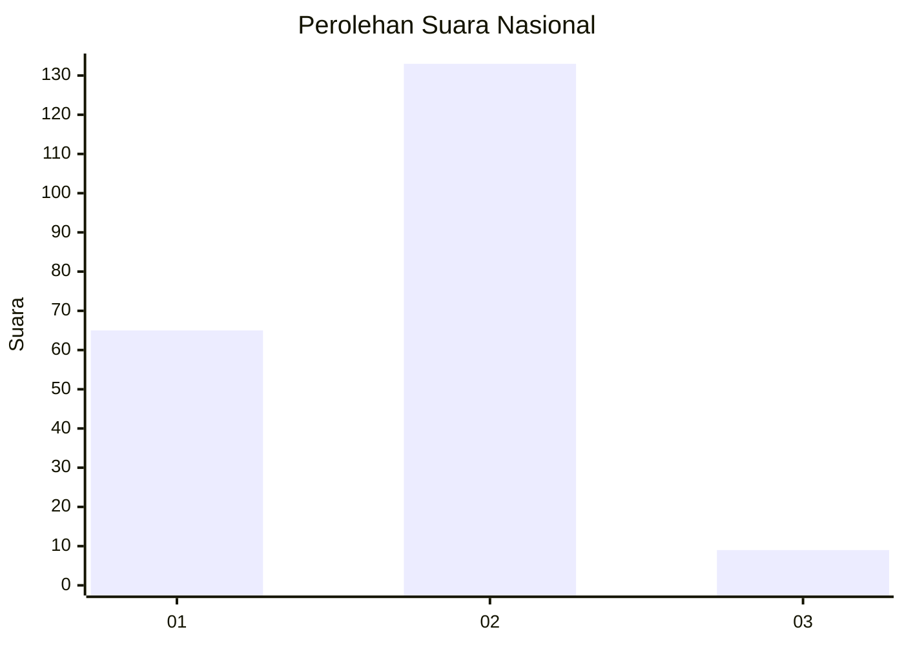
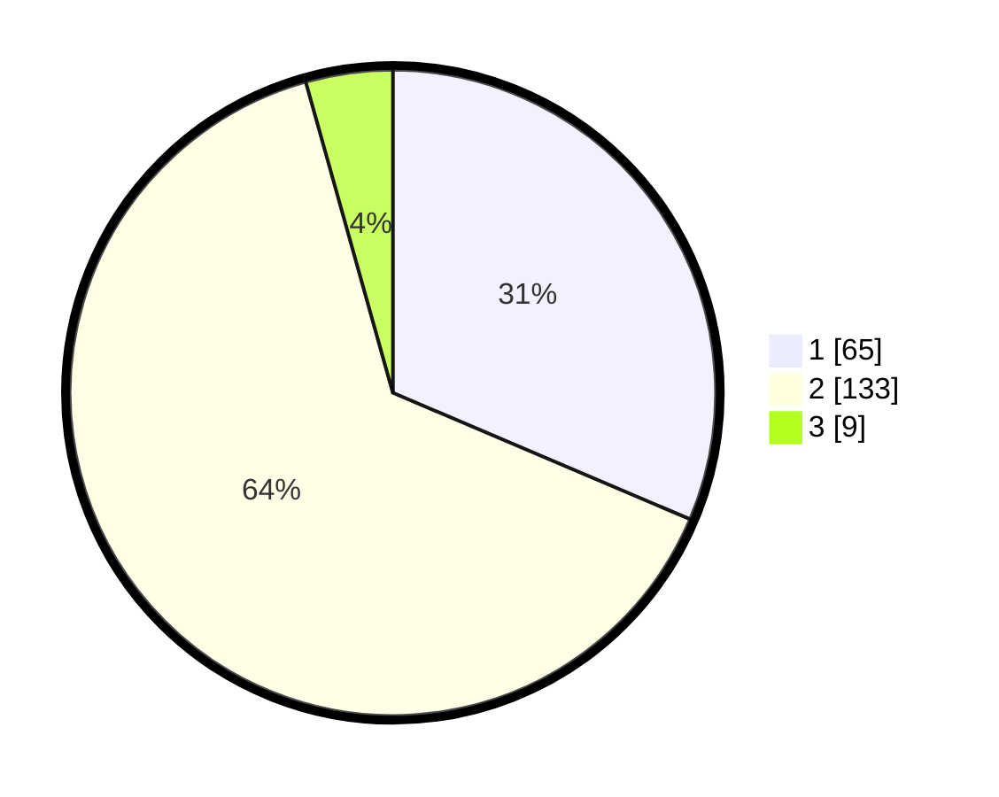

# Hasil

## Grafik

## Tabel

| No.    | Nama Paslon    | Suara | Suara (raw) | Persentase |
|:------ |:-------------- | -----:| -----------:| ----------:|
| 100025 | ANIES MUHAIMIN | 65    | [65][p-1]   | 31,40      |
| 100026 | PRABOWO GIBRAN | 133   | [133][p-2]  | 64,25      |
| 100027 | GANJAR MAHFUD  | 9     | [9][p-3]    | 4,35       |

[p-1]: https://github.com/gigit-pemilu/pemilu-2024/blob/main/pilpres/hitung-suara/sub/31-dki-jakarta/sub/72-jakarta-utara/sub/04-cilincing/sub/1004-kalibaru/sub/090-tps/sub/paslon-1.txt
[p-2]: https://github.com/gigit-pemilu/pemilu-2024/blob/main/pilpres/hitung-suara/sub/31-dki-jakarta/sub/72-jakarta-utara/sub/04-cilincing/sub/1004-kalibaru/sub/090-tps/sub/paslon-2.txt
[p-3]: https://github.com/gigit-pemilu/pemilu-2024/blob/main/pilpres/hitung-suara/sub/31-dki-jakarta/sub/72-jakarta-utara/sub/04-cilincing/sub/1004-kalibaru/sub/090-tps/sub/paslon-3.txt

## Foto C Plano

https://sirekap-obj-formc.kpu.go.id/4c83/pemilu/ppwp/31/72/04/10/04/3172041004090-20240214-235428--5a879a98-5042-4c2a-a8f2-18445042f644.jpg

https://sirekap-obj-formc.kpu.go.id/4c83/pemilu/ppwp/31/72/04/10/04/3172041004090-20240214-235513--d6c5c71a-8dad-4dca-ae01-36db31dba443.jpg

https://sirekap-obj-formc.kpu.go.id/4c83/pemilu/ppwp/31/72/04/10/04/3172041004090-20240215-000412--c8fb40c4-d707-44eb-beb6-4e0e46a20796.jpg

## Metadata

| Key        | Value               |
| ---------- | ------------------- |
| Time Stamp | 2024-02-21 19:00:00 |

