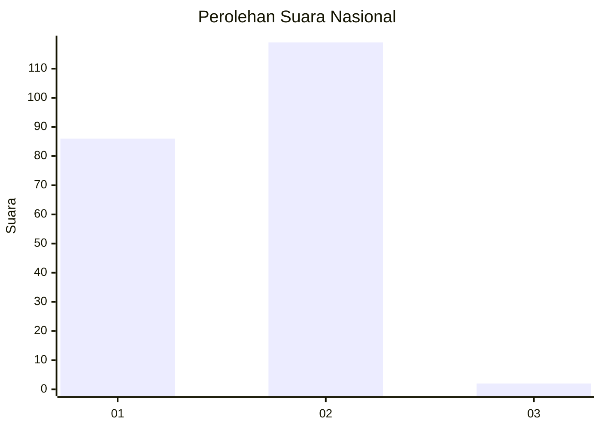
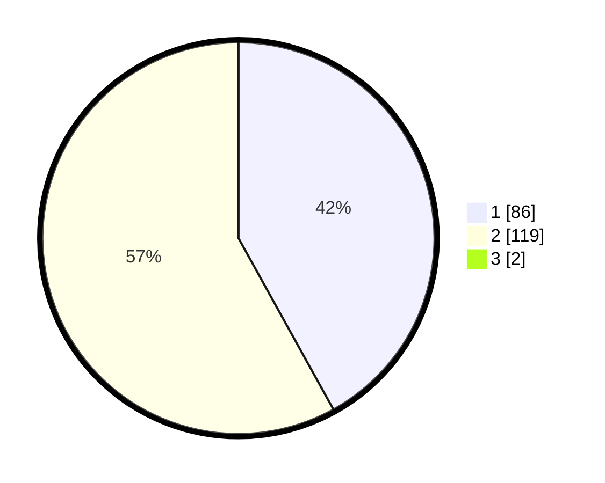

# Hasil

## Grafik

## Tabel

| No.    | Nama Paslon    | Suara | Suara (raw) | Persentase |
|:------ |:-------------- | -----:| -----------:| ----------:|
| 100025 | ANIES MUHAIMIN | 86    | [86][p-1]   | 41,55      |
| 100026 | PRABOWO GIBRAN | 119   | [119][p-2]  | 57,49      |
| 100027 | GANJAR MAHFUD  | 2     | [2][p-3]    | 0,97       |

[p-1]: https://github.com/gigit-pemilu/pemilu-2024/blob/main/pilpres/hitung-suara/sub/31-dki-jakarta/sub/72-jakarta-utara/sub/04-cilincing/sub/1004-kalibaru/sub/092-tps/sub/paslon-1.txt
[p-2]: https://github.com/gigit-pemilu/pemilu-2024/blob/main/pilpres/hitung-suara/sub/31-dki-jakarta/sub/72-jakarta-utara/sub/04-cilincing/sub/1004-kalibaru/sub/092-tps/sub/paslon-2.txt
[p-3]: https://github.com/gigit-pemilu/pemilu-2024/blob/main/pilpres/hitung-suara/sub/31-dki-jakarta/sub/72-jakarta-utara/sub/04-cilincing/sub/1004-kalibaru/sub/092-tps/sub/paslon-3.txt

## Foto C Plano

https://sirekap-obj-formc.kpu.go.id/d192/pemilu/ppwp/31/72/04/10/04/3172041004092-20240214-214603--f6275fd8-d184-4161-84d1-a191106830e7.jpg

https://sirekap-obj-formc.kpu.go.id/d192/pemilu/ppwp/31/72/04/10/04/3172041004092-20240214-220701--01df983b-f641-407a-9c75-62567a662fe2.jpg

https://sirekap-obj-formc.kpu.go.id/d192/pemilu/ppwp/31/72/04/10/04/3172041004092-20240214-201033--d9e8f38a-7289-4046-b0c1-4714b7b689d2.jpg

## Metadata

| Key        | Value               |
| ---------- | ------------------- |
| Time Stamp | 2024-02-20 20:00:00 |

