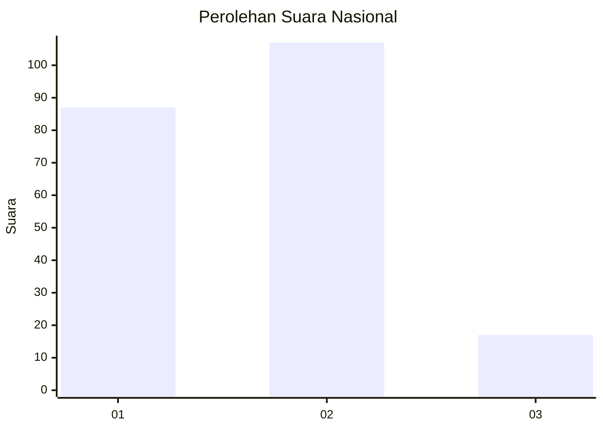
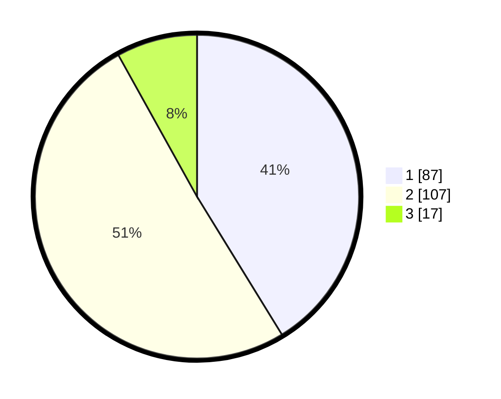

# Hasil

## Grafik

## Tabel

| No.    | Nama Paslon    | Suara | Suara (raw) | Persentase |
|:------ |:-------------- | -----:| -----------:| ----------:|
| 100025 | ANIES MUHAIMIN | 87    | [87][p-1]   | 41,23      |
| 100026 | PRABOWO GIBRAN | 107   | [107][p-2]  | 50,71      |
| 100027 | GANJAR MAHFUD  | 17    | [17][p-3]   | 8,06       |

[p-1]: https://github.com/gigit-pemilu/pemilu-2024/blob/main/pilpres/hitung-suara/sub/31-dki-jakarta/sub/72-jakarta-utara/sub/04-cilincing/sub/1004-kalibaru/sub/106-tps/sub/paslon-1.txt
[p-2]: https://github.com/gigit-pemilu/pemilu-2024/blob/main/pilpres/hitung-suara/sub/31-dki-jakarta/sub/72-jakarta-utara/sub/04-cilincing/sub/1004-kalibaru/sub/106-tps/sub/paslon-2.txt
[p-3]: https://github.com/gigit-pemilu/pemilu-2024/blob/main/pilpres/hitung-suara/sub/31-dki-jakarta/sub/72-jakarta-utara/sub/04-cilincing/sub/1004-kalibaru/sub/106-tps/sub/paslon-3.txt

## Foto C Plano

https://sirekap-obj-formc.kpu.go.id/3180/pemilu/ppwp/31/72/04/10/04/3172041004106-20240214-200919--efd87992-7619-4a53-93e4-d02babb0b41c.jpg

https://sirekap-obj-formc.kpu.go.id/3180/pemilu/ppwp/31/72/04/10/04/3172041004106-20240214-200719--ee02320e-d531-4e43-aa31-869b5d437e64.jpg

https://sirekap-obj-formc.kpu.go.id/3180/pemilu/ppwp/31/72/04/10/04/3172041004106-20240214-201024--443ff265-a563-4969-8a33-4f7d82d8c287.jpg

## Metadata

| Key        | Value               |
| ---------- | ------------------- |
| Time Stamp | 2024-02-20 22:00:00 |

