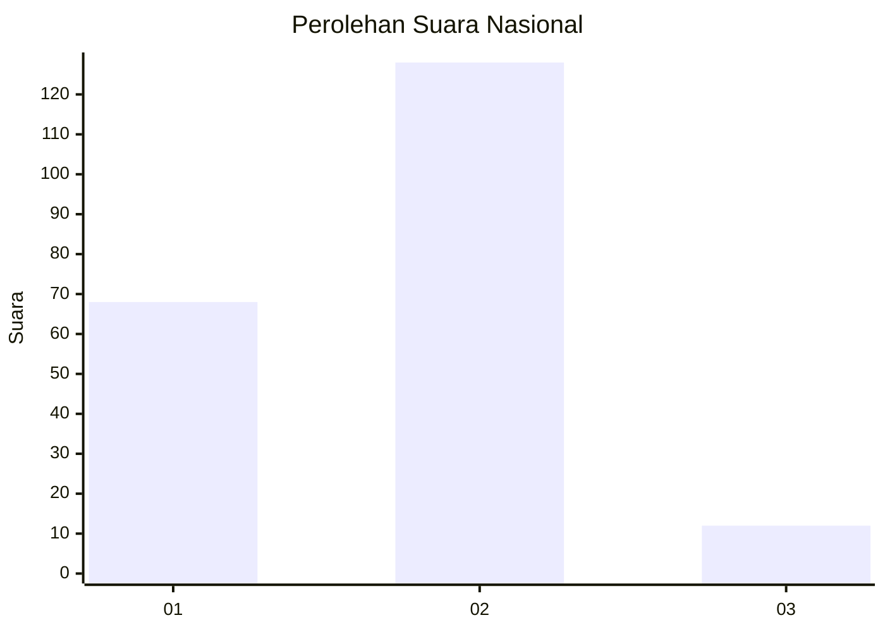
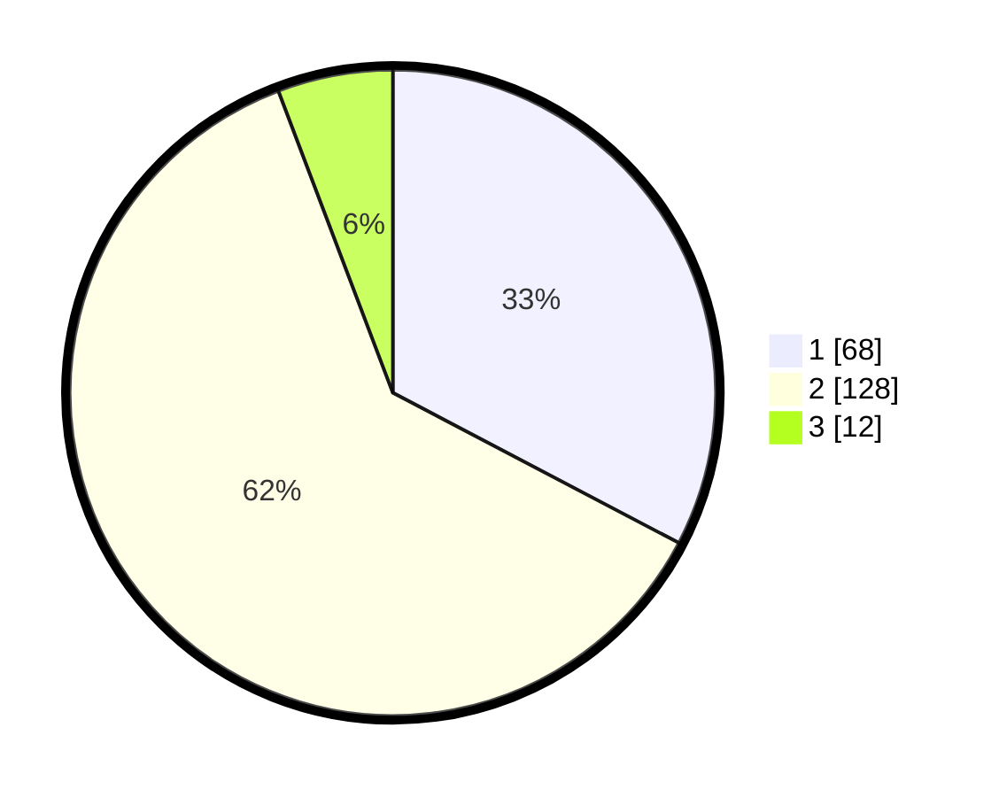

# Hasil

## Grafik

## Tabel

| No.    | Nama Paslon    | Suara | Suara (raw) | Persentase |
|:------ |:-------------- | -----:| -----------:| ----------:|
| 100025 | ANIES MUHAIMIN | 68    | [68][p-1]   | 32,69      |
| 100026 | PRABOWO GIBRAN | 128   | [128][p-2]  | 61,54      |
| 100027 | GANJAR MAHFUD  | 12    | [12][p-3]   | 5,77       |

[p-1]: https://github.com/gigit-pemilu/pemilu-2024/blob/main/pilpres/hitung-suara/sub/31-dki-jakarta/sub/72-jakarta-utara/sub/04-cilincing/sub/1004-kalibaru/sub/110-tps/sub/paslon-1.txt
[p-2]: https://github.com/gigit-pemilu/pemilu-2024/blob/main/pilpres/hitung-suara/sub/31-dki-jakarta/sub/72-jakarta-utara/sub/04-cilincing/sub/1004-kalibaru/sub/110-tps/sub/paslon-2.txt
[p-3]: https://github.com/gigit-pemilu/pemilu-2024/blob/main/pilpres/hitung-suara/sub/31-dki-jakarta/sub/72-jakarta-utara/sub/04-cilincing/sub/1004-kalibaru/sub/110-tps/sub/paslon-3.txt

## Foto C Plano

https://sirekap-obj-formc.kpu.go.id/7254/pemilu/ppwp/31/72/04/10/04/3172041004110-20240215-000232--d5197367-e643-464e-8b46-803017267e5a.jpg

https://sirekap-obj-formc.kpu.go.id/7254/pemilu/ppwp/31/72/04/10/04/3172041004110-20240215-000342--e159b262-2659-49e7-84c9-16cf832db640.jpg

https://sirekap-obj-formc.kpu.go.id/7254/pemilu/ppwp/31/72/04/10/04/3172041004110-20240215-000454--e5f7f94e-2346-40f3-9842-a58d63dfa9bb.jpg

## Metadata

| Key        | Value               |
| ---------- | ------------------- |
| Time Stamp | 2024-02-21 19:00:00 |

