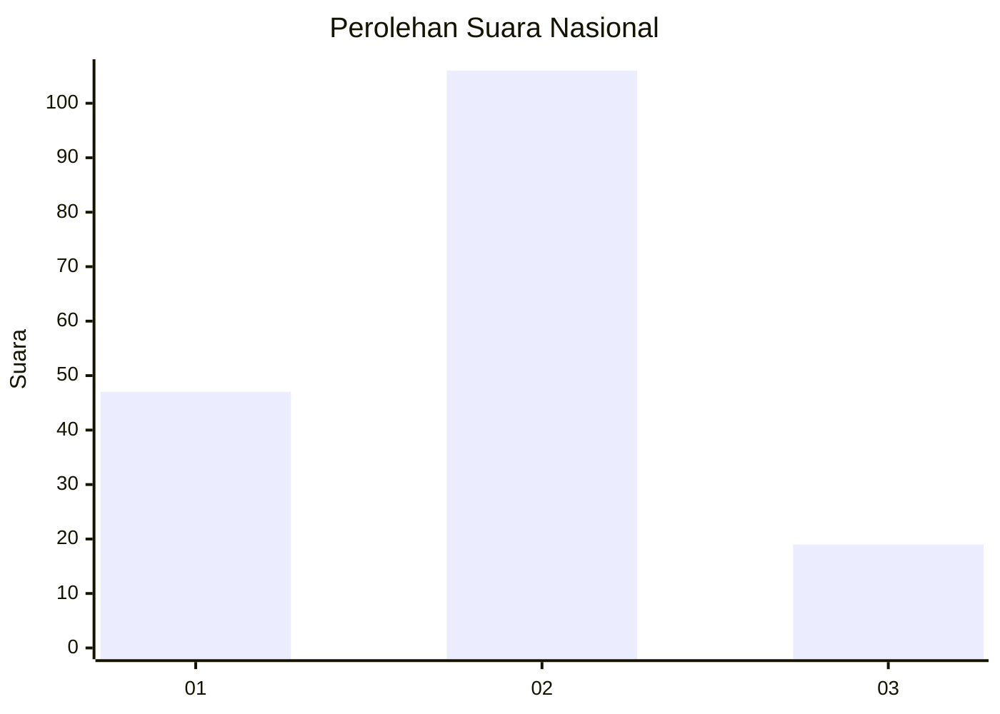
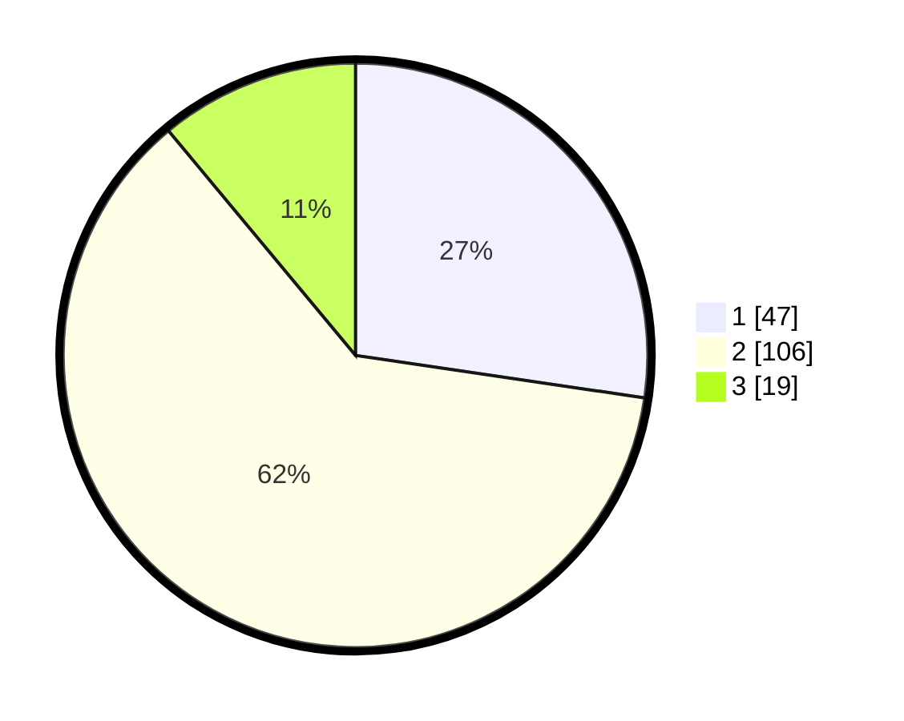

# Hasil

## Grafik

## Tabel

| No.    | Nama Paslon    | Suara | Suara (raw) | Persentase |
|:------ |:-------------- | -----:| -----------:| ----------:|
| 100025 | ANIES MUHAIMIN | 47    | [47][p-1]   | 27,33      |
| 100026 | PRABOWO GIBRAN | 106   | [106][p-2]  | 61,63      |
| 100027 | GANJAR MAHFUD  | 19    | [19][p-3]   | 11,05      |

[p-1]: https://github.com/gigit-pemilu/pemilu-2024/blob/main/pilpres/hitung-suara/sub/31-dki-jakarta/sub/72-jakarta-utara/sub/04-cilincing/sub/1004-kalibaru/sub/116-tps/sub/paslon-1.txt
[p-2]: https://github.com/gigit-pemilu/pemilu-2024/blob/main/pilpres/hitung-suara/sub/31-dki-jakarta/sub/72-jakarta-utara/sub/04-cilincing/sub/1004-kalibaru/sub/116-tps/sub/paslon-2.txt
[p-3]: https://github.com/gigit-pemilu/pemilu-2024/blob/main/pilpres/hitung-suara/sub/31-dki-jakarta/sub/72-jakarta-utara/sub/04-cilincing/sub/1004-kalibaru/sub/116-tps/sub/paslon-3.txt

## Foto C Plano

https://sirekap-obj-formc.kpu.go.id/2087/pemilu/ppwp/31/72/04/10/04/3172041004116-20240215-001157--be1b9cde-c5cd-41b5-8c79-7a77f8cb6861.jpg

https://sirekap-obj-formc.kpu.go.id/2087/pemilu/ppwp/31/72/04/10/04/3172041004116-20240215-001251--b56d7ee1-68e7-4697-83ec-ca80875e93c7.jpg

https://sirekap-obj-formc.kpu.go.id/2087/pemilu/ppwp/31/72/04/10/04/3172041004116-20240215-001336--caca07ff-c1a0-4b41-b586-6e1ac27b11c4.jpg

## Metadata

| Key        | Value               |
| ---------- | ------------------- |
| Time Stamp | 2024-02-21 19:00:00 |

