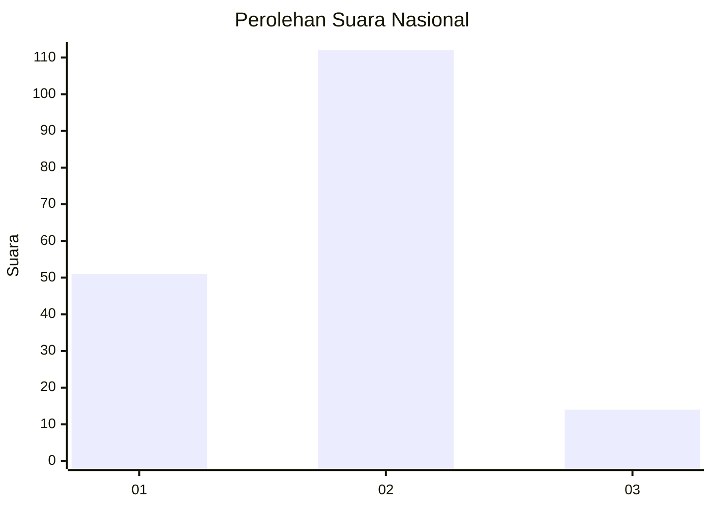
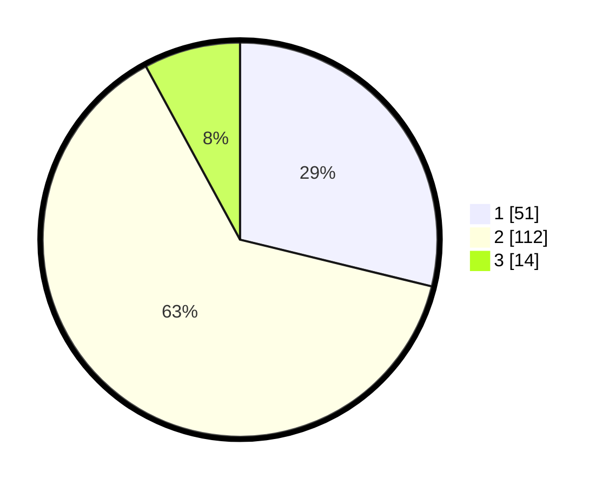

# Hasil

## Grafik

## Tabel

| No.    | Nama Paslon    | Suara | Suara (raw) | Persentase |
|:------ |:-------------- | -----:| -----------:| ----------:|
| 100025 | ANIES MUHAIMIN | 51    | [51][p-1]   | 28,81      |
| 100026 | PRABOWO GIBRAN | 112   | [112][p-2]  | 63,28      |
| 100027 | GANJAR MAHFUD  | 14    | [14][p-3]   | 7,91       |

[p-1]: https://github.com/gigit-pemilu/pemilu-2024/blob/main/pilpres/hitung-suara/sub/31-dki-jakarta/sub/72-jakarta-utara/sub/04-cilincing/sub/1004-kalibaru/sub/119-tps/sub/paslon-1.txt
[p-2]: https://github.com/gigit-pemilu/pemilu-2024/blob/main/pilpres/hitung-suara/sub/31-dki-jakarta/sub/72-jakarta-utara/sub/04-cilincing/sub/1004-kalibaru/sub/119-tps/sub/paslon-2.txt
[p-3]: https://github.com/gigit-pemilu/pemilu-2024/blob/main/pilpres/hitung-suara/sub/31-dki-jakarta/sub/72-jakarta-utara/sub/04-cilincing/sub/1004-kalibaru/sub/119-tps/sub/paslon-3.txt

## Foto C Plano

https://sirekap-obj-formc.kpu.go.id/1722/pemilu/ppwp/31/72/04/10/04/3172041004119-20240214-201036--9101ab8a-4b37-4edb-8501-3f4764c31168.jpg

https://sirekap-obj-formc.kpu.go.id/1722/pemilu/ppwp/31/72/04/10/04/3172041004119-20240214-201124--e007d80a-2c79-4449-a4b5-0f72d62c2400.jpg

https://sirekap-obj-formc.kpu.go.id/1722/pemilu/ppwp/31/72/04/10/04/3172041004119-20240214-212900--6958c6e8-2441-43e1-b351-30143cd83e90.jpg

## Metadata

| Key        | Value               |
| ---------- | ------------------- |
| Time Stamp | 2024-02-15 00:41:44 |

