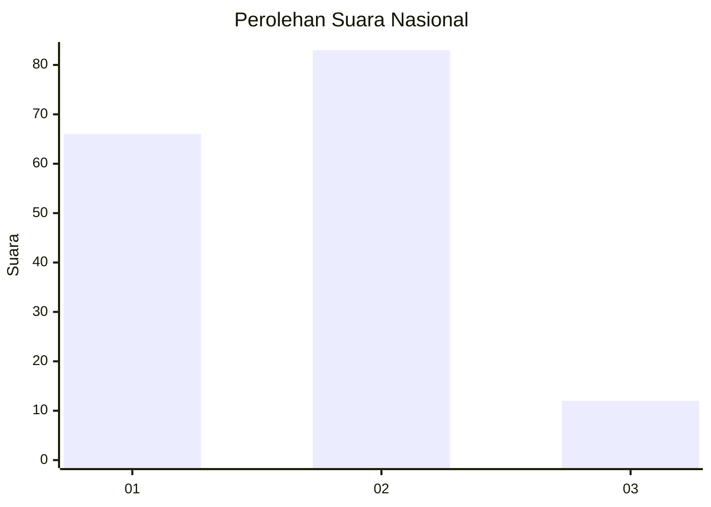

# Hasil

## Grafik

## Tabel

| No.    | Nama Paslon    | Suara | Suara (raw) | Persentase |
|:------ |:-------------- | -----:| -----------:| ----------:|
| 100025 | ANIES MUHAIMIN | 66    | [66][p-1]   | 40,99      |
| 100026 | PRABOWO GIBRAN | 83    | [83][p-2]   | 51,55      |
| 100027 | GANJAR MAHFUD  | 12    | [12][p-3]   | 7,45       |

[p-1]: https://github.com/gigit-pemilu/pemilu-2024/blob/main/pilpres/hitung-suara/sub/31-dki-jakarta/sub/72-jakarta-utara/sub/04-cilincing/sub/1004-kalibaru/sub/121-tps/sub/paslon-1.txt
[p-2]: https://github.com/gigit-pemilu/pemilu-2024/blob/main/pilpres/hitung-suara/sub/31-dki-jakarta/sub/72-jakarta-utara/sub/04-cilincing/sub/1004-kalibaru/sub/121-tps/sub/paslon-2.txt
[p-3]: https://github.com/gigit-pemilu/pemilu-2024/blob/main/pilpres/hitung-suara/sub/31-dki-jakarta/sub/72-jakarta-utara/sub/04-cilincing/sub/1004-kalibaru/sub/121-tps/sub/paslon-3.txt

## Foto C Plano

https://sirekap-obj-formc.kpu.go.id/e950/pemilu/ppwp/31/72/04/10/04/3172041004121-20240214-203022--317520cd-a752-4bd7-a6e1-ce66d5b3dbb5.jpg

https://sirekap-obj-formc.kpu.go.id/e950/pemilu/ppwp/31/72/04/10/04/3172041004121-20240214-203316--d8e9f657-993f-4796-9daa-29c322c5f3ca.jpg

https://sirekap-obj-formc.kpu.go.id/e950/pemilu/ppwp/31/72/04/10/04/3172041004121-20240214-203507--e4a34e6a-33ea-46e9-a33a-d229281df2f3.jpg

## Metadata

| Key        | Value               |
| ---------- | ------------------- |
| Time Stamp | 2024-02-21 19:00:00 |

