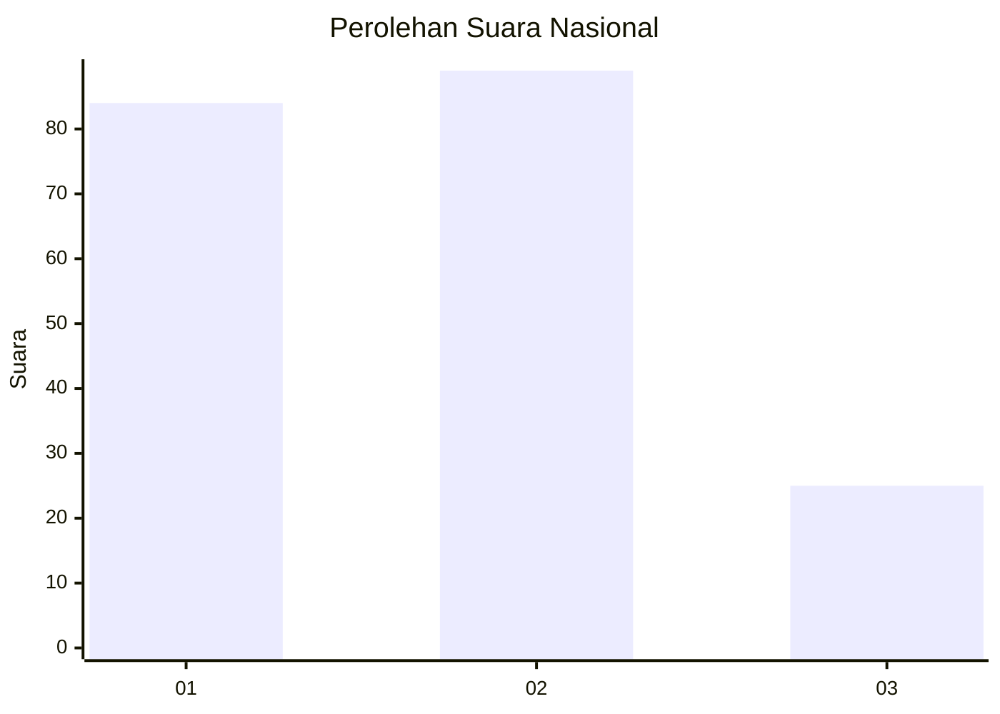
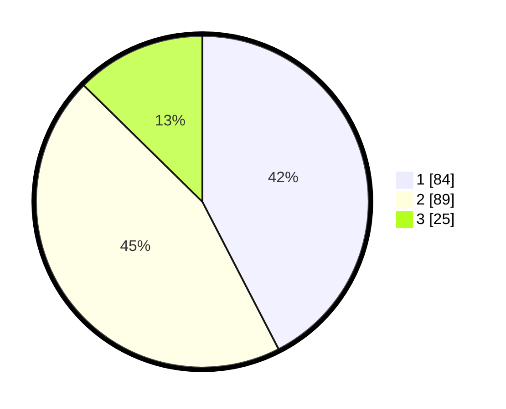

# Hasil

## Grafik

## Tabel

| No.    | Nama Paslon    | Suara | Suara (raw) | Persentase |
|:------ |:-------------- | -----:| -----------:| ----------:|
| 100025 | ANIES MUHAIMIN | 84    | [84][p-1]   | 42,42      |
| 100026 | PRABOWO GIBRAN | 89    | [89][p-2]   | 44,95      |
| 100027 | GANJAR MAHFUD  | 25    | [25][p-3]   | 12,63      |

[p-1]: https://github.com/gigit-pemilu/pemilu-2024/blob/main/pilpres/hitung-suara/sub/31-dki-jakarta/sub/72-jakarta-utara/sub/04-cilincing/sub/1004-kalibaru/sub/133-tps/sub/paslon-1.txt
[p-2]: https://github.com/gigit-pemilu/pemilu-2024/blob/main/pilpres/hitung-suara/sub/31-dki-jakarta/sub/72-jakarta-utara/sub/04-cilincing/sub/1004-kalibaru/sub/133-tps/sub/paslon-2.txt
[p-3]: https://github.com/gigit-pemilu/pemilu-2024/blob/main/pilpres/hitung-suara/sub/31-dki-jakarta/sub/72-jakarta-utara/sub/04-cilincing/sub/1004-kalibaru/sub/133-tps/sub/paslon-3.txt

## Foto C Plano

https://sirekap-obj-formc.kpu.go.id/de0a/pemilu/ppwp/31/72/04/10/04/3172041004133-20240214-184751--50790d13-3d24-494b-a544-1fdefe4f46a8.jpg

https://sirekap-obj-formc.kpu.go.id/de0a/pemilu/ppwp/31/72/04/10/04/3172041004133-20240214-184839--20cca4b1-346f-4e3a-a6a8-5bcd82dc76ab.jpg

https://sirekap-obj-formc.kpu.go.id/de0a/pemilu/ppwp/31/72/04/10/04/3172041004133-20240214-184922--253eed84-f185-4907-8ee2-2686e6d88acd.jpg

## Metadata

| Key        | Value               |
| ---------- | ------------------- |
| Time Stamp | 2024-02-21 19:00:00 |

