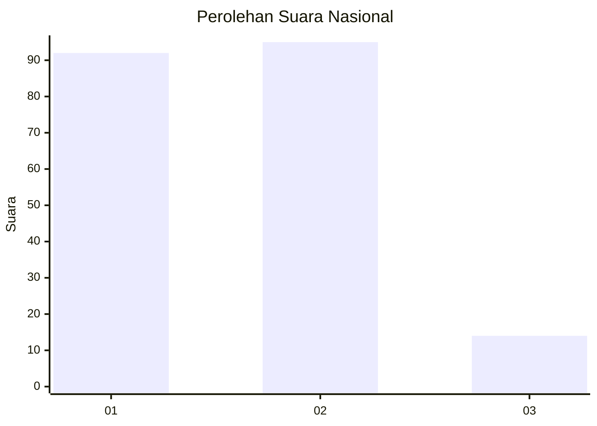
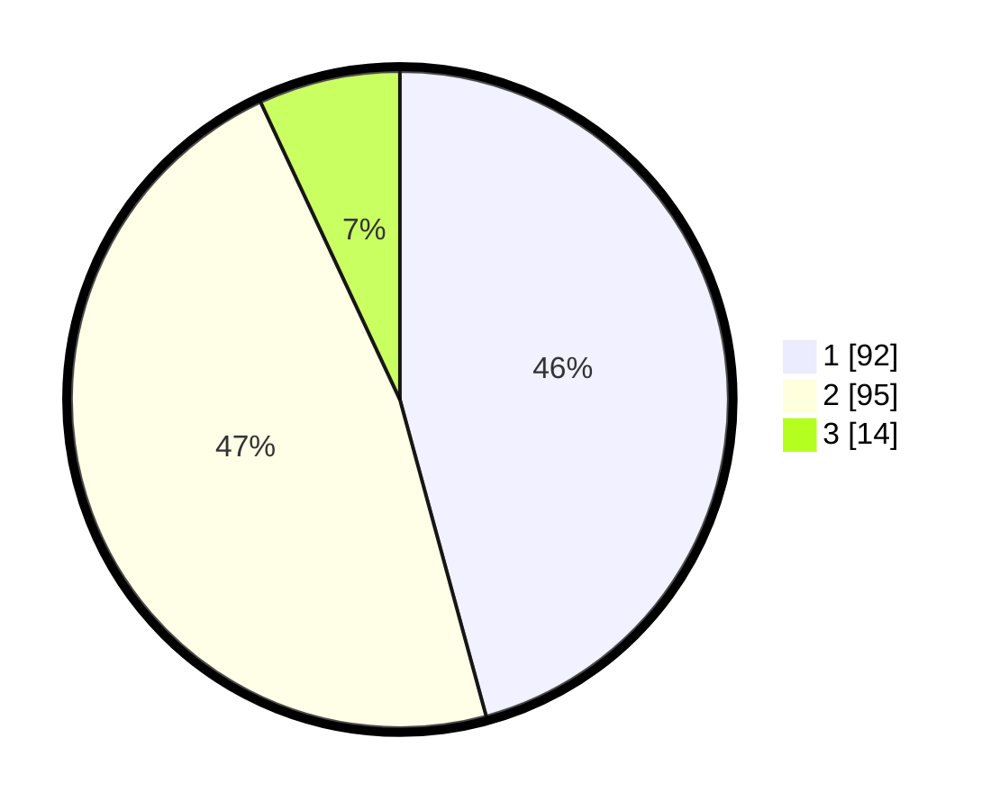

# Hasil

## Grafik

## Tabel

| No.    | Nama Paslon    | Suara | Suara (raw) | Persentase |
|:------ |:-------------- | -----:| -----------:| ----------:|
| 100025 | ANIES MUHAIMIN | 92    | [92][p-1]   | 45,77      |
| 100026 | PRABOWO GIBRAN | 95    | [95][p-2]   | 47,26      |
| 100027 | GANJAR MAHFUD  | 14    | [14][p-3]   | 6,97       |

[p-1]: https://github.com/gigit-pemilu/pemilu-2024/blob/main/pilpres/hitung-suara/sub/31-dki-jakarta/sub/72-jakarta-utara/sub/04-cilincing/sub/1004-kalibaru/sub/138-tps/sub/paslon-1.txt
[p-2]: https://github.com/gigit-pemilu/pemilu-2024/blob/main/pilpres/hitung-suara/sub/31-dki-jakarta/sub/72-jakarta-utara/sub/04-cilincing/sub/1004-kalibaru/sub/138-tps/sub/paslon-2.txt
[p-3]: https://github.com/gigit-pemilu/pemilu-2024/blob/main/pilpres/hitung-suara/sub/31-dki-jakarta/sub/72-jakarta-utara/sub/04-cilincing/sub/1004-kalibaru/sub/138-tps/sub/paslon-3.txt

## Foto C Plano

https://sirekap-obj-formc.kpu.go.id/0ff0/pemilu/ppwp/31/72/04/10/04/3172041004138-20240214-224531--5114b539-38b1-44fb-a5e8-b4c944e0e207.jpg

https://sirekap-obj-formc.kpu.go.id/0ff0/pemilu/ppwp/31/72/04/10/04/3172041004138-20240214-224752--5da25cee-8603-4915-b878-8791068875aa.jpg

https://sirekap-obj-formc.kpu.go.id/0ff0/pemilu/ppwp/31/72/04/10/04/3172041004138-20240214-192437--380d33db-3dfc-46cb-bb73-afe099b5c024.jpg

## Metadata

| Key        | Value               |
| ---------- | ------------------- |
| Time Stamp | 2024-02-21 19:00:00 |

