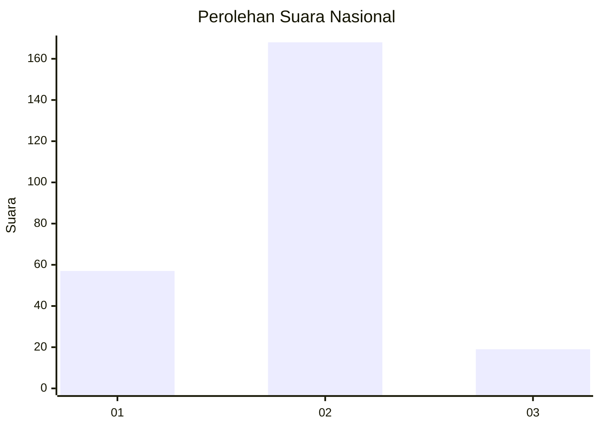
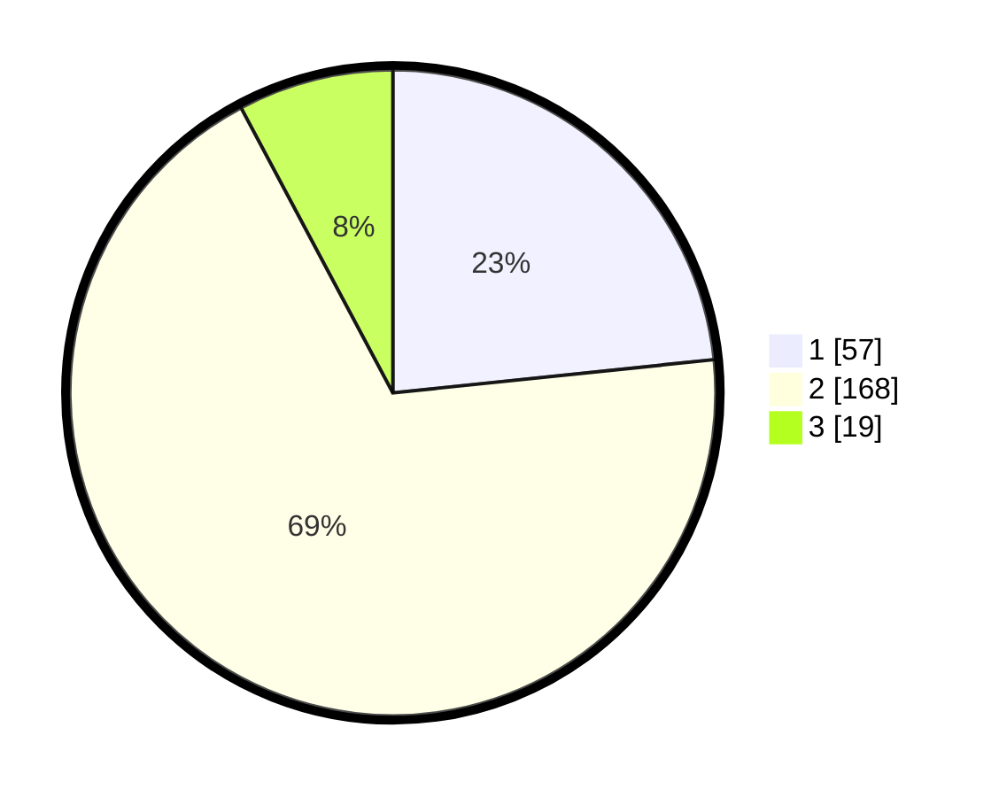

# Hasil

## Grafik

## Tabel

| No.    | Nama Paslon    | Suara | Suara (raw) | Persentase |
|:------ |:-------------- | -----:| -----------:| ----------:|
| 100025 | ANIES MUHAIMIN | 57    | [57][p-1]   | 23,36      |
| 100026 | PRABOWO GIBRAN | 168   | [168][p-2]  | 68,85      |
| 100027 | GANJAR MAHFUD  | 19    | [19][p-3]   | 7,79       |

[p-1]: https://github.com/gigit-pemilu/pemilu-2024/blob/main/pilpres/hitung-suara/sub/31-dki-jakarta/sub/72-jakarta-utara/sub/04-cilincing/sub/1004-kalibaru/sub/150-tps/sub/paslon-1.txt
[p-2]: https://github.com/gigit-pemilu/pemilu-2024/blob/main/pilpres/hitung-suara/sub/31-dki-jakarta/sub/72-jakarta-utara/sub/04-cilincing/sub/1004-kalibaru/sub/150-tps/sub/paslon-2.txt
[p-3]: https://github.com/gigit-pemilu/pemilu-2024/blob/main/pilpres/hitung-suara/sub/31-dki-jakarta/sub/72-jakarta-utara/sub/04-cilincing/sub/1004-kalibaru/sub/150-tps/sub/paslon-3.txt

## Foto C Plano

https://sirekap-obj-formc.kpu.go.id/fdfb/pemilu/ppwp/31/72/04/10/04/3172041004150-20240215-003733--fb77f3e1-7bbf-46a7-82ad-b958e52636c9.jpg

https://sirekap-obj-formc.kpu.go.id/fdfb/pemilu/ppwp/31/72/04/10/04/3172041004150-20240215-003833--75fd764d-27c6-45c6-b81d-fc2ac41385b3.jpg

https://sirekap-obj-formc.kpu.go.id/fdfb/pemilu/ppwp/31/72/04/10/04/3172041004150-20240215-003931--1be994bd-9d29-46cd-ace5-9531d0791f75.jpg

## Metadata

| Key        | Value               |
| ---------- | ------------------- |
| Time Stamp | 2024-02-21 19:00:00 |

