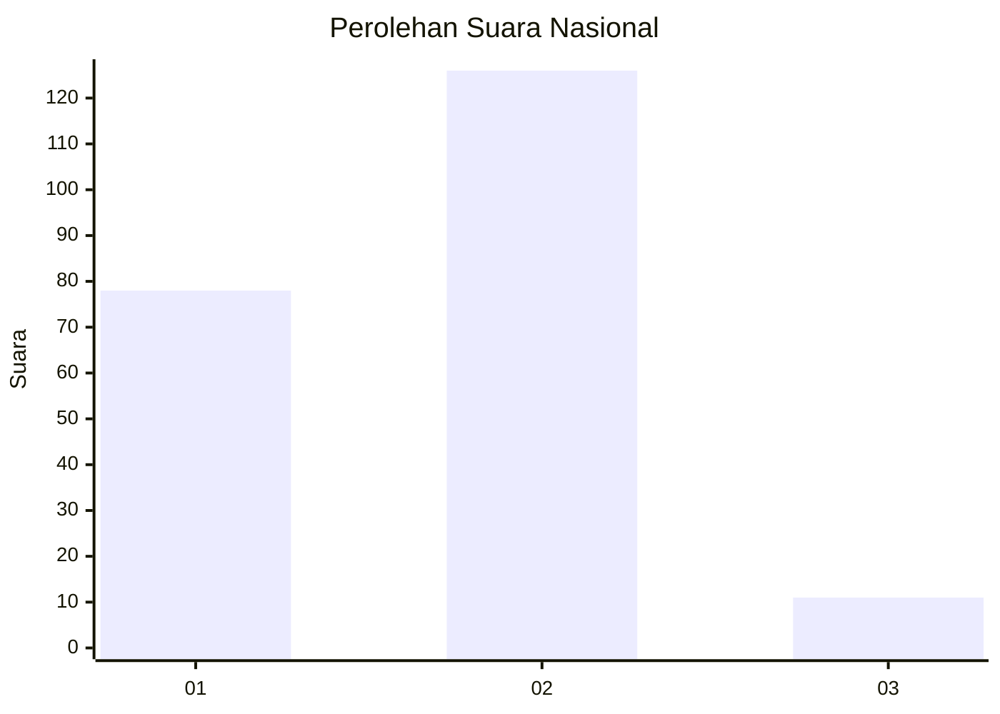
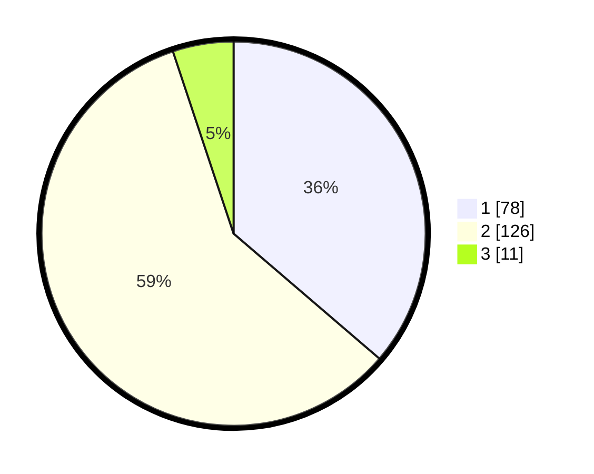

# Hasil

## Grafik

## Tabel

| No.    | Nama Paslon    | Suara | Suara (raw) | Persentase |
|:------ |:-------------- | -----:| -----------:| ----------:|
| 100025 | ANIES MUHAIMIN | 78    | [78][p-1]   | 36,28      |
| 100026 | PRABOWO GIBRAN | 126   | [126][p-2]  | 58,60      |
| 100027 | GANJAR MAHFUD  | 11    | [11][p-3]   | 5,12       |

[p-1]: https://github.com/gigit-pemilu/pemilu-2024/blob/main/pilpres/hitung-suara/sub/31-dki-jakarta/sub/72-jakarta-utara/sub/04-cilincing/sub/1004-kalibaru/sub/154-tps/sub/paslon-1.txt
[p-2]: https://github.com/gigit-pemilu/pemilu-2024/blob/main/pilpres/hitung-suara/sub/31-dki-jakarta/sub/72-jakarta-utara/sub/04-cilincing/sub/1004-kalibaru/sub/154-tps/sub/paslon-2.txt
[p-3]: https://github.com/gigit-pemilu/pemilu-2024/blob/main/pilpres/hitung-suara/sub/31-dki-jakarta/sub/72-jakarta-utara/sub/04-cilincing/sub/1004-kalibaru/sub/154-tps/sub/paslon-3.txt

## Foto C Plano

https://sirekap-obj-formc.kpu.go.id/97f9/pemilu/ppwp/31/72/04/10/04/3172041004154-20240214-210713--fb046395-ce7d-468c-9d0b-6599d178be88.jpg

https://sirekap-obj-formc.kpu.go.id/97f9/pemilu/ppwp/31/72/04/10/04/3172041004154-20240214-210814--87a4d808-6a92-4bb7-9491-603e720ec042.jpg

https://sirekap-obj-formc.kpu.go.id/97f9/pemilu/ppwp/31/72/04/10/04/3172041004154-20240214-210958--86b78d46-7127-4b17-ac3c-b94e7d2622d5.jpg

## Metadata

| Key        | Value               |
| ---------- | ------------------- |
| Time Stamp | 2024-02-21 19:00:00 |

