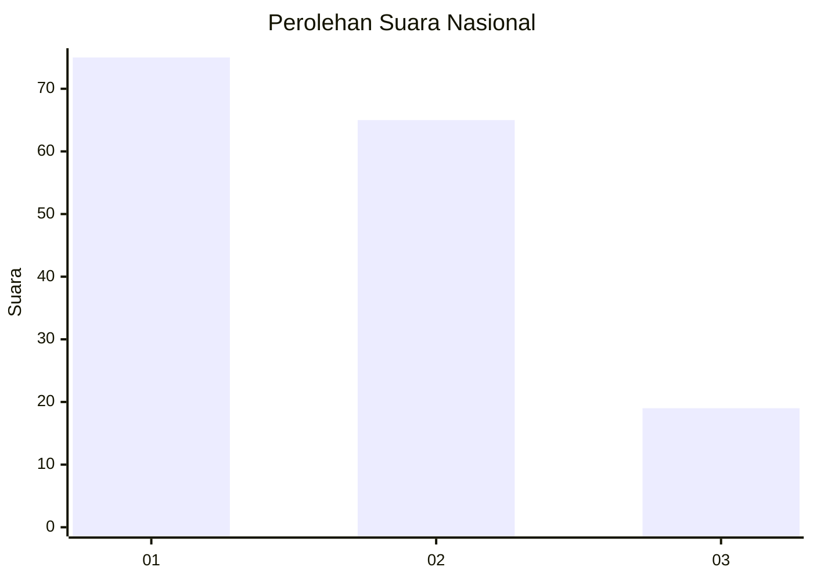
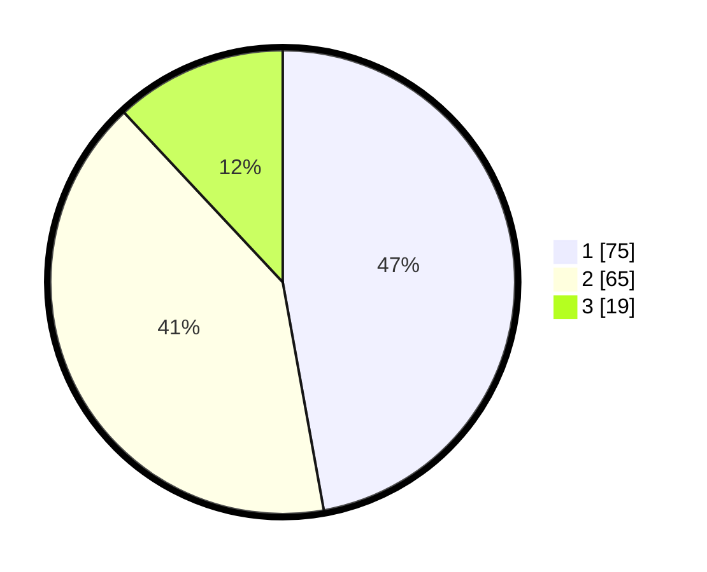

# Hasil

## Grafik

## Tabel

| No.    | Nama Paslon    | Suara | Suara (raw) | Persentase |
|:------ |:-------------- | -----:| -----------:| ----------:|
| 100025 | ANIES MUHAIMIN | 75    | [75][p-1]   | 47,17      |
| 100026 | PRABOWO GIBRAN | 65    | [65][p-2]   | 40,88      |
| 100027 | GANJAR MAHFUD  | 19    | [19][p-3]   | 11,95      |

[p-1]: https://github.com/gigit-pemilu/pemilu-2024/blob/main/pilpres/hitung-suara/sub/31-dki-jakarta/sub/72-jakarta-utara/sub/04-cilincing/sub/1004-kalibaru/sub/175-tps/sub/paslon-1.txt
[p-2]: https://github.com/gigit-pemilu/pemilu-2024/blob/main/pilpres/hitung-suara/sub/31-dki-jakarta/sub/72-jakarta-utara/sub/04-cilincing/sub/1004-kalibaru/sub/175-tps/sub/paslon-2.txt
[p-3]: https://github.com/gigit-pemilu/pemilu-2024/blob/main/pilpres/hitung-suara/sub/31-dki-jakarta/sub/72-jakarta-utara/sub/04-cilincing/sub/1004-kalibaru/sub/175-tps/sub/paslon-3.txt

## Foto C Plano

https://sirekap-obj-formc.kpu.go.id/9d1e/pemilu/ppwp/31/72/04/10/04/3172041004175-20240214-224152--56b9528b-af16-435f-8d22-a1f4ef679e7a.jpg

https://sirekap-obj-formc.kpu.go.id/9d1e/pemilu/ppwp/31/72/04/10/04/3172041004175-20240214-223841--9f6c8727-85ef-4450-bbaa-8ed659f2856b.jpg

https://sirekap-obj-formc.kpu.go.id/9d1e/pemilu/ppwp/31/72/04/10/04/3172041004175-20240214-224255--e27228ad-9384-4e60-a73e-d931180a8e6d.jpg

## Metadata

| Key        | Value               |
| ---------- | ------------------- |
| Time Stamp | 2024-02-21 19:00:00 |

