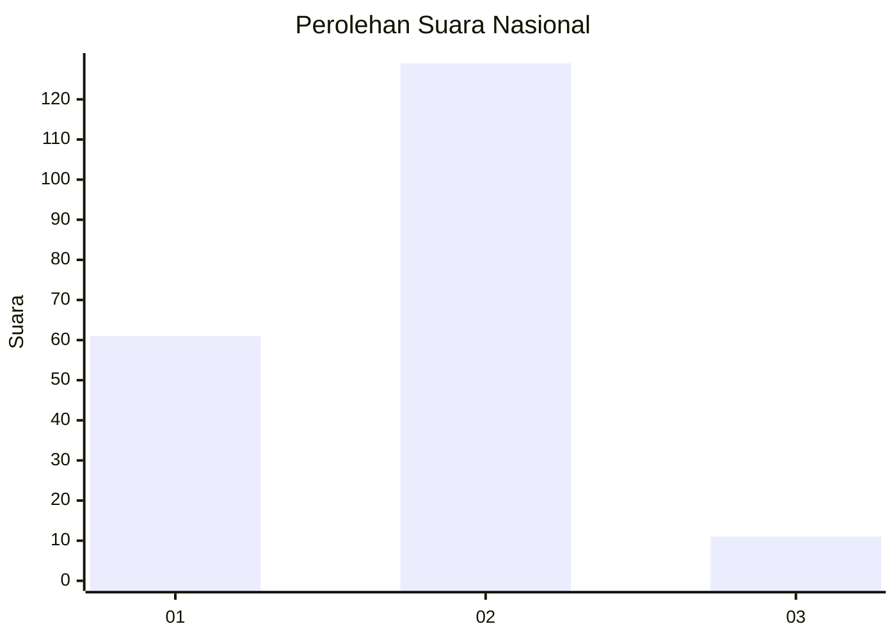
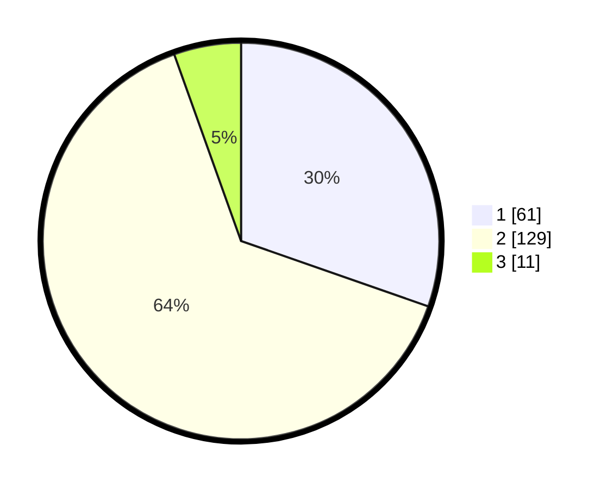

# Hasil

## Grafik

## Tabel

| No.    | Nama Paslon    | Suara | Suara (raw) | Persentase |
|:------ |:-------------- | -----:| -----------:| ----------:|
| 100025 | ANIES MUHAIMIN | 61    | [61][p-1]   | 30,35      |
| 100026 | PRABOWO GIBRAN | 129   | [129][p-2]  | 64,18      |
| 100027 | GANJAR MAHFUD  | 11    | [11][p-3]   | 5,47       |

[p-1]: https://github.com/gigit-pemilu/pemilu-2024/blob/main/pilpres/hitung-suara/sub/31-dki-jakarta/sub/72-jakarta-utara/sub/04-cilincing/sub/1004-kalibaru/sub/181-tps/sub/paslon-1.txt
[p-2]: https://github.com/gigit-pemilu/pemilu-2024/blob/main/pilpres/hitung-suara/sub/31-dki-jakarta/sub/72-jakarta-utara/sub/04-cilincing/sub/1004-kalibaru/sub/181-tps/sub/paslon-2.txt
[p-3]: https://github.com/gigit-pemilu/pemilu-2024/blob/main/pilpres/hitung-suara/sub/31-dki-jakarta/sub/72-jakarta-utara/sub/04-cilincing/sub/1004-kalibaru/sub/181-tps/sub/paslon-3.txt

## Foto C Plano

https://sirekap-obj-formc.kpu.go.id/0471/pemilu/ppwp/31/72/04/10/04/3172041004181-20240214-235622--54c76ea0-28f5-4515-9c42-2f0c1b7cc92f.jpg

https://sirekap-obj-formc.kpu.go.id/0471/pemilu/ppwp/31/72/04/10/04/3172041004181-20240214-201241--833df816-6464-4848-b769-7b079c39270d.jpg

https://sirekap-obj-formc.kpu.go.id/0471/pemilu/ppwp/31/72/04/10/04/3172041004181-20240214-235747--fd117ffd-4535-4dfe-88e1-9cb6fa95f23d.jpg

## Metadata

| Key        | Value               |
| ---------- | ------------------- |
| Time Stamp | 2024-02-15 01:47:43 |

