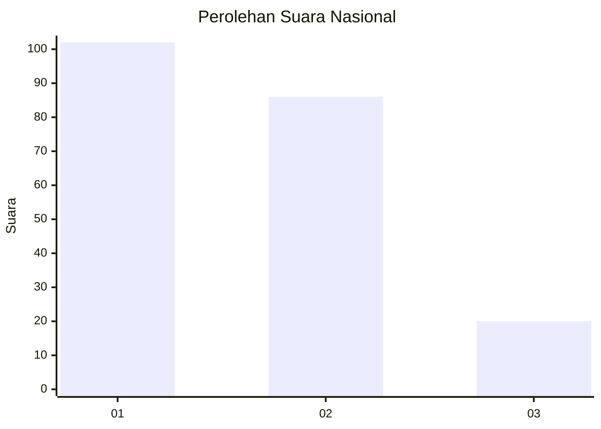
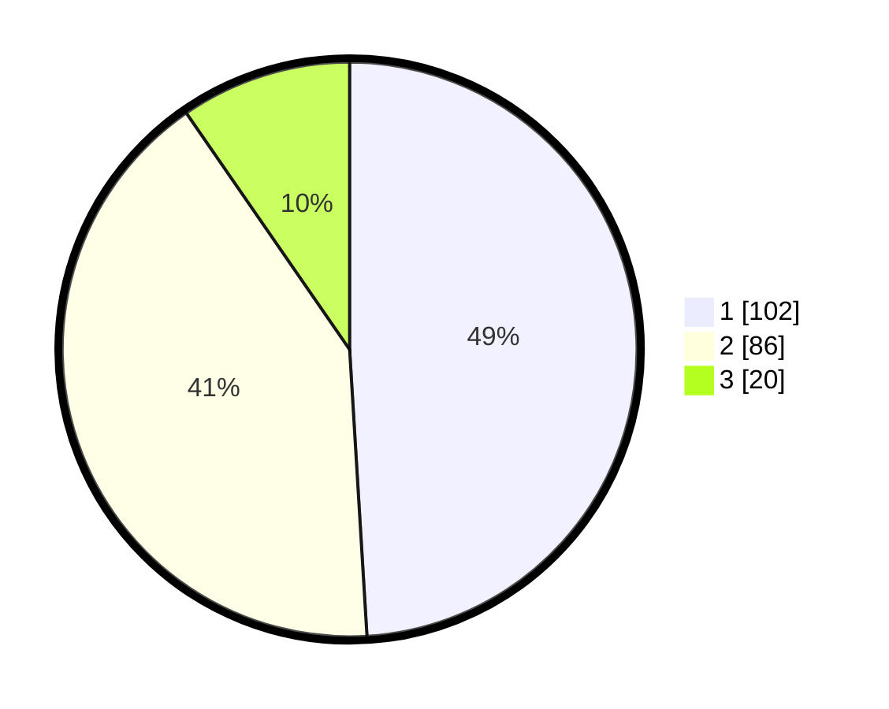

# Hasil

## Grafik

## Tabel

| No.    | Nama Paslon    | Suara | Suara (raw) | Persentase |
|:------ |:-------------- | -----:| -----------:| ----------:|
| 100025 | ANIES MUHAIMIN | 102   | [102][p-1]  | 49,04      |
| 100026 | PRABOWO GIBRAN | 86    | [86][p-2]   | 41,35      |
| 100027 | GANJAR MAHFUD  | 20    | [20][p-3]   | 9,62       |

[p-1]: https://github.com/gigit-pemilu/pemilu-2024/blob/main/pilpres/hitung-suara/sub/31-dki-jakarta/sub/72-jakarta-utara/sub/04-cilincing/sub/1004-kalibaru/sub/188-tps/sub/paslon-1.txt
[p-2]: https://github.com/gigit-pemilu/pemilu-2024/blob/main/pilpres/hitung-suara/sub/31-dki-jakarta/sub/72-jakarta-utara/sub/04-cilincing/sub/1004-kalibaru/sub/188-tps/sub/paslon-2.txt
[p-3]: https://github.com/gigit-pemilu/pemilu-2024/blob/main/pilpres/hitung-suara/sub/31-dki-jakarta/sub/72-jakarta-utara/sub/04-cilincing/sub/1004-kalibaru/sub/188-tps/sub/paslon-3.txt

## Foto C Plano

https://sirekap-obj-formc.kpu.go.id/21ab/pemilu/ppwp/31/72/04/10/04/3172041004188-20240215-004108--95ea2db2-cf8a-4056-8a4f-f325d3cea46f.jpg

https://sirekap-obj-formc.kpu.go.id/21ab/pemilu/ppwp/31/72/04/10/04/3172041004188-20240215-004156--5d4530fb-b97d-482c-b6f3-4cada055ba1b.jpg

https://sirekap-obj-formc.kpu.go.id/21ab/pemilu/ppwp/31/72/04/10/04/3172041004188-20240215-004237--ab7ba9c9-8203-4039-a0ca-39edf7aff9b6.jpg

## Metadata

| Key        | Value               |
| ---------- | ------------------- |
| Time Stamp | 2024-02-21 15:00:00 |

