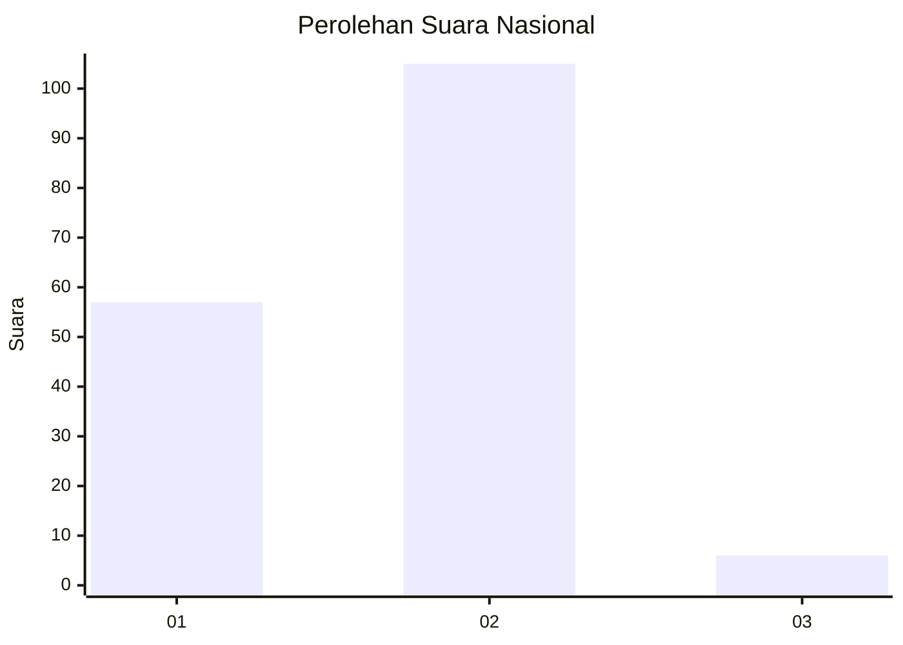
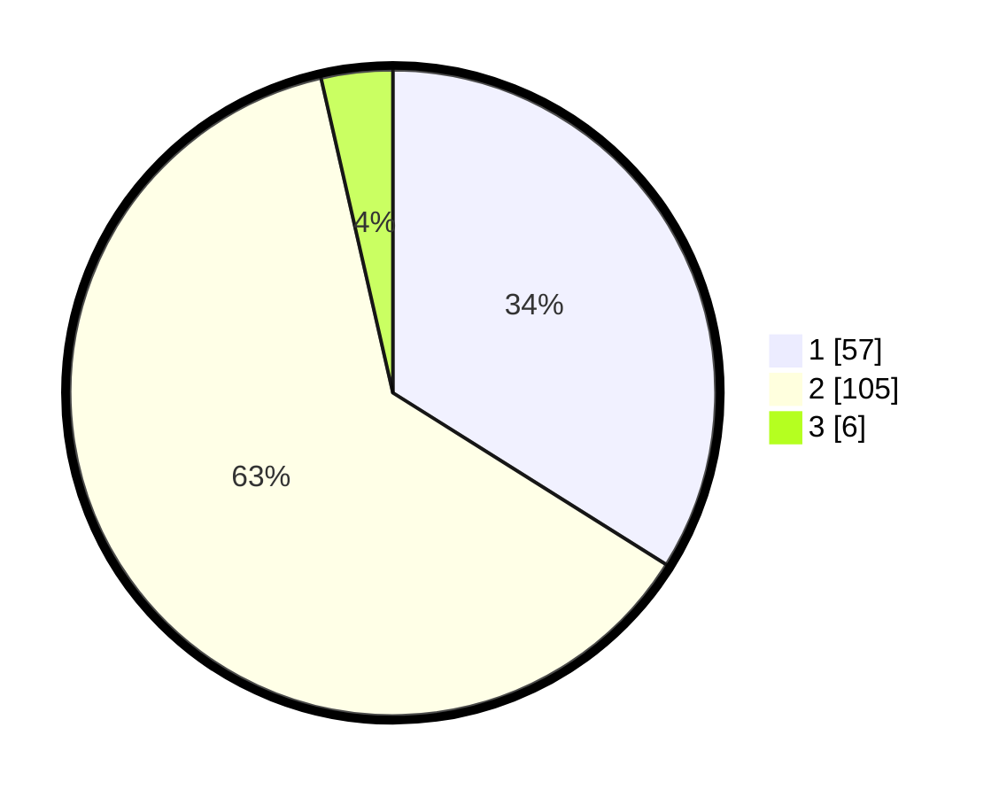

# Hasil

## Grafik

## Tabel

| No.    | Nama Paslon    | Suara | Suara (raw) | Persentase |
|:------ |:-------------- | -----:| -----------:| ----------:|
| 100025 | ANIES MUHAIMIN | 57    | [57][p-1]   | 33,93      |
| 100026 | PRABOWO GIBRAN | 105   | [105][p-2]  | 62,50      |
| 100027 | GANJAR MAHFUD  | 6     | [6][p-3]    | 3,57       |

[p-1]: https://github.com/gigit-pemilu/pemilu-2024/blob/main/pilpres/hitung-suara/sub/31-dki-jakarta/sub/72-jakarta-utara/sub/04-cilincing/sub/1004-kalibaru/sub/197-tps/sub/paslon-1.txt
[p-2]: https://github.com/gigit-pemilu/pemilu-2024/blob/main/pilpres/hitung-suara/sub/31-dki-jakarta/sub/72-jakarta-utara/sub/04-cilincing/sub/1004-kalibaru/sub/197-tps/sub/paslon-2.txt
[p-3]: https://github.com/gigit-pemilu/pemilu-2024/blob/main/pilpres/hitung-suara/sub/31-dki-jakarta/sub/72-jakarta-utara/sub/04-cilincing/sub/1004-kalibaru/sub/197-tps/sub/paslon-3.txt

## Foto C Plano

https://sirekap-obj-formc.kpu.go.id/d29c/pemilu/ppwp/31/72/04/10/04/3172041004197-20240214-223826--8ff82e6e-a261-4aa7-8af4-7a2aa87dc068.jpg

https://sirekap-obj-formc.kpu.go.id/d29c/pemilu/ppwp/31/72/04/10/04/3172041004197-20240214-223858--39e02fba-8cdd-426f-b4f6-1befb207b7e9.jpg

https://sirekap-obj-formc.kpu.go.id/d29c/pemilu/ppwp/31/72/04/10/04/3172041004197-20240214-223932--f2b7c399-6a76-432d-b504-c8ec33778d02.jpg

## Metadata

| Key        | Value               |
| ---------- | ------------------- |
| Time Stamp | 2024-02-21 19:00:00 |

