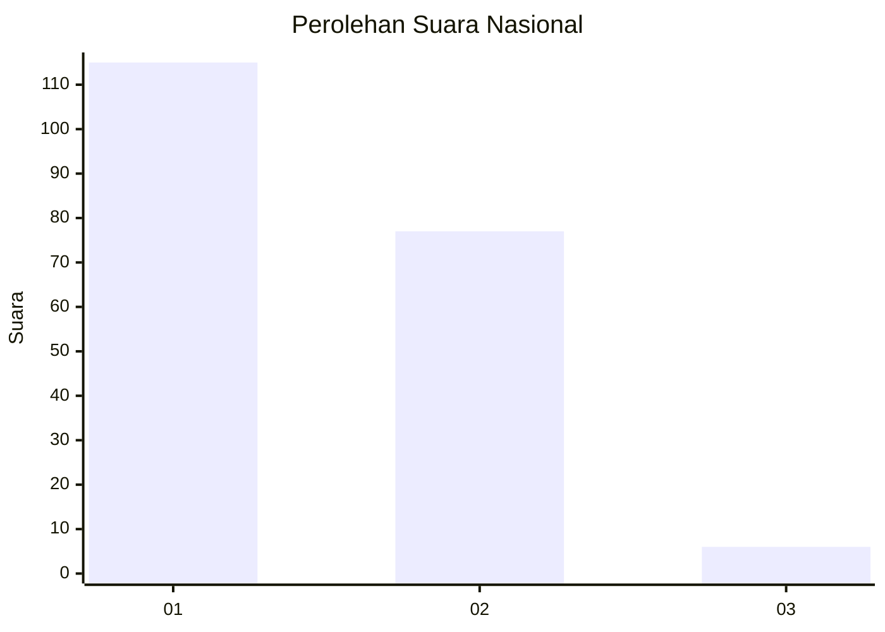
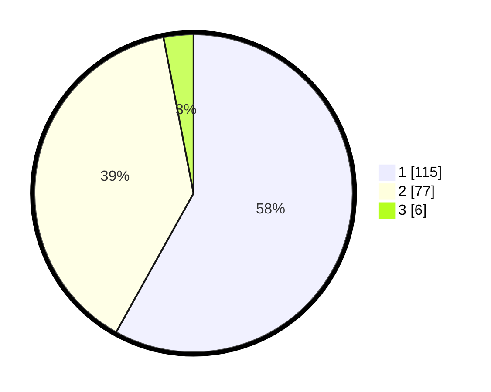

# Hasil

## Grafik

## Tabel

| No.    | Nama Paslon    | Suara | Suara (raw) | Persentase |
|:------ |:-------------- | -----:| -----------:| ----------:|
| 100025 | ANIES MUHAIMIN | 115   | [115][p-1]  | 58,08      |
| 100026 | PRABOWO GIBRAN | 77    | [77][p-2]   | 38,89      |
| 100027 | GANJAR MAHFUD  | 6     | [6][p-3]    | 3,03       |

[p-1]: https://github.com/gigit-pemilu/pemilu-2024/blob/main/pilpres/hitung-suara/sub/31-dki-jakarta/sub/72-jakarta-utara/sub/04-cilincing/sub/1004-kalibaru/sub/220-tps/sub/paslon-1.txt
[p-2]: https://github.com/gigit-pemilu/pemilu-2024/blob/main/pilpres/hitung-suara/sub/31-dki-jakarta/sub/72-jakarta-utara/sub/04-cilincing/sub/1004-kalibaru/sub/220-tps/sub/paslon-2.txt
[p-3]: https://github.com/gigit-pemilu/pemilu-2024/blob/main/pilpres/hitung-suara/sub/31-dki-jakarta/sub/72-jakarta-utara/sub/04-cilincing/sub/1004-kalibaru/sub/220-tps/sub/paslon-3.txt

## Foto C Plano

https://sirekap-obj-formc.kpu.go.id/a4b1/pemilu/ppwp/31/72/04/10/04/3172041004220-20240214-233246--74f103b6-cfdd-4eb2-9f1f-8e49302b8ab0.jpg

https://sirekap-obj-formc.kpu.go.id/a4b1/pemilu/ppwp/31/72/04/10/04/3172041004220-20240214-233250--cf684b17-fd69-446e-adc5-0de6d121944e.jpg

https://sirekap-obj-formc.kpu.go.id/a4b1/pemilu/ppwp/31/72/04/10/04/3172041004220-20240214-233253--deb939c5-e9ec-4237-8439-818e7c0b28fd.jpg

## Metadata

| Key        | Value               |
| ---------- | ------------------- |
| Time Stamp | 2024-02-20 23:00:00 |

