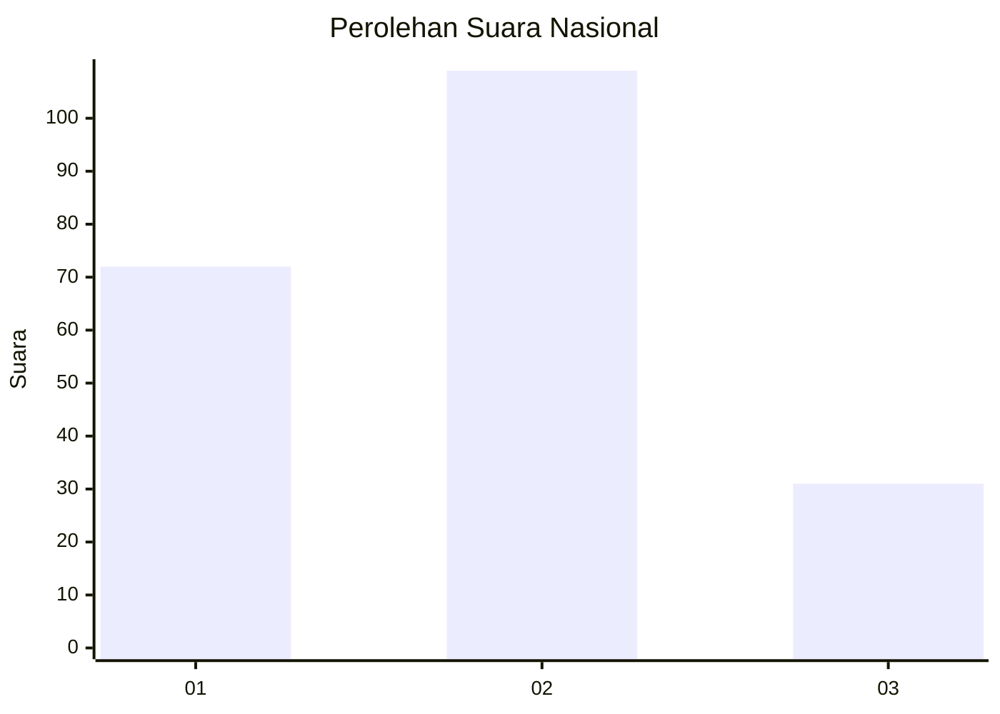
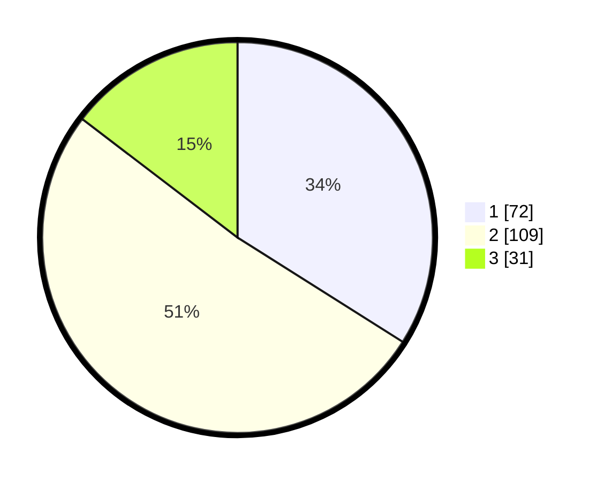

# Hasil

## Grafik

## Tabel

| No.    | Nama Paslon    | Suara | Suara (raw) | Persentase |
|:------ |:-------------- | -----:| -----------:| ----------:|
| 100025 | ANIES MUHAIMIN | 72    | [72][p-1]   | 33,96      |
| 100026 | PRABOWO GIBRAN | 109   | [109][p-2]  | 51,42      |
| 100027 | GANJAR MAHFUD  | 31    | [31][p-3]   | 14,62      |

[p-1]: https://github.com/gigit-pemilu/pemilu-2024/blob/main/pilpres/hitung-suara/sub/31-dki-jakarta/sub/72-jakarta-utara/sub/04-cilincing/sub/1005-semper-timur/sub/008-tps/sub/paslon-1.txt
[p-2]: https://github.com/gigit-pemilu/pemilu-2024/blob/main/pilpres/hitung-suara/sub/31-dki-jakarta/sub/72-jakarta-utara/sub/04-cilincing/sub/1005-semper-timur/sub/008-tps/sub/paslon-2.txt
[p-3]: https://github.com/gigit-pemilu/pemilu-2024/blob/main/pilpres/hitung-suara/sub/31-dki-jakarta/sub/72-jakarta-utara/sub/04-cilincing/sub/1005-semper-timur/sub/008-tps/sub/paslon-3.txt

## Foto C Plano

https://sirekap-obj-formc.kpu.go.id/93ee/pemilu/ppwp/31/72/04/10/05/3172041005008-20240214-215606--fc2beb56-559e-4e4e-9323-f178111c16c1.jpg

https://sirekap-obj-formc.kpu.go.id/93ee/pemilu/ppwp/31/72/04/10/05/3172041005008-20240214-215715--ee22f8de-e2bc-4769-ad78-629ce6c81eee.jpg

https://sirekap-obj-formc.kpu.go.id/93ee/pemilu/ppwp/31/72/04/10/05/3172041005008-20240214-215808--2db6c9ab-9df8-4b3a-a0ac-ce7638a47882.jpg

## Metadata

| Key        | Value               |
| ---------- | ------------------- |
| Time Stamp | 2024-02-20 21:00:00 |

