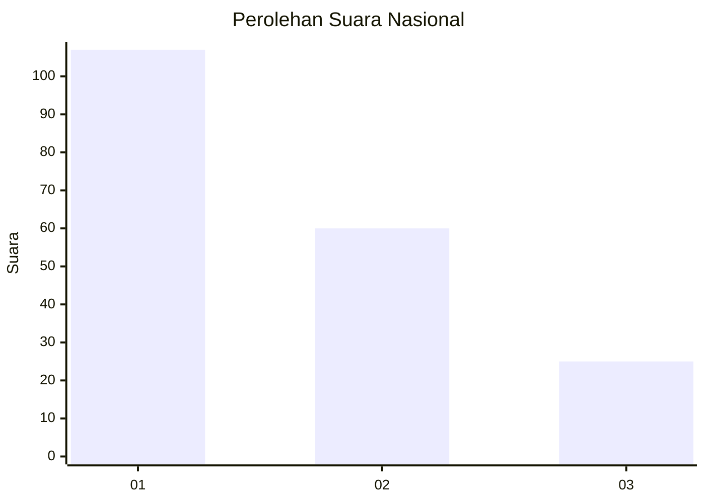
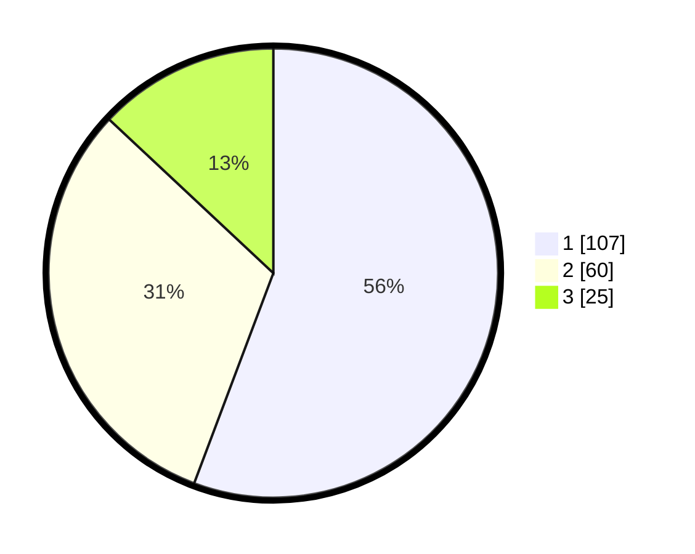

# Hasil

## Grafik

## Tabel

| No.    | Nama Paslon    | Suara | Suara (raw) | Persentase |
|:------ |:-------------- | -----:| -----------:| ----------:|
| 100025 | ANIES MUHAIMIN | 107   | [107][p-1]  | 55,73      |
| 100026 | PRABOWO GIBRAN | 60    | [60][p-2]   | 31,25      |
| 100027 | GANJAR MAHFUD  | 25    | [25][p-3]   | 13,02      |

[p-1]: https://github.com/gigit-pemilu/pemilu-2024/blob/main/pilpres/hitung-suara/sub/31-dki-jakarta/sub/72-jakarta-utara/sub/04-cilincing/sub/1005-semper-timur/sub/017-tps/sub/paslon-1.txt
[p-2]: https://github.com/gigit-pemilu/pemilu-2024/blob/main/pilpres/hitung-suara/sub/31-dki-jakarta/sub/72-jakarta-utara/sub/04-cilincing/sub/1005-semper-timur/sub/017-tps/sub/paslon-2.txt
[p-3]: https://github.com/gigit-pemilu/pemilu-2024/blob/main/pilpres/hitung-suara/sub/31-dki-jakarta/sub/72-jakarta-utara/sub/04-cilincing/sub/1005-semper-timur/sub/017-tps/sub/paslon-3.txt

## Foto C Plano

https://sirekap-obj-formc.kpu.go.id/b490/pemilu/ppwp/31/72/04/10/05/3172041005017-20240214-194618--23bee812-88e3-4458-8200-0b281d05b8c0.jpg

https://sirekap-obj-formc.kpu.go.id/b490/pemilu/ppwp/31/72/04/10/05/3172041005017-20240214-194714--f82bdbe0-f262-4f2b-ab9e-f0b5711d75a7.jpg

https://sirekap-obj-formc.kpu.go.id/b490/pemilu/ppwp/31/72/04/10/05/3172041005017-20240214-194841--353092f2-a211-4172-a607-045b03522f85.jpg

## Metadata

| Key        | Value               |
| ---------- | ------------------- |
| Time Stamp | 2024-02-21 17:00:00 |

