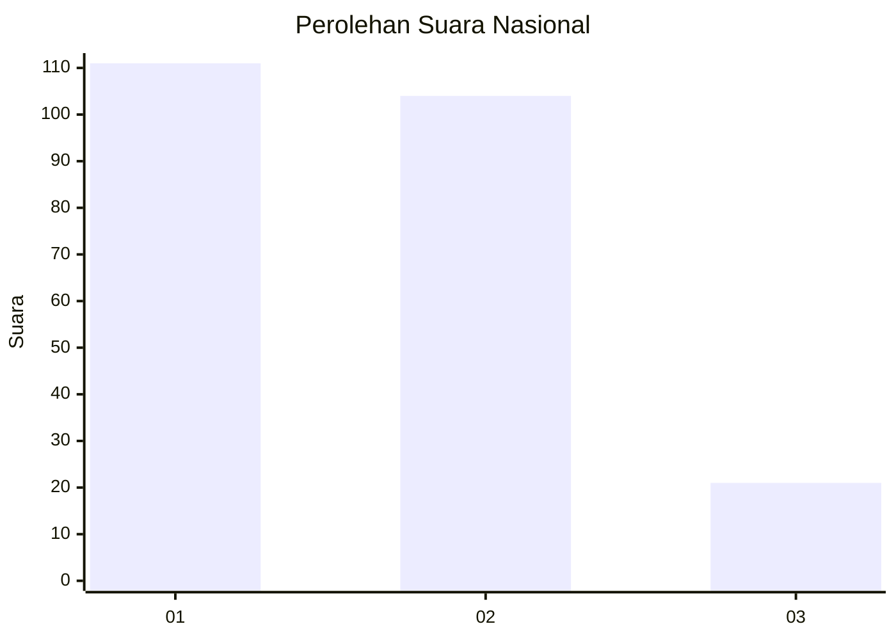
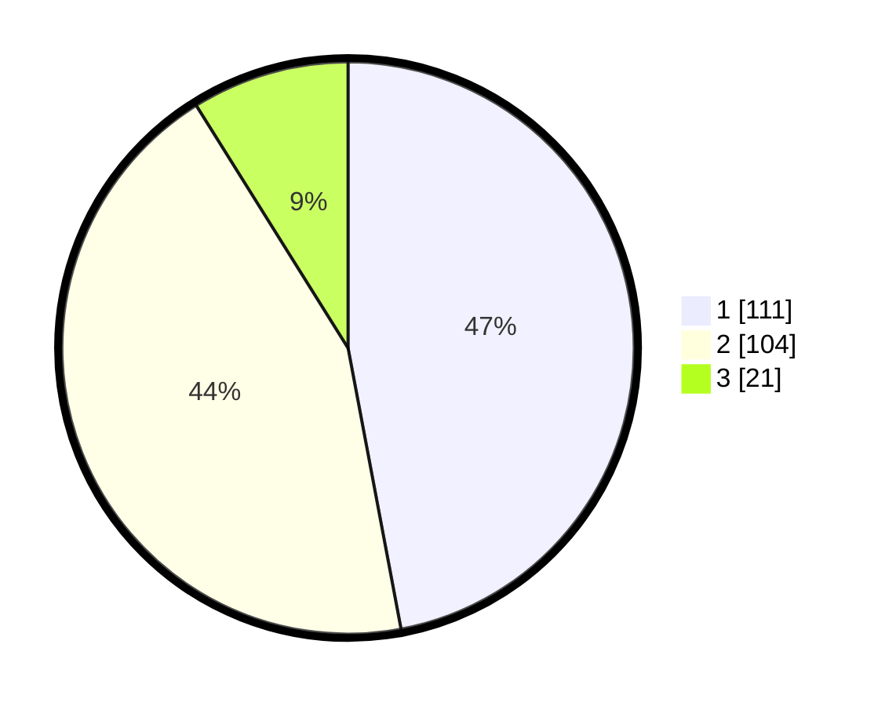

# Hasil

## Grafik

## Tabel

| No.    | Nama Paslon    | Suara | Suara (raw) | Persentase |
|:------ |:-------------- | -----:| -----------:| ----------:|
| 100025 | ANIES MUHAIMIN | 111   | [111][p-1]  | 47,03      |
| 100026 | PRABOWO GIBRAN | 104   | [104][p-2]  | 44,07      |
| 100027 | GANJAR MAHFUD  | 21    | [21][p-3]   | 8,90       |

[p-1]: https://github.com/gigit-pemilu/pemilu-2024/blob/main/pilpres/hitung-suara/sub/31-dki-jakarta/sub/72-jakarta-utara/sub/04-cilincing/sub/1005-semper-timur/sub/032-tps/sub/paslon-1.txt
[p-2]: https://github.com/gigit-pemilu/pemilu-2024/blob/main/pilpres/hitung-suara/sub/31-dki-jakarta/sub/72-jakarta-utara/sub/04-cilincing/sub/1005-semper-timur/sub/032-tps/sub/paslon-2.txt
[p-3]: https://github.com/gigit-pemilu/pemilu-2024/blob/main/pilpres/hitung-suara/sub/31-dki-jakarta/sub/72-jakarta-utara/sub/04-cilincing/sub/1005-semper-timur/sub/032-tps/sub/paslon-3.txt

## Foto C Plano

https://sirekap-obj-formc.kpu.go.id/a423/pemilu/ppwp/31/72/04/10/05/3172041005032-20240215-001434--a6fcdf95-6d99-48f7-b3f6-95fc5850ad3f.jpg

https://sirekap-obj-formc.kpu.go.id/a423/pemilu/ppwp/31/72/04/10/05/3172041005032-20240215-001601--2f304da0-3661-4fa5-9b53-4ec19e303a2c.jpg

https://sirekap-obj-formc.kpu.go.id/a423/pemilu/ppwp/31/72/04/10/05/3172041005032-20240215-001702--acfffce4-5d57-4cb3-a09e-afc774378247.jpg

## Metadata

| Key        | Value               |
| ---------- | ------------------- |
| Time Stamp | 2024-02-21 19:00:00 |

