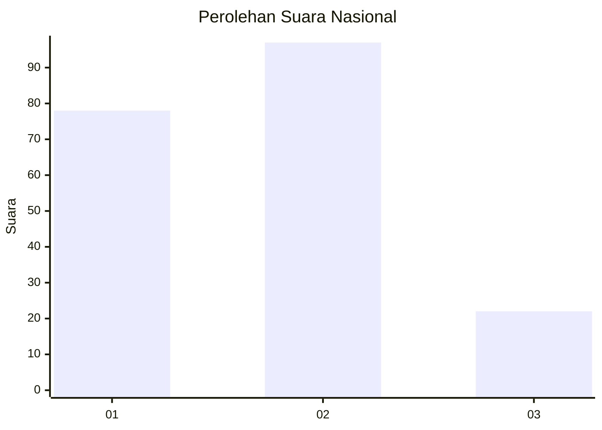
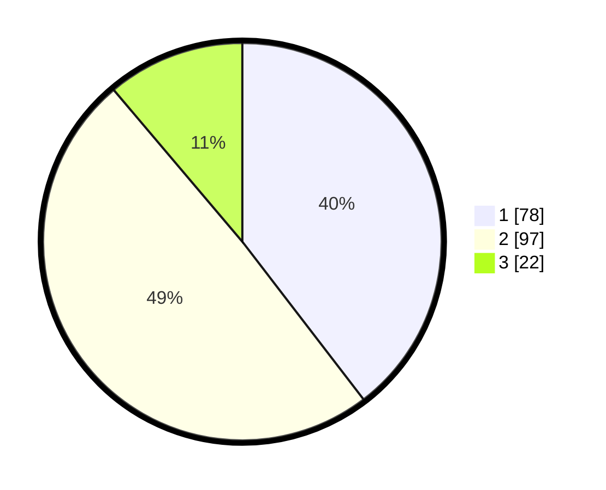

# Hasil

## Grafik

## Tabel

| No.    | Nama Paslon    | Suara | Suara (raw) | Persentase |
|:------ |:-------------- | -----:| -----------:| ----------:|
| 100025 | ANIES MUHAIMIN | 78    | [78][p-1]   | 39,59      |
| 100026 | PRABOWO GIBRAN | 97    | [97][p-2]   | 49,24      |
| 100027 | GANJAR MAHFUD  | 22    | [22][p-3]   | 11,17      |

[p-1]: https://github.com/gigit-pemilu/pemilu-2024/blob/main/pilpres/hitung-suara/sub/31-dki-jakarta/sub/72-jakarta-utara/sub/04-cilincing/sub/1005-semper-timur/sub/041-tps/sub/paslon-1.txt
[p-2]: https://github.com/gigit-pemilu/pemilu-2024/blob/main/pilpres/hitung-suara/sub/31-dki-jakarta/sub/72-jakarta-utara/sub/04-cilincing/sub/1005-semper-timur/sub/041-tps/sub/paslon-2.txt
[p-3]: https://github.com/gigit-pemilu/pemilu-2024/blob/main/pilpres/hitung-suara/sub/31-dki-jakarta/sub/72-jakarta-utara/sub/04-cilincing/sub/1005-semper-timur/sub/041-tps/sub/paslon-3.txt

## Foto C Plano

https://sirekap-obj-formc.kpu.go.id/decb/pemilu/ppwp/31/72/04/10/05/3172041005041-20240214-224806--a93de046-4061-4a96-8ba4-ad459a680ece.jpg

https://sirekap-obj-formc.kpu.go.id/decb/pemilu/ppwp/31/72/04/10/05/3172041005041-20240214-225506--bd445d00-0438-44ca-8b09-538fd8c7f737.jpg

https://sirekap-obj-formc.kpu.go.id/decb/pemilu/ppwp/31/72/04/10/05/3172041005041-20240214-225839--b5365a7b-3ef2-4488-89ae-c72360857d0f.jpg

## Metadata

| Key        | Value               |
| ---------- | ------------------- |
| Time Stamp | 2024-02-21 19:00:00 |

