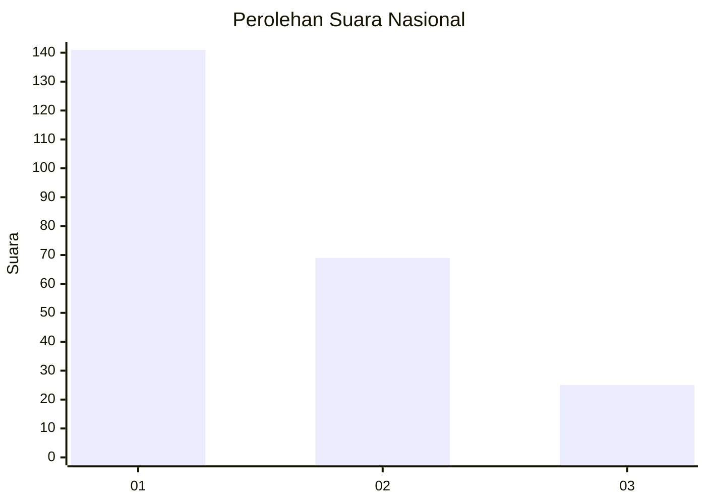
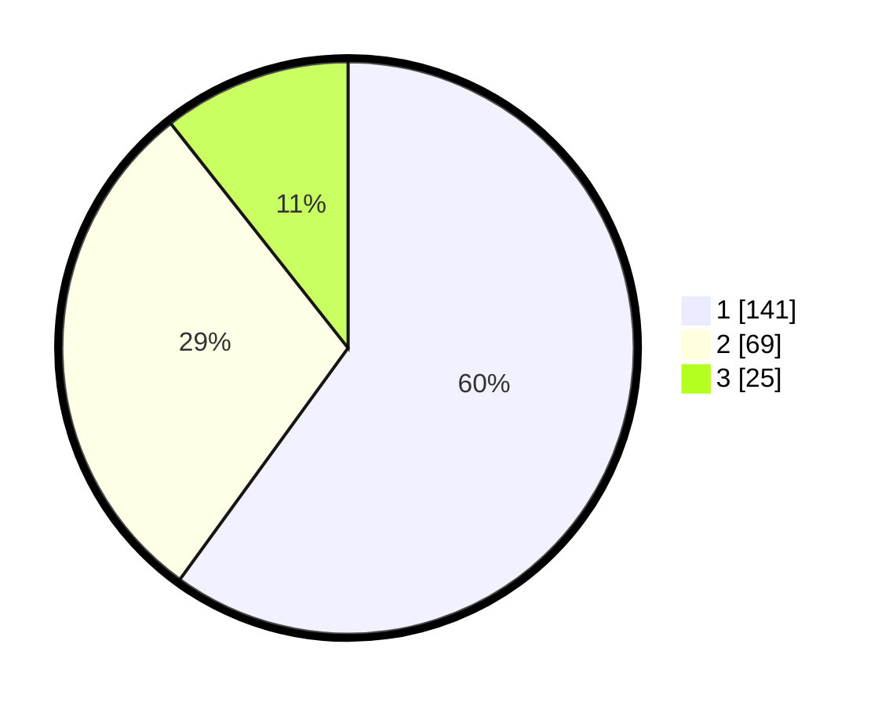

# Hasil

## Grafik

## Tabel

| No.    | Nama Paslon    | Suara | Suara (raw) | Persentase |
|:------ |:-------------- | -----:| -----------:| ----------:|
| 100025 | ANIES MUHAIMIN | 141   | [141][p-1]  | 60,00      |
| 100026 | PRABOWO GIBRAN | 69    | [69][p-2]   | 29,36      |
| 100027 | GANJAR MAHFUD  | 25    | [25][p-3]   | 10,64      |

[p-1]: https://github.com/gigit-pemilu/pemilu-2024/blob/main/pilpres/hitung-suara/sub/31-dki-jakarta/sub/72-jakarta-utara/sub/04-cilincing/sub/1005-semper-timur/sub/053-tps/sub/paslon-1.txt
[p-2]: https://github.com/gigit-pemilu/pemilu-2024/blob/main/pilpres/hitung-suara/sub/31-dki-jakarta/sub/72-jakarta-utara/sub/04-cilincing/sub/1005-semper-timur/sub/053-tps/sub/paslon-2.txt
[p-3]: https://github.com/gigit-pemilu/pemilu-2024/blob/main/pilpres/hitung-suara/sub/31-dki-jakarta/sub/72-jakarta-utara/sub/04-cilincing/sub/1005-semper-timur/sub/053-tps/sub/paslon-3.txt

## Foto C Plano

https://sirekap-obj-formc.kpu.go.id/c648/pemilu/ppwp/31/72/04/10/05/3172041005053-20240214-220539--3ae2a93c-ae69-4ae1-a023-a634b9013925.jpg

https://sirekap-obj-formc.kpu.go.id/c648/pemilu/ppwp/31/72/04/10/05/3172041005053-20240214-220650--b35b175f-53c6-4b74-93bb-6ae41820a48a.jpg

https://sirekap-obj-formc.kpu.go.id/c648/pemilu/ppwp/31/72/04/10/05/3172041005053-20240214-220733--d149b9ba-6d08-4fff-bf0e-ed387c26a02b.jpg

## Metadata

| Key        | Value               |
| ---------- | ------------------- |
| Time Stamp | 2024-02-21 19:00:00 |

