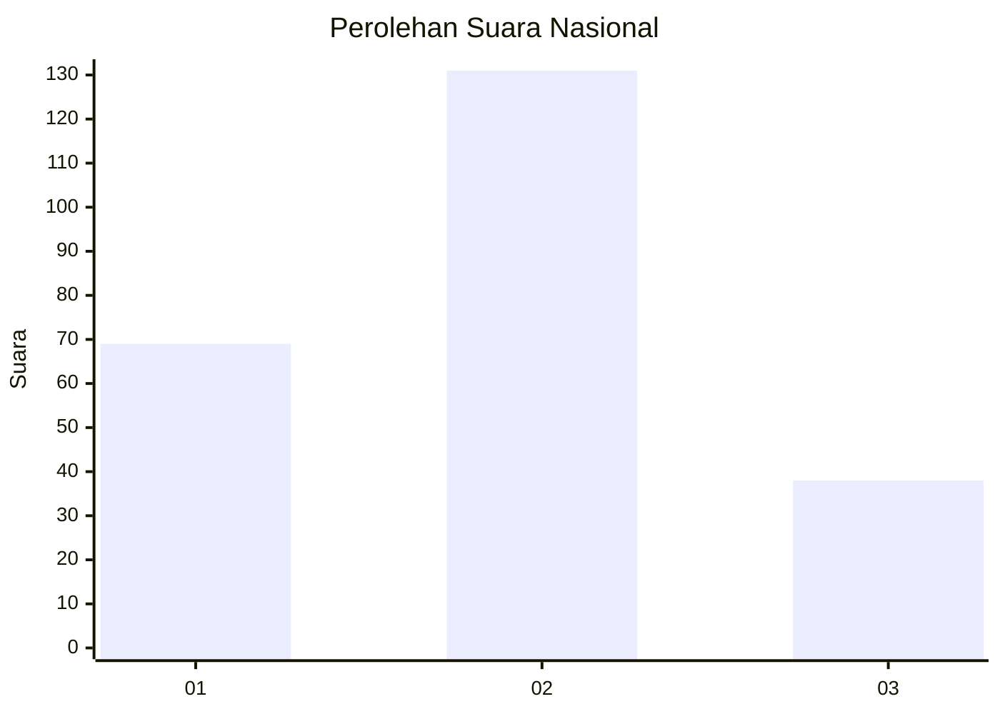
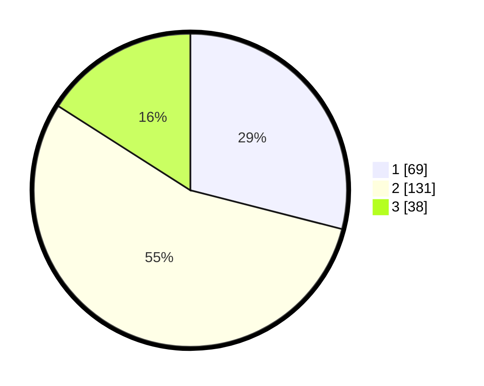

# Hasil

## Grafik

## Tabel

| No.    | Nama Paslon    | Suara | Suara (raw) | Persentase |
|:------ |:-------------- | -----:| -----------:| ----------:|
| 100025 | ANIES MUHAIMIN | 69    | [69][p-1]   | 28,99      |
| 100026 | PRABOWO GIBRAN | 131   | [131][p-2]  | 55,04      |
| 100027 | GANJAR MAHFUD  | 38    | [38][p-3]   | 15,97      |

[p-1]: https://github.com/gigit-pemilu/pemilu-2024/blob/main/pilpres/hitung-suara/sub/31-dki-jakarta/sub/72-jakarta-utara/sub/04-cilincing/sub/1005-semper-timur/sub/084-tps/sub/paslon-1.txt
[p-2]: https://github.com/gigit-pemilu/pemilu-2024/blob/main/pilpres/hitung-suara/sub/31-dki-jakarta/sub/72-jakarta-utara/sub/04-cilincing/sub/1005-semper-timur/sub/084-tps/sub/paslon-2.txt
[p-3]: https://github.com/gigit-pemilu/pemilu-2024/blob/main/pilpres/hitung-suara/sub/31-dki-jakarta/sub/72-jakarta-utara/sub/04-cilincing/sub/1005-semper-timur/sub/084-tps/sub/paslon-3.txt

## Foto C Plano

https://sirekap-obj-formc.kpu.go.id/a123/pemilu/ppwp/31/72/04/10/05/3172041005084-20240215-010917--b1e89f60-0c1f-43ec-bbea-a8ce152c13e1.jpg

https://sirekap-obj-formc.kpu.go.id/a123/pemilu/ppwp/31/72/04/10/05/3172041005084-20240215-011011--e851f171-ceac-48e0-b9f5-fe60fd6fc85e.jpg

https://sirekap-obj-formc.kpu.go.id/a123/pemilu/ppwp/31/72/04/10/05/3172041005084-20240215-011100--21647857-9a5a-4070-92d2-4f0899a13295.jpg

## Metadata

| Key        | Value               |
| ---------- | ------------------- |
| Time Stamp | 2024-02-21 16:00:00 |

