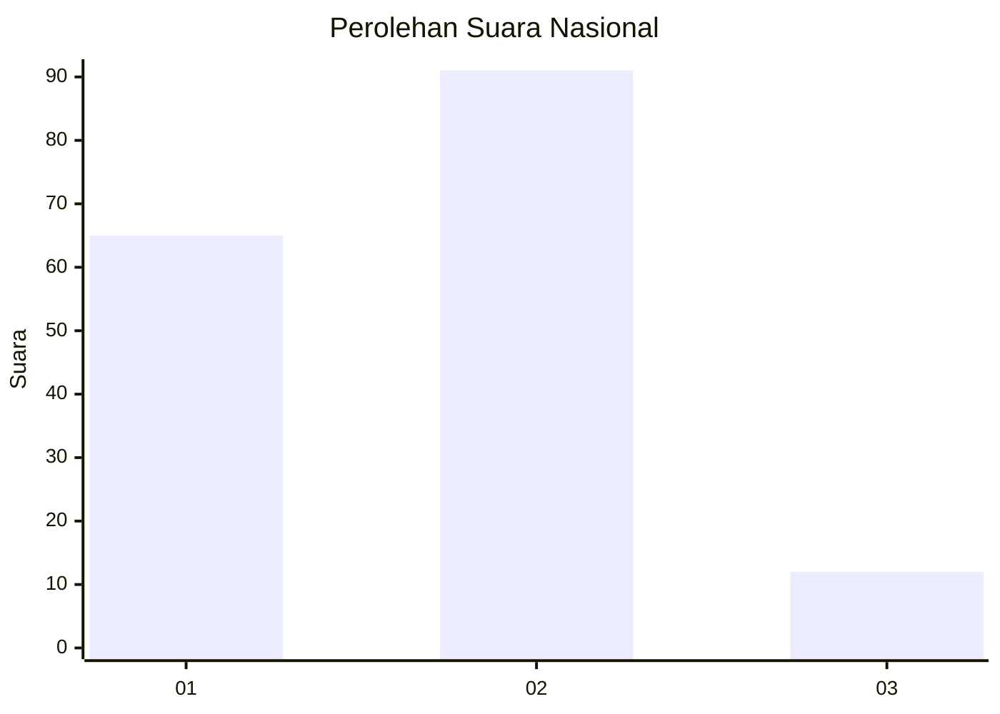
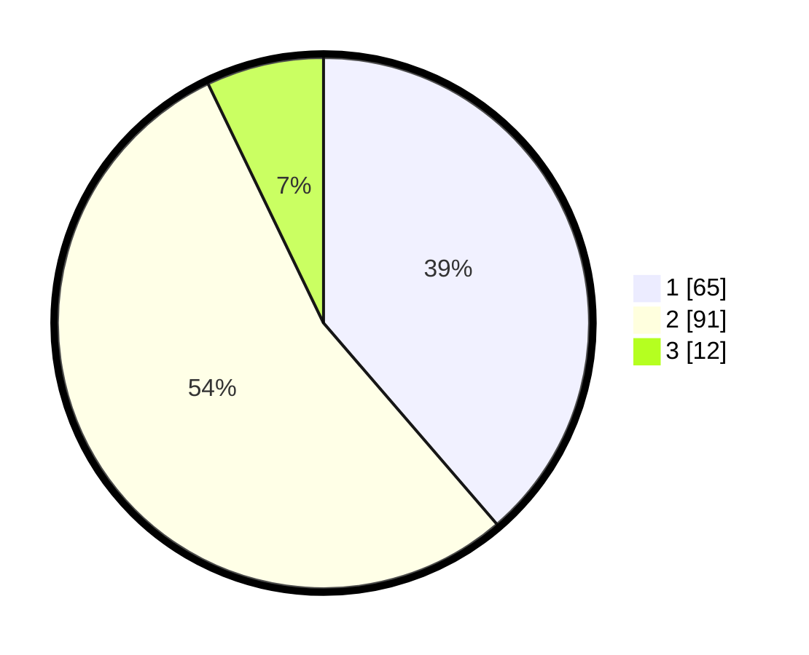

# Hasil

## Grafik

## Tabel

| No.    | Nama Paslon    | Suara | Suara (raw) | Persentase |
|:------ |:-------------- | -----:| -----------:| ----------:|
| 100025 | ANIES MUHAIMIN | 65    | [65][p-1]   | 38,69      |
| 100026 | PRABOWO GIBRAN | 91    | [91][p-2]   | 54,17      |
| 100027 | GANJAR MAHFUD  | 12    | [12][p-3]   | 7,14       |

[p-1]: https://github.com/gigit-pemilu/pemilu-2024/blob/main/pilpres/hitung-suara/sub/31-dki-jakarta/sub/72-jakarta-utara/sub/04-cilincing/sub/1005-semper-timur/sub/103-tps/sub/paslon-1.txt
[p-2]: https://github.com/gigit-pemilu/pemilu-2024/blob/main/pilpres/hitung-suara/sub/31-dki-jakarta/sub/72-jakarta-utara/sub/04-cilincing/sub/1005-semper-timur/sub/103-tps/sub/paslon-2.txt
[p-3]: https://github.com/gigit-pemilu/pemilu-2024/blob/main/pilpres/hitung-suara/sub/31-dki-jakarta/sub/72-jakarta-utara/sub/04-cilincing/sub/1005-semper-timur/sub/103-tps/sub/paslon-3.txt

## Foto C Plano

https://sirekap-obj-formc.kpu.go.id/eed7/pemilu/ppwp/31/72/04/10/05/3172041005103-20240214-234214--a76d5662-7816-4de7-a05b-83db105bce77.jpg

https://sirekap-obj-formc.kpu.go.id/eed7/pemilu/ppwp/31/72/04/10/05/3172041005103-20240214-234337--476e0871-a536-4207-84c9-f3c57603374c.jpg

https://sirekap-obj-formc.kpu.go.id/eed7/pemilu/ppwp/31/72/04/10/05/3172041005103-20240214-234505--06190a78-ae3d-4677-9b72-2670a930939c.jpg

## Metadata

| Key        | Value               |
| ---------- | ------------------- |
| Time Stamp | 2024-02-20 23:00:00 |

