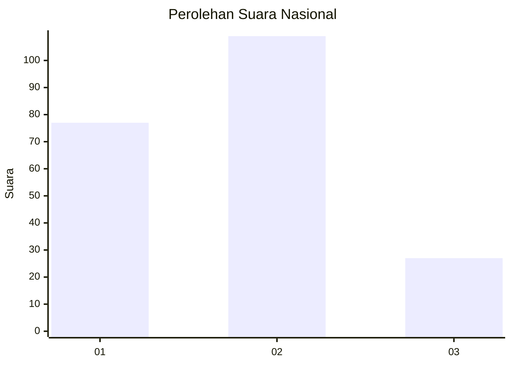
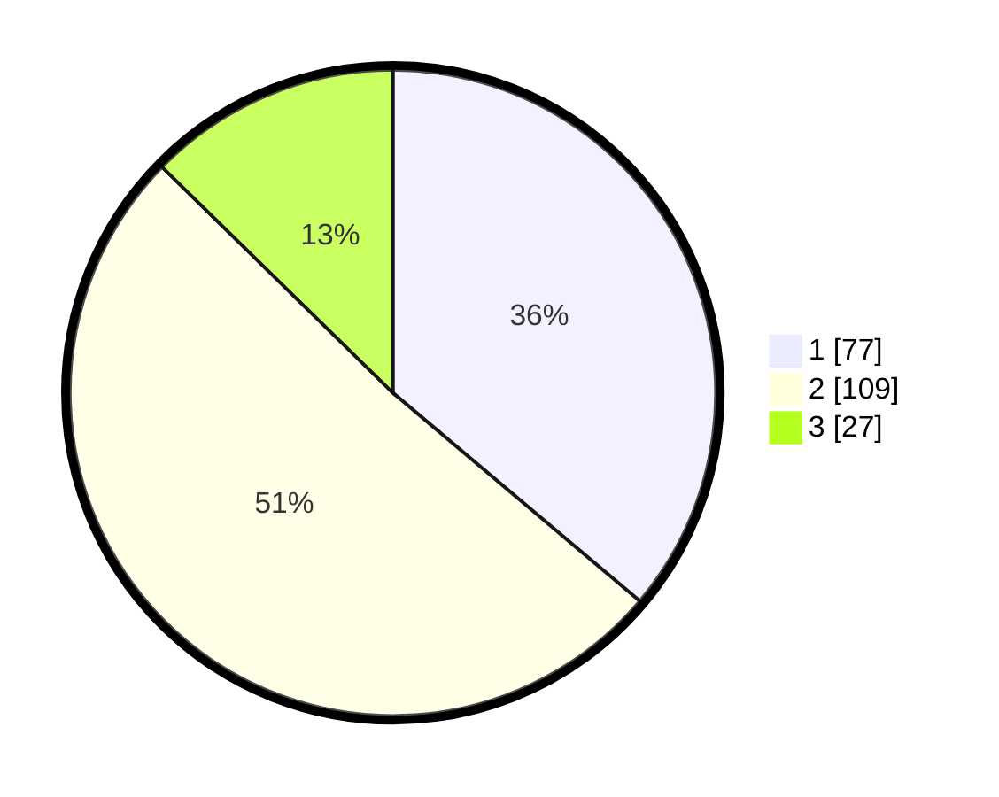

# Hasil

## Grafik

## Tabel

| No.    | Nama Paslon    | Suara | Suara (raw) | Persentase |
|:------ |:-------------- | -----:| -----------:| ----------:|
| 100025 | ANIES MUHAIMIN | 77    | [77][p-1]   | 36,15      |
| 100026 | PRABOWO GIBRAN | 109   | [109][p-2]  | 51,17      |
| 100027 | GANJAR MAHFUD  | 27    | [27][p-3]   | 12,68      |

[p-1]: https://github.com/gigit-pemilu/pemilu-2024/blob/main/pilpres/hitung-suara/sub/31-dki-jakarta/sub/72-jakarta-utara/sub/04-cilincing/sub/1005-semper-timur/sub/106-tps/sub/paslon-1.txt
[p-2]: https://github.com/gigit-pemilu/pemilu-2024/blob/main/pilpres/hitung-suara/sub/31-dki-jakarta/sub/72-jakarta-utara/sub/04-cilincing/sub/1005-semper-timur/sub/106-tps/sub/paslon-2.txt
[p-3]: https://github.com/gigit-pemilu/pemilu-2024/blob/main/pilpres/hitung-suara/sub/31-dki-jakarta/sub/72-jakarta-utara/sub/04-cilincing/sub/1005-semper-timur/sub/106-tps/sub/paslon-3.txt

## Foto C Plano

https://sirekap-obj-formc.kpu.go.id/b303/pemilu/ppwp/31/72/04/10/05/3172041005106-20240214-235542--e3ed7aa5-a7d0-4cc0-a3c6-04699b59a410.jpg

https://sirekap-obj-formc.kpu.go.id/b303/pemilu/ppwp/31/72/04/10/05/3172041005106-20240214-235653--6b3ec497-bf2e-4eab-b3f7-3df00403b6f3.jpg

https://sirekap-obj-formc.kpu.go.id/b303/pemilu/ppwp/31/72/04/10/05/3172041005106-20240214-235727--cc00a489-baf3-4260-b7f2-a3f7cb8b4130.jpg

## Metadata

| Key        | Value               |
| ---------- | ------------------- |
| Time Stamp | 2024-02-21 13:00:00 |

