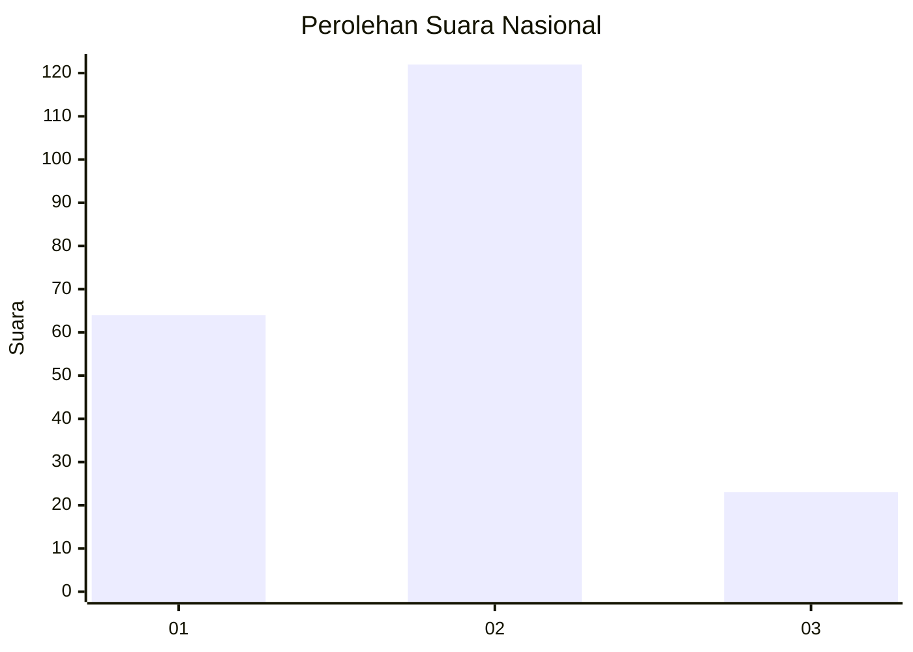
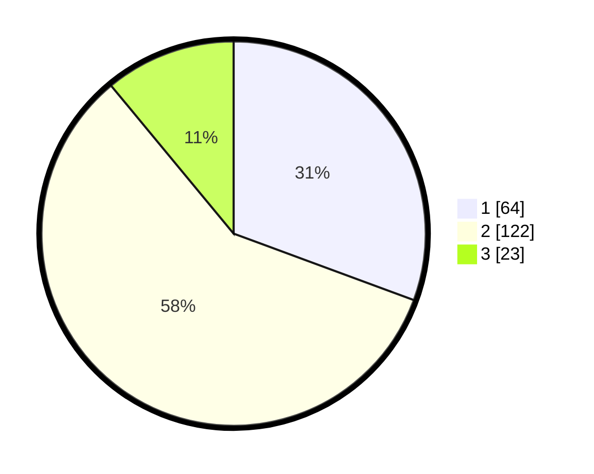

# Hasil

## Grafik

## Tabel

| No.    | Nama Paslon    | Suara | Suara (raw) | Persentase |
|:------ |:-------------- | -----:| -----------:| ----------:|
| 100025 | ANIES MUHAIMIN | 64    | [64][p-1]   | 30,62      |
| 100026 | PRABOWO GIBRAN | 122   | [122][p-2]  | 58,37      |
| 100027 | GANJAR MAHFUD  | 23    | [23][p-3]   | 11,00      |

[p-1]: https://github.com/gigit-pemilu/pemilu-2024/blob/main/pilpres/hitung-suara/sub/31-dki-jakarta/sub/72-jakarta-utara/sub/04-cilincing/sub/1005-semper-timur/sub/107-tps/sub/paslon-1.txt
[p-2]: https://github.com/gigit-pemilu/pemilu-2024/blob/main/pilpres/hitung-suara/sub/31-dki-jakarta/sub/72-jakarta-utara/sub/04-cilincing/sub/1005-semper-timur/sub/107-tps/sub/paslon-2.txt
[p-3]: https://github.com/gigit-pemilu/pemilu-2024/blob/main/pilpres/hitung-suara/sub/31-dki-jakarta/sub/72-jakarta-utara/sub/04-cilincing/sub/1005-semper-timur/sub/107-tps/sub/paslon-3.txt

## Foto C Plano

https://sirekap-obj-formc.kpu.go.id/ba2c/pemilu/ppwp/31/72/04/10/05/3172041005107-20240214-210642--f462c34a-0b50-44b3-ac7e-5b617582c1d3.jpg

https://sirekap-obj-formc.kpu.go.id/ba2c/pemilu/ppwp/31/72/04/10/05/3172041005107-20240214-233555--0d7a6c71-c236-49cc-af73-15577b2f3c3a.jpg

https://sirekap-obj-formc.kpu.go.id/ba2c/pemilu/ppwp/31/72/04/10/05/3172041005107-20240214-233724--a2f7ceca-8577-4ae0-a6b4-5d8270ed9d3a.jpg

## Metadata

| Key        | Value               |
| ---------- | ------------------- |
| Time Stamp | 2024-02-21 13:00:00 |

