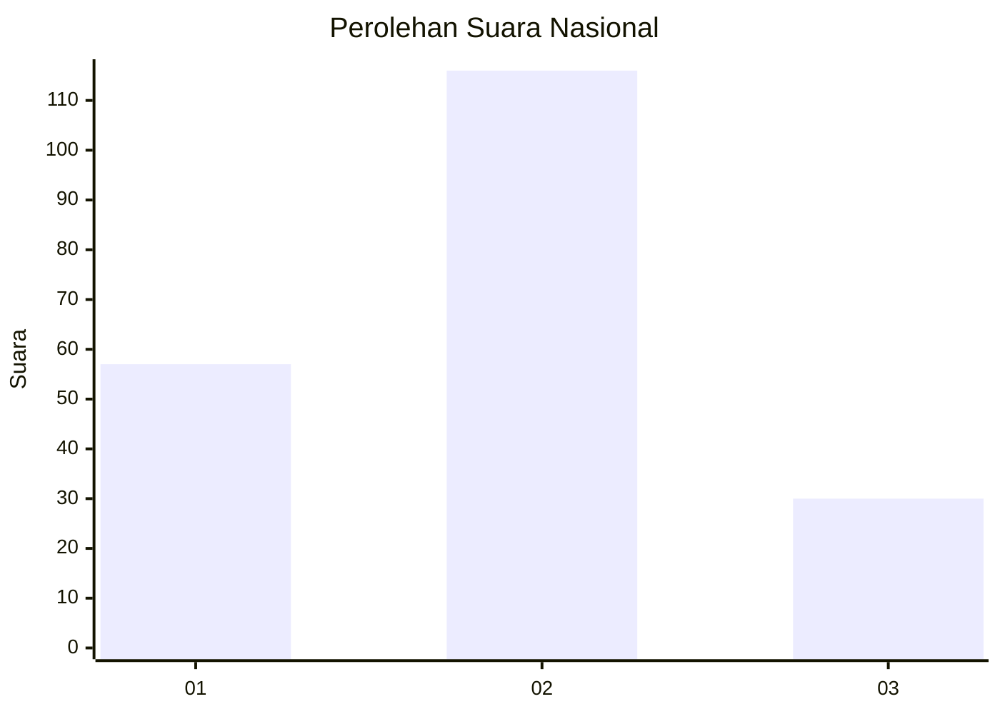
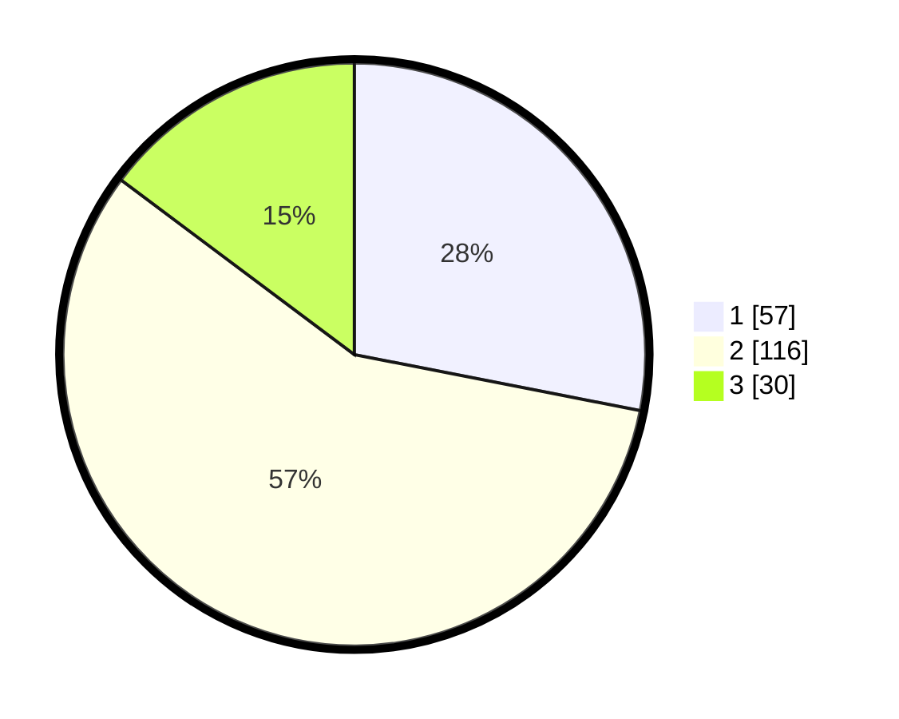

# Hasil

## Grafik

## Tabel

| No.    | Nama Paslon    | Suara | Suara (raw) | Persentase |
|:------ |:-------------- | -----:| -----------:| ----------:|
| 100025 | ANIES MUHAIMIN | 57    | [57][p-1]   | 28,08      |
| 100026 | PRABOWO GIBRAN | 116   | [116][p-2]  | 57,14      |
| 100027 | GANJAR MAHFUD  | 30    | [30][p-3]   | 14,78      |

[p-1]: https://github.com/gigit-pemilu/pemilu-2024/blob/main/pilpres/hitung-suara/sub/31-dki-jakarta/sub/72-jakarta-utara/sub/04-cilincing/sub/1005-semper-timur/sub/108-tps/sub/paslon-1.txt
[p-2]: https://github.com/gigit-pemilu/pemilu-2024/blob/main/pilpres/hitung-suara/sub/31-dki-jakarta/sub/72-jakarta-utara/sub/04-cilincing/sub/1005-semper-timur/sub/108-tps/sub/paslon-2.txt
[p-3]: https://github.com/gigit-pemilu/pemilu-2024/blob/main/pilpres/hitung-suara/sub/31-dki-jakarta/sub/72-jakarta-utara/sub/04-cilincing/sub/1005-semper-timur/sub/108-tps/sub/paslon-3.txt

## Foto C Plano

https://sirekap-obj-formc.kpu.go.id/528c/pemilu/ppwp/31/72/04/10/05/3172041005108-20240214-213917--667fcdd7-d5bb-4f4d-8546-2c6d1d0b7e3e.jpg

https://sirekap-obj-formc.kpu.go.id/528c/pemilu/ppwp/31/72/04/10/05/3172041005108-20240214-213534--3e899bc5-a965-4520-8778-a47345ec8e1e.jpg

https://sirekap-obj-formc.kpu.go.id/528c/pemilu/ppwp/31/72/04/10/05/3172041005108-20240214-212326--8e1f2358-1694-40fd-bdf2-451d4574c51f.jpg

## Metadata

| Key        | Value               |
| ---------- | ------------------- |
| Time Stamp | 2024-02-21 13:00:00 |

