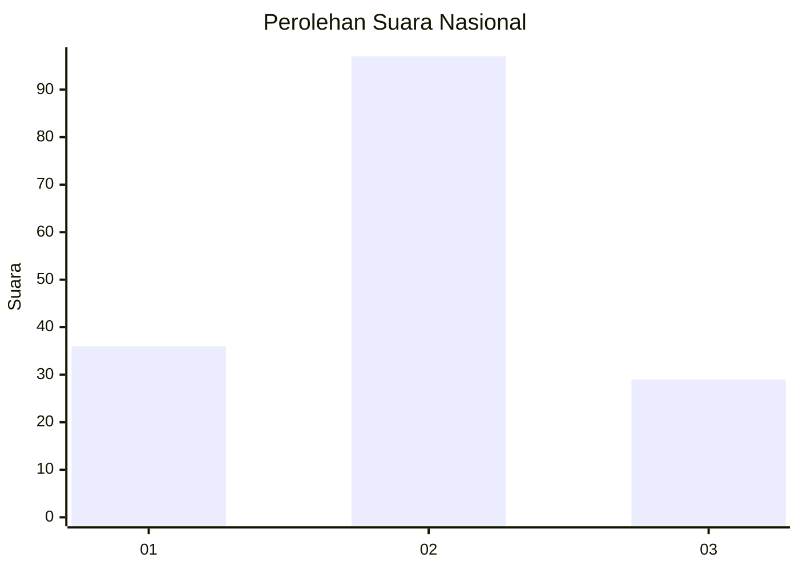
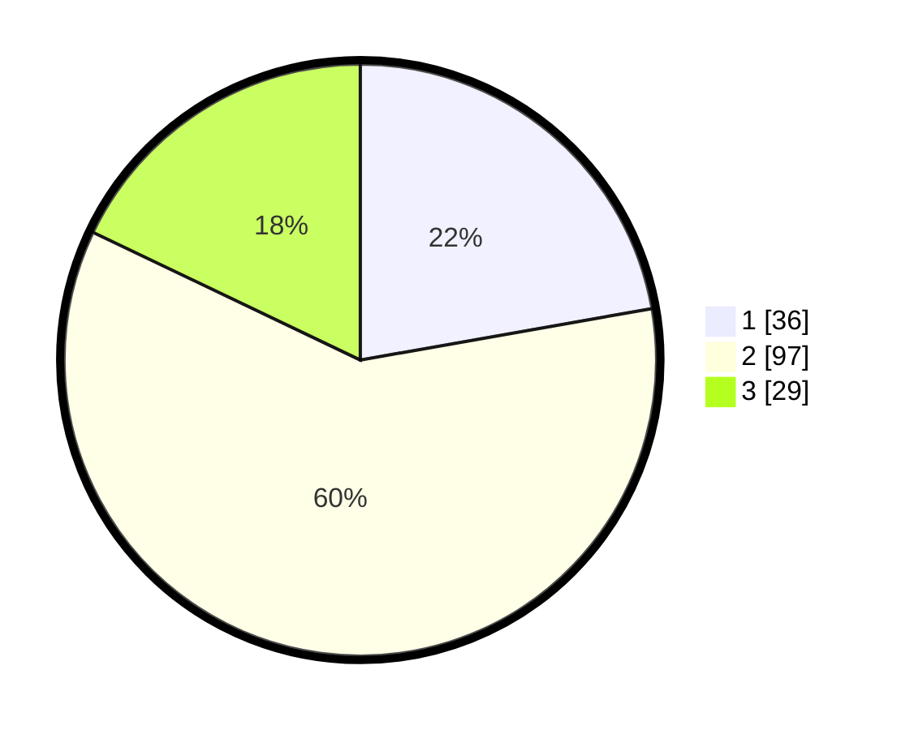

# Hasil

## Grafik

## Tabel

| No.    | Nama Paslon    | Suara | Suara (raw) | Persentase |
|:------ |:-------------- | -----:| -----------:| ----------:|
| 100025 | ANIES MUHAIMIN | 36    | [36][p-1]   | 22,22      |
| 100026 | PRABOWO GIBRAN | 97    | [97][p-2]   | 59,88      |
| 100027 | GANJAR MAHFUD  | 29    | [29][p-3]   | 17,90      |

[p-1]: https://github.com/gigit-pemilu/pemilu-2024/blob/main/pilpres/hitung-suara/sub/31-dki-jakarta/sub/72-jakarta-utara/sub/04-cilincing/sub/1005-semper-timur/sub/114-tps/sub/paslon-1.txt
[p-2]: https://github.com/gigit-pemilu/pemilu-2024/blob/main/pilpres/hitung-suara/sub/31-dki-jakarta/sub/72-jakarta-utara/sub/04-cilincing/sub/1005-semper-timur/sub/114-tps/sub/paslon-2.txt
[p-3]: https://github.com/gigit-pemilu/pemilu-2024/blob/main/pilpres/hitung-suara/sub/31-dki-jakarta/sub/72-jakarta-utara/sub/04-cilincing/sub/1005-semper-timur/sub/114-tps/sub/paslon-3.txt

## Foto C Plano

https://sirekap-obj-formc.kpu.go.id/f38d/pemilu/ppwp/31/72/04/10/05/3172041005114-20240214-210709--d377c723-26b5-4f4f-9ce0-c6081648b82e.jpg

https://sirekap-obj-formc.kpu.go.id/f38d/pemilu/ppwp/31/72/04/10/05/3172041005114-20240214-201324--a59c103a-ad26-44aa-8b49-cfb8eff448c8.jpg

https://sirekap-obj-formc.kpu.go.id/f38d/pemilu/ppwp/31/72/04/10/05/3172041005114-20240214-210431--53696353-d9c0-4aa7-a10b-d40844baef91.jpg

## Metadata

| Key        | Value               |
| ---------- | ------------------- |
| Time Stamp | 2024-02-21 13:00:00 |

