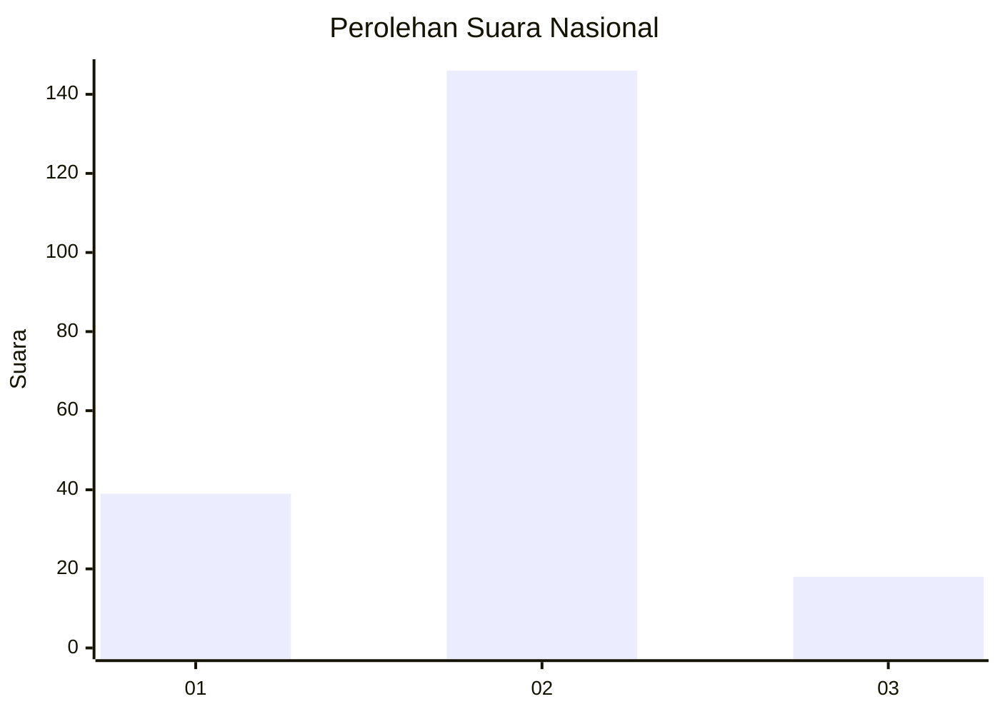
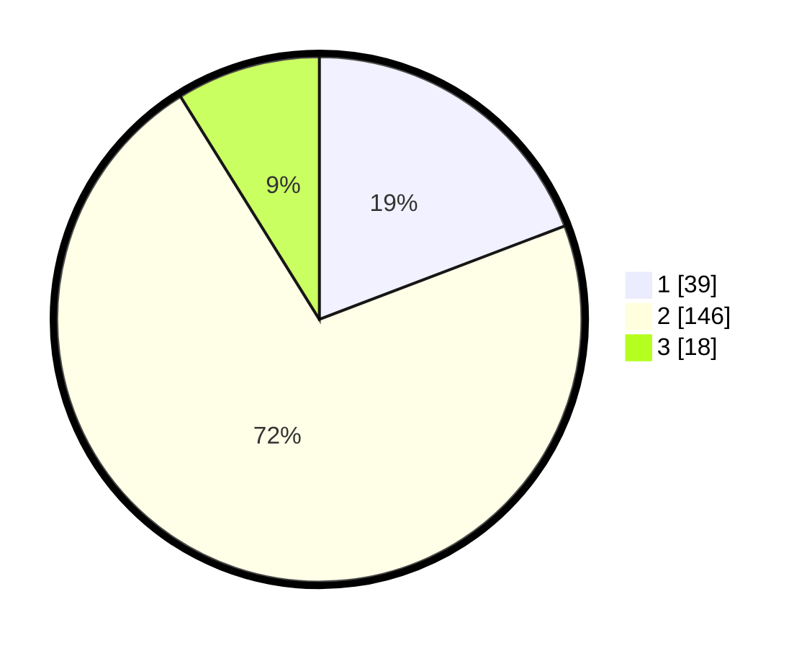

# Hasil

## Grafik

## Tabel

| No.    | Nama Paslon    | Suara | Suara (raw) | Persentase |
|:------ |:-------------- | -----:| -----------:| ----------:|
| 100025 | ANIES MUHAIMIN | 39    | [39][p-1]   | 19,21      |
| 100026 | PRABOWO GIBRAN | 146   | [146][p-2]  | 71,92      |
| 100027 | GANJAR MAHFUD  | 18    | [18][p-3]   | 8,87       |

[p-1]: https://github.com/gigit-pemilu/pemilu-2024/blob/main/pilpres/hitung-suara/sub/31-dki-jakarta/sub/72-jakarta-utara/sub/04-cilincing/sub/1005-semper-timur/sub/120-tps/sub/paslon-1.txt
[p-2]: https://github.com/gigit-pemilu/pemilu-2024/blob/main/pilpres/hitung-suara/sub/31-dki-jakarta/sub/72-jakarta-utara/sub/04-cilincing/sub/1005-semper-timur/sub/120-tps/sub/paslon-2.txt
[p-3]: https://github.com/gigit-pemilu/pemilu-2024/blob/main/pilpres/hitung-suara/sub/31-dki-jakarta/sub/72-jakarta-utara/sub/04-cilincing/sub/1005-semper-timur/sub/120-tps/sub/paslon-3.txt

## Foto C Plano

https://sirekap-obj-formc.kpu.go.id/1d42/pemilu/ppwp/31/72/04/10/05/3172041005120-20240214-235202--eb72f752-9018-462d-81bb-865154da0ecc.jpg

https://sirekap-obj-formc.kpu.go.id/1d42/pemilu/ppwp/31/72/04/10/05/3172041005120-20240214-235720--e0c259d9-2e20-497f-b991-ae6dbc803f32.jpg

https://sirekap-obj-formc.kpu.go.id/1d42/pemilu/ppwp/31/72/04/10/05/3172041005120-20240214-235829--5f7c116c-3116-427c-9447-82dce4296780.jpg

## Metadata

| Key        | Value               |
| ---------- | ------------------- |
| Time Stamp | 2024-02-20 23:00:00 |

