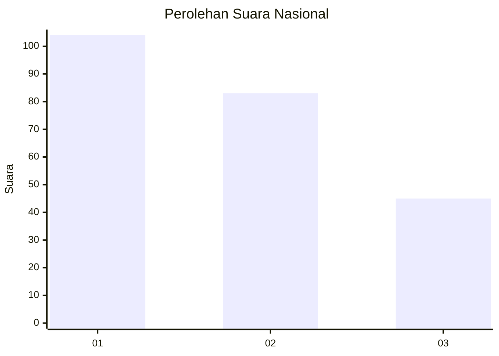
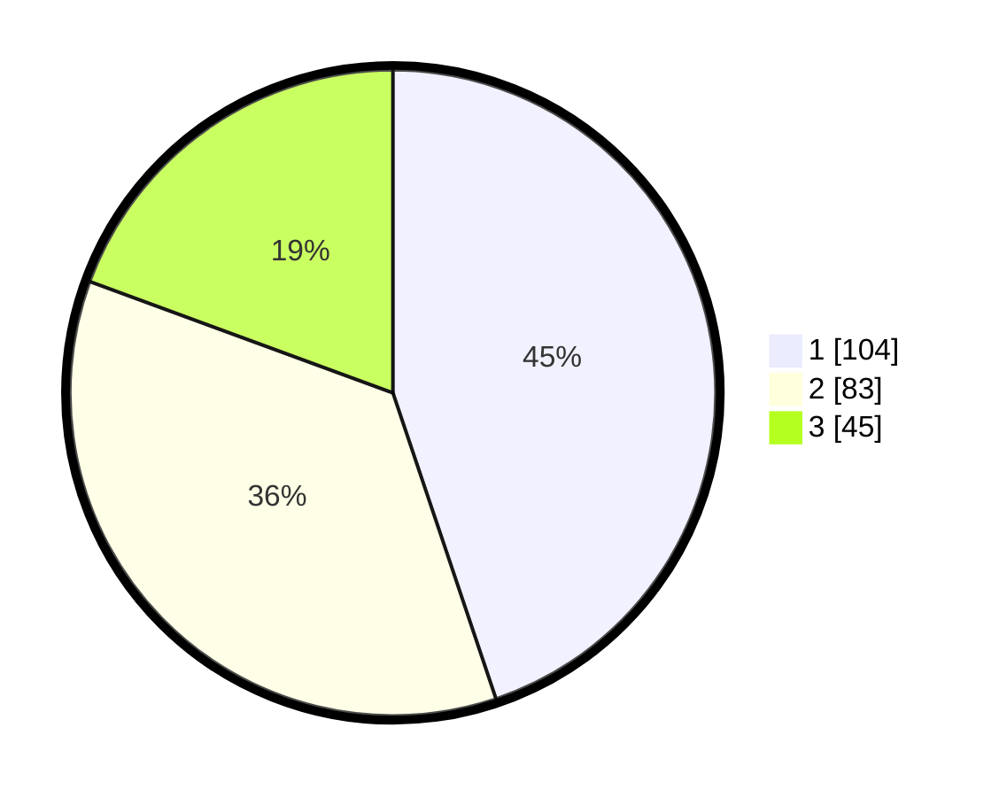

# Hasil

## Grafik

## Tabel

| No.    | Nama Paslon    | Suara | Suara (raw) | Persentase |
|:------ |:-------------- | -----:| -----------:| ----------:|
| 100025 | ANIES MUHAIMIN | 104   | [104][p-1]  | 44,83      |
| 100026 | PRABOWO GIBRAN | 83    | [83][p-2]   | 35,78      |
| 100027 | GANJAR MAHFUD  | 45    | [45][p-3]   | 19,40      |

[p-1]: https://github.com/gigit-pemilu/pemilu-2024/blob/main/pilpres/hitung-suara/sub/31-dki-jakarta/sub/72-jakarta-utara/sub/04-cilincing/sub/1006-rorotan/sub/001-tps/sub/paslon-1.txt
[p-2]: https://github.com/gigit-pemilu/pemilu-2024/blob/main/pilpres/hitung-suara/sub/31-dki-jakarta/sub/72-jakarta-utara/sub/04-cilincing/sub/1006-rorotan/sub/001-tps/sub/paslon-2.txt
[p-3]: https://github.com/gigit-pemilu/pemilu-2024/blob/main/pilpres/hitung-suara/sub/31-dki-jakarta/sub/72-jakarta-utara/sub/04-cilincing/sub/1006-rorotan/sub/001-tps/sub/paslon-3.txt

## Foto C Plano

https://sirekap-obj-formc.kpu.go.id/e05e/pemilu/ppwp/31/72/04/10/06/3172041006001-20240214-221435--c1499333-b781-4d98-bf3a-3d179fef8d0e.jpg

https://sirekap-obj-formc.kpu.go.id/e05e/pemilu/ppwp/31/72/04/10/06/3172041006001-20240214-221652--88860ee7-997b-4051-9232-430a527ca3fe.jpg

https://sirekap-obj-formc.kpu.go.id/e05e/pemilu/ppwp/31/72/04/10/06/3172041006001-20240214-221854--73ec3837-0ee7-43ae-b721-cf9dab9cc6db.jpg

## Metadata

| Key        | Value               |
| ---------- | ------------------- |
| Time Stamp | 2024-02-21 19:00:00 |

