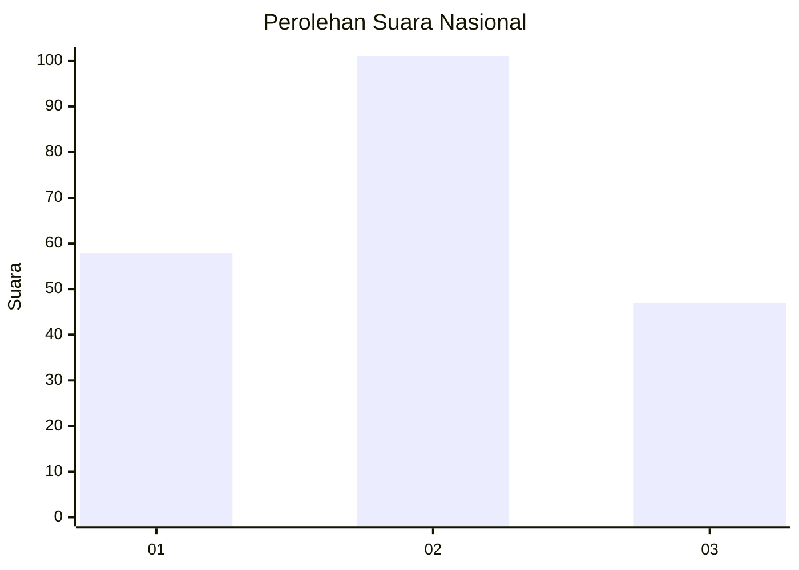
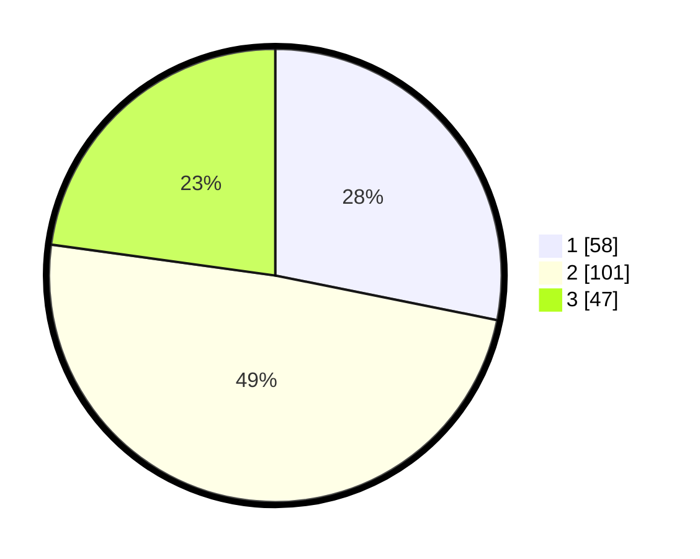

# Hasil

## Grafik

## Tabel

| No.    | Nama Paslon    | Suara | Suara (raw) | Persentase |
|:------ |:-------------- | -----:| -----------:| ----------:|
| 100025 | ANIES MUHAIMIN | 58    | [58][p-1]   | 28,16      |
| 100026 | PRABOWO GIBRAN | 101   | [101][p-2]  | 49,03      |
| 100027 | GANJAR MAHFUD  | 47    | [47][p-3]   | 22,82      |

[p-1]: https://github.com/gigit-pemilu/pemilu-2024/blob/main/pilpres/hitung-suara/sub/31-dki-jakarta/sub/72-jakarta-utara/sub/04-cilincing/sub/1006-rorotan/sub/011-tps/sub/paslon-1.txt
[p-2]: https://github.com/gigit-pemilu/pemilu-2024/blob/main/pilpres/hitung-suara/sub/31-dki-jakarta/sub/72-jakarta-utara/sub/04-cilincing/sub/1006-rorotan/sub/011-tps/sub/paslon-2.txt
[p-3]: https://github.com/gigit-pemilu/pemilu-2024/blob/main/pilpres/hitung-suara/sub/31-dki-jakarta/sub/72-jakarta-utara/sub/04-cilincing/sub/1006-rorotan/sub/011-tps/sub/paslon-3.txt

## Foto C Plano

https://sirekap-obj-formc.kpu.go.id/d78c/pemilu/ppwp/31/72/04/10/06/3172041006011-20240214-200139--3f3b6244-084e-44ce-8af6-8d00c5d4cbf4.jpg

https://sirekap-obj-formc.kpu.go.id/d78c/pemilu/ppwp/31/72/04/10/06/3172041006011-20240214-204529--accac65b-b1e6-4cd6-9341-29852c7523fe.jpg

https://sirekap-obj-formc.kpu.go.id/d78c/pemilu/ppwp/31/72/04/10/06/3172041006011-20240214-204618--d044dcd5-4acf-47d6-b904-00fe839e9c0d.jpg

## Metadata

| Key        | Value               |
| ---------- | ------------------- |
| Time Stamp | 2024-02-21 19:00:00 |

