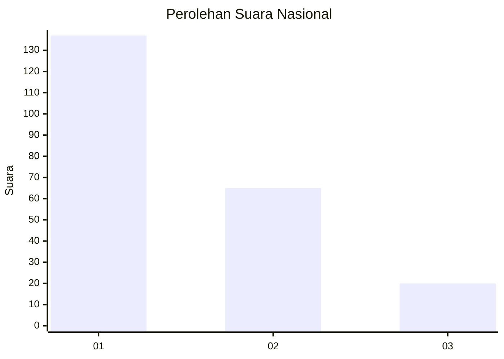
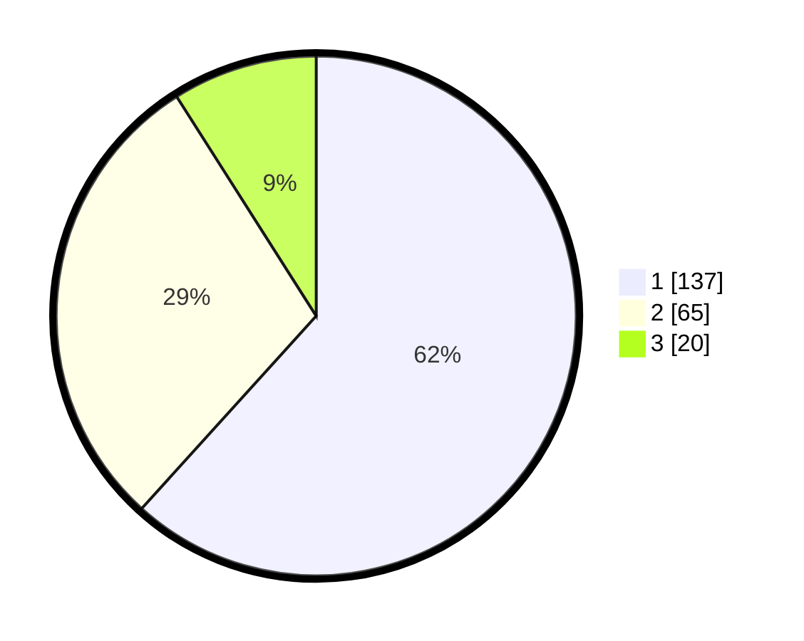

# Hasil

## Grafik

## Tabel

| No.    | Nama Paslon    | Suara | Suara (raw) | Persentase |
|:------ |:-------------- | -----:| -----------:| ----------:|
| 100025 | ANIES MUHAIMIN | 137   | [137][p-1]  | 61,71      |
| 100026 | PRABOWO GIBRAN | 65    | [65][p-2]   | 29,28      |
| 100027 | GANJAR MAHFUD  | 20    | [20][p-3]   | 9,01       |

[p-1]: https://github.com/gigit-pemilu/pemilu-2024/blob/main/pilpres/hitung-suara/sub/31-dki-jakarta/sub/72-jakarta-utara/sub/04-cilincing/sub/1006-rorotan/sub/015-tps/sub/paslon-1.txt
[p-2]: https://github.com/gigit-pemilu/pemilu-2024/blob/main/pilpres/hitung-suara/sub/31-dki-jakarta/sub/72-jakarta-utara/sub/04-cilincing/sub/1006-rorotan/sub/015-tps/sub/paslon-2.txt
[p-3]: https://github.com/gigit-pemilu/pemilu-2024/blob/main/pilpres/hitung-suara/sub/31-dki-jakarta/sub/72-jakarta-utara/sub/04-cilincing/sub/1006-rorotan/sub/015-tps/sub/paslon-3.txt

## Foto C Plano

https://sirekap-obj-formc.kpu.go.id/cb21/pemilu/ppwp/31/72/04/10/06/3172041006015-20240214-230146--c9fab9ce-2d95-484a-92a0-062934ee0bc3.jpg

https://sirekap-obj-formc.kpu.go.id/cb21/pemilu/ppwp/31/72/04/10/06/3172041006015-20240214-230305--cf8241a4-2526-487d-be10-23bf99f7c590.jpg

https://sirekap-obj-formc.kpu.go.id/cb21/pemilu/ppwp/31/72/04/10/06/3172041006015-20240214-230425--f8ffa7b2-3304-40eb-b6f8-b2d061a14fe4.jpg

## Metadata

| Key        | Value               |
| ---------- | ------------------- |
| Time Stamp | 2024-02-21 19:00:00 |

