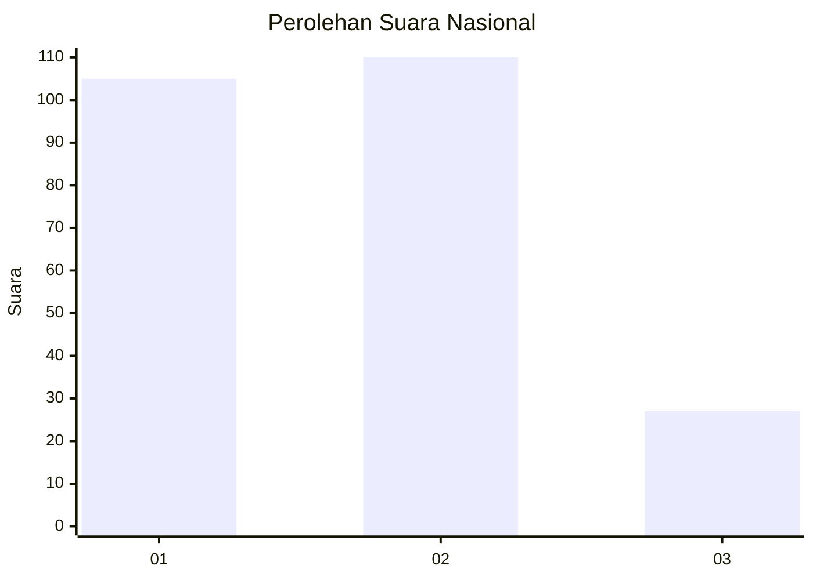
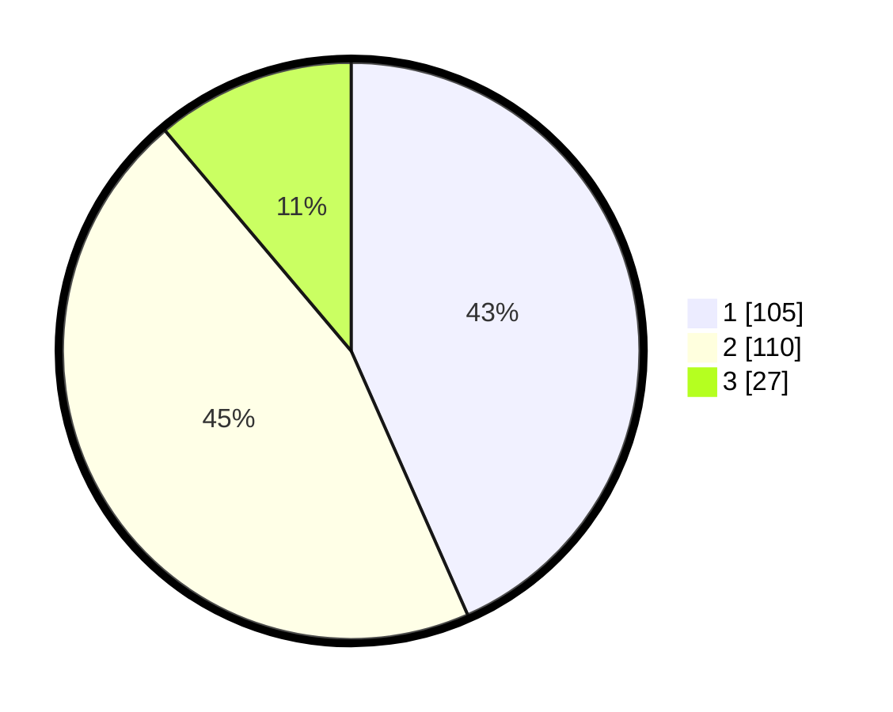

# Hasil

## Grafik

## Tabel

| No.    | Nama Paslon    | Suara | Suara (raw) | Persentase |
|:------ |:-------------- | -----:| -----------:| ----------:|
| 100025 | ANIES MUHAIMIN | 105   | [105][p-1]  | 43,39      |
| 100026 | PRABOWO GIBRAN | 110   | [110][p-2]  | 45,45      |
| 100027 | GANJAR MAHFUD  | 27    | [27][p-3]   | 11,16      |

[p-1]: https://github.com/gigit-pemilu/pemilu-2024/blob/main/pilpres/hitung-suara/sub/31-dki-jakarta/sub/72-jakarta-utara/sub/04-cilincing/sub/1006-rorotan/sub/018-tps/sub/paslon-1.txt
[p-2]: https://github.com/gigit-pemilu/pemilu-2024/blob/main/pilpres/hitung-suara/sub/31-dki-jakarta/sub/72-jakarta-utara/sub/04-cilincing/sub/1006-rorotan/sub/018-tps/sub/paslon-2.txt
[p-3]: https://github.com/gigit-pemilu/pemilu-2024/blob/main/pilpres/hitung-suara/sub/31-dki-jakarta/sub/72-jakarta-utara/sub/04-cilincing/sub/1006-rorotan/sub/018-tps/sub/paslon-3.txt

## Foto C Plano

https://sirekap-obj-formc.kpu.go.id/f9fd/pemilu/ppwp/31/72/04/10/06/3172041006018-20240214-225040--3c8780be-a131-48b3-a6ce-d50fca1f3852.jpg

https://sirekap-obj-formc.kpu.go.id/f9fd/pemilu/ppwp/31/72/04/10/06/3172041006018-20240214-225258--aa845a3f-96a0-43f8-bf70-9907f06e4e32.jpg

https://sirekap-obj-formc.kpu.go.id/f9fd/pemilu/ppwp/31/72/04/10/06/3172041006018-20240214-225508--f0fe00b7-5542-4f34-b0e6-5e42cc0eaeb7.jpg

## Metadata

| Key        | Value               |
| ---------- | ------------------- |
| Time Stamp | 2024-02-21 19:00:00 |

