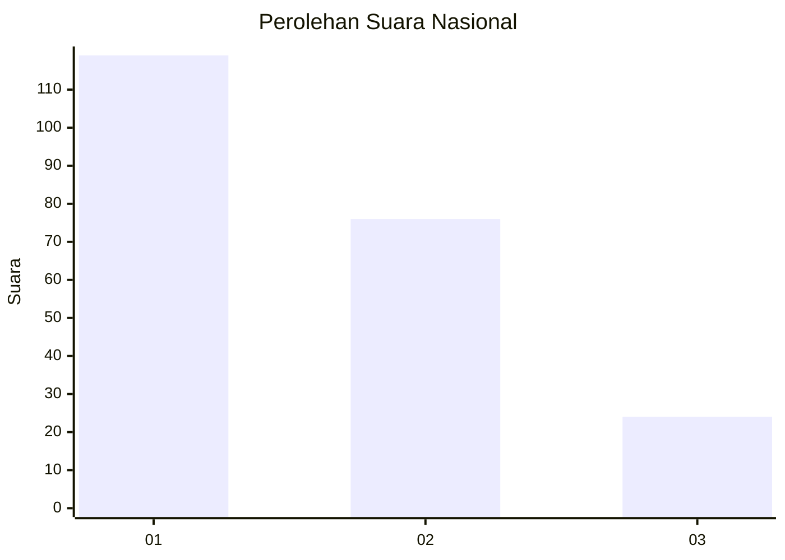
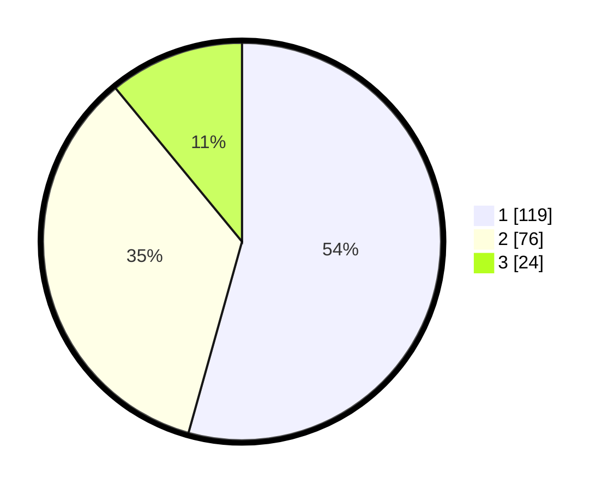

# Hasil

## Grafik

## Tabel

| No.    | Nama Paslon    | Suara | Suara (raw) | Persentase |
|:------ |:-------------- | -----:| -----------:| ----------:|
| 100025 | ANIES MUHAIMIN | 119   | [119][p-1]  | 54,34      |
| 100026 | PRABOWO GIBRAN | 76    | [76][p-2]   | 34,70      |
| 100027 | GANJAR MAHFUD  | 24    | [24][p-3]   | 10,96      |

[p-1]: https://github.com/gigit-pemilu/pemilu-2024/blob/main/pilpres/hitung-suara/sub/31-dki-jakarta/sub/72-jakarta-utara/sub/04-cilincing/sub/1006-rorotan/sub/020-tps/sub/paslon-1.txt
[p-2]: https://github.com/gigit-pemilu/pemilu-2024/blob/main/pilpres/hitung-suara/sub/31-dki-jakarta/sub/72-jakarta-utara/sub/04-cilincing/sub/1006-rorotan/sub/020-tps/sub/paslon-2.txt
[p-3]: https://github.com/gigit-pemilu/pemilu-2024/blob/main/pilpres/hitung-suara/sub/31-dki-jakarta/sub/72-jakarta-utara/sub/04-cilincing/sub/1006-rorotan/sub/020-tps/sub/paslon-3.txt

## Foto C Plano

https://sirekap-obj-formc.kpu.go.id/758b/pemilu/ppwp/31/72/04/10/06/3172041006020-20240215-015148--d92b87c2-1775-4d9d-90cf-142bd0c5f6ba.jpg

https://sirekap-obj-formc.kpu.go.id/758b/pemilu/ppwp/31/72/04/10/06/3172041006020-20240215-015435--485fb40d-5cfc-45b9-9a7c-d34ecc451c61.jpg

https://sirekap-obj-formc.kpu.go.id/758b/pemilu/ppwp/31/72/04/10/06/3172041006020-20240215-015651--58677af4-e6b1-4f92-a801-60f412bd6ed2.jpg

## Metadata

| Key        | Value               |
| ---------- | ------------------- |
| Time Stamp | 2024-02-21 17:00:00 |

