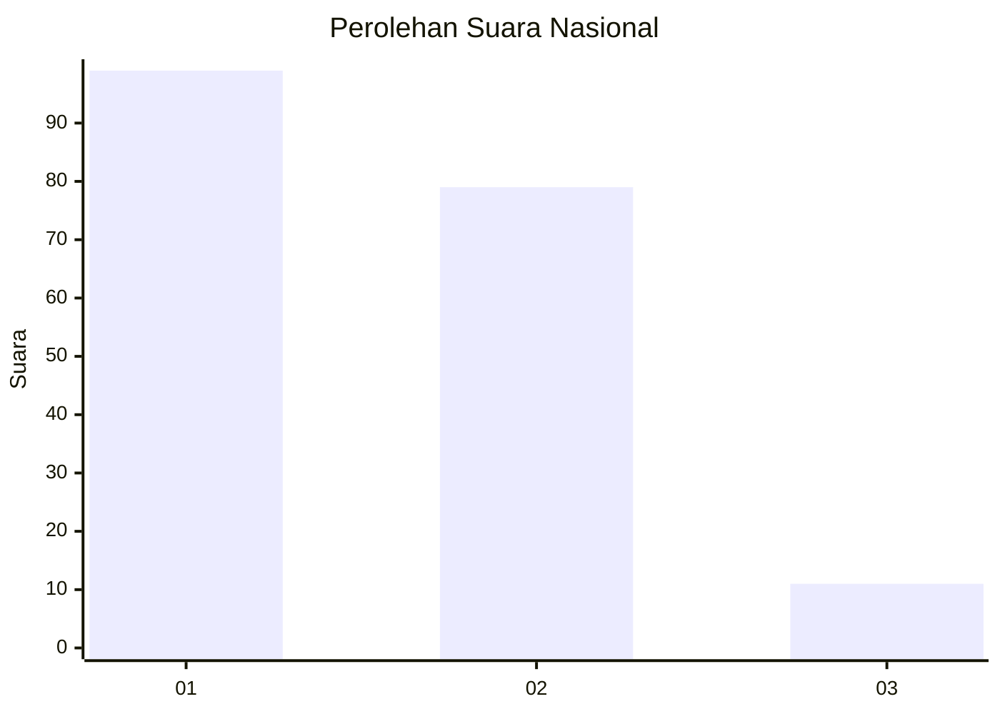
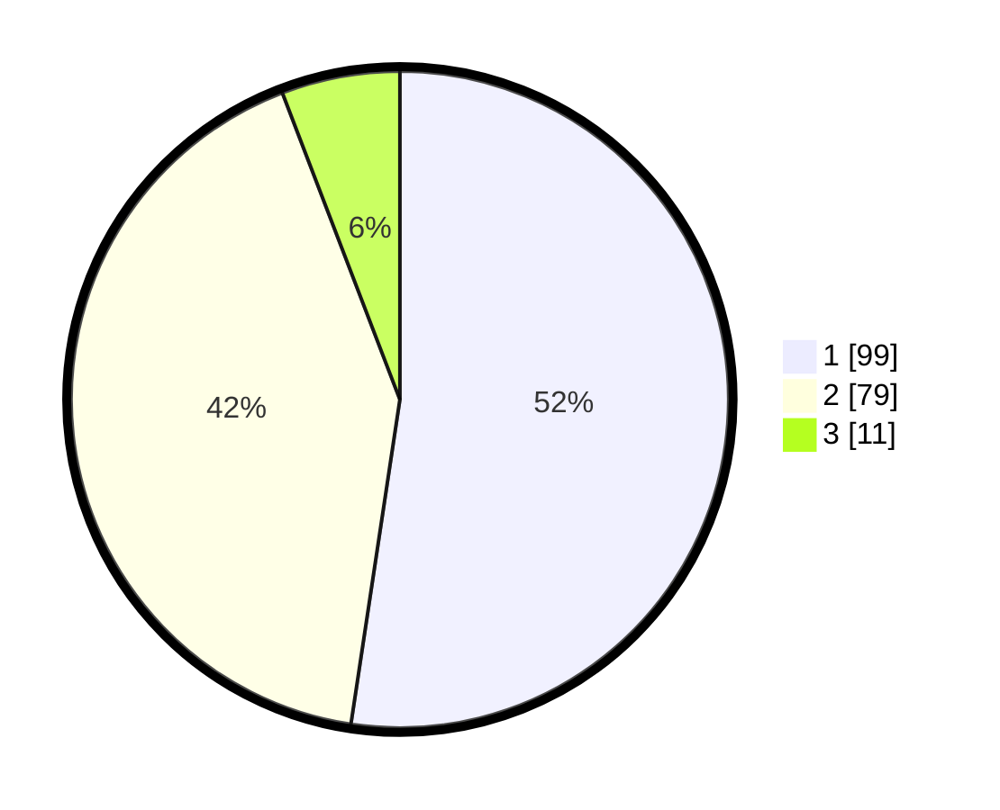

# Hasil

## Grafik

## Tabel

| No.    | Nama Paslon    | Suara | Suara (raw) | Persentase |
|:------ |:-------------- | -----:| -----------:| ----------:|
| 100025 | ANIES MUHAIMIN | 99    | [99][p-1]   | 52,38      |
| 100026 | PRABOWO GIBRAN | 79    | [79][p-2]   | 41,80      |
| 100027 | GANJAR MAHFUD  | 11    | [11][p-3]   | 5,82       |

[p-1]: https://github.com/gigit-pemilu/pemilu-2024/blob/main/pilpres/hitung-suara/sub/31-dki-jakarta/sub/72-jakarta-utara/sub/04-cilincing/sub/1006-rorotan/sub/032-tps/sub/paslon-1.txt
[p-2]: https://github.com/gigit-pemilu/pemilu-2024/blob/main/pilpres/hitung-suara/sub/31-dki-jakarta/sub/72-jakarta-utara/sub/04-cilincing/sub/1006-rorotan/sub/032-tps/sub/paslon-2.txt
[p-3]: https://github.com/gigit-pemilu/pemilu-2024/blob/main/pilpres/hitung-suara/sub/31-dki-jakarta/sub/72-jakarta-utara/sub/04-cilincing/sub/1006-rorotan/sub/032-tps/sub/paslon-3.txt

## Foto C Plano

https://sirekap-obj-formc.kpu.go.id/f099/pemilu/ppwp/31/72/04/10/06/3172041006032-20240214-221506--48d4e361-cf68-42ad-aa1d-ec26e12c73d3.jpg

https://sirekap-obj-formc.kpu.go.id/f099/pemilu/ppwp/31/72/04/10/06/3172041006032-20240214-225056--05c4868a-53fc-487c-bda3-5f657091f5ec.jpg

https://sirekap-obj-formc.kpu.go.id/f099/pemilu/ppwp/31/72/04/10/06/3172041006032-20240214-225154--fa3ef3dc-b17c-403a-a64c-2379e84f07b1.jpg

## Metadata

| Key        | Value               |
| ---------- | ------------------- |
| Time Stamp | 2024-02-21 19:00:00 |

