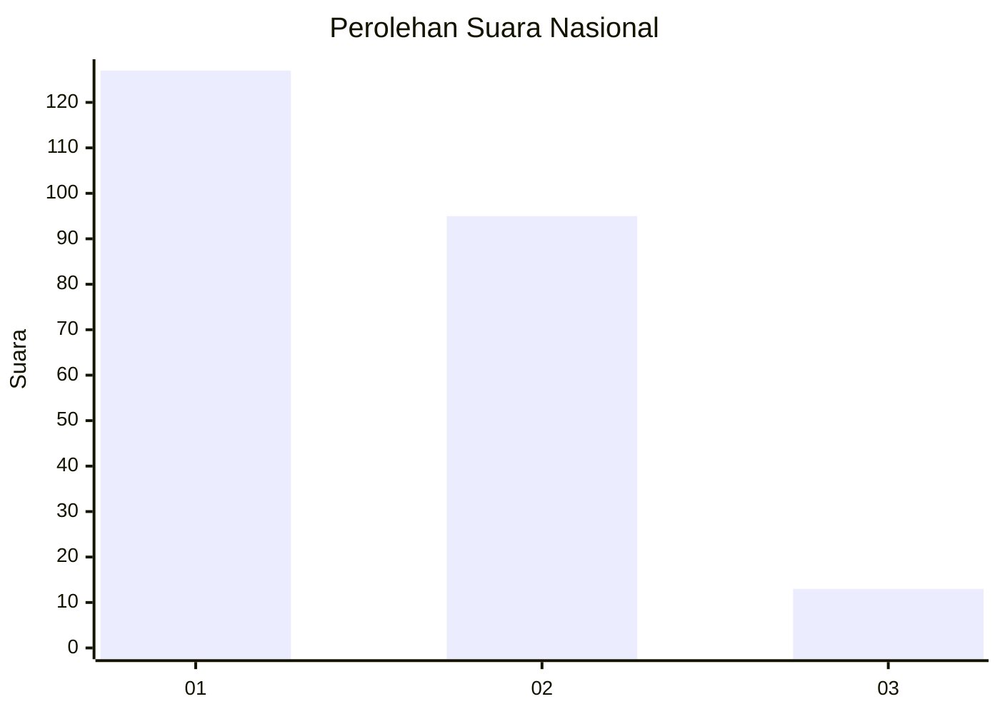
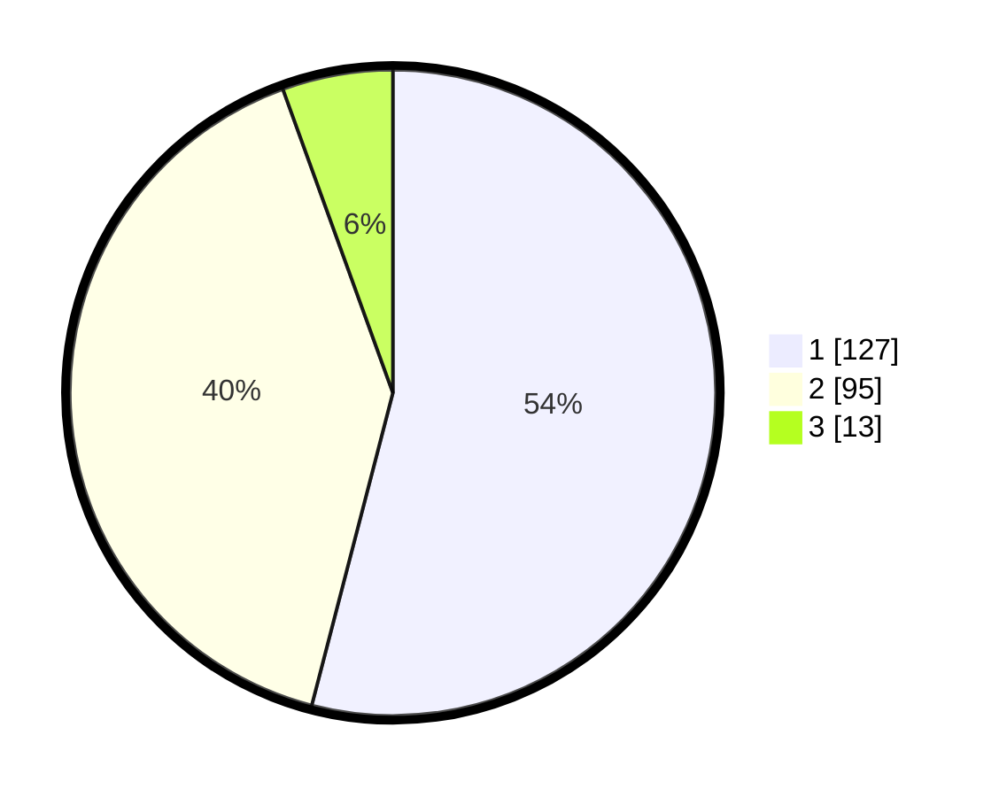

# Hasil

## Grafik

## Tabel

| No.    | Nama Paslon    | Suara | Suara (raw) | Persentase |
|:------ |:-------------- | -----:| -----------:| ----------:|
| 100025 | ANIES MUHAIMIN | 127   | [127][p-1]  | 54,04      |
| 100026 | PRABOWO GIBRAN | 95    | [95][p-2]   | 40,43      |
| 100027 | GANJAR MAHFUD  | 13    | [13][p-3]   | 5,53       |

[p-1]: https://github.com/gigit-pemilu/pemilu-2024/blob/main/pilpres/hitung-suara/sub/31-dki-jakarta/sub/72-jakarta-utara/sub/04-cilincing/sub/1006-rorotan/sub/054-tps/sub/paslon-1.txt
[p-2]: https://github.com/gigit-pemilu/pemilu-2024/blob/main/pilpres/hitung-suara/sub/31-dki-jakarta/sub/72-jakarta-utara/sub/04-cilincing/sub/1006-rorotan/sub/054-tps/sub/paslon-2.txt
[p-3]: https://github.com/gigit-pemilu/pemilu-2024/blob/main/pilpres/hitung-suara/sub/31-dki-jakarta/sub/72-jakarta-utara/sub/04-cilincing/sub/1006-rorotan/sub/054-tps/sub/paslon-3.txt

## Foto C Plano

https://sirekap-obj-formc.kpu.go.id/250d/pemilu/ppwp/31/72/04/10/06/3172041006054-20240215-011329--b1c1c833-87c4-427f-9b22-1b40490a0e93.jpg

https://sirekap-obj-formc.kpu.go.id/250d/pemilu/ppwp/31/72/04/10/06/3172041006054-20240215-011400--d4c42d80-6364-4b70-a564-cfe8250b2877.jpg

https://sirekap-obj-formc.kpu.go.id/250d/pemilu/ppwp/31/72/04/10/06/3172041006054-20240215-011425--64f853f6-6471-46d2-85ef-3d3f46481c41.jpg

## Metadata

| Key        | Value               |
| ---------- | ------------------- |
| Time Stamp | 2024-02-21 19:00:00 |

