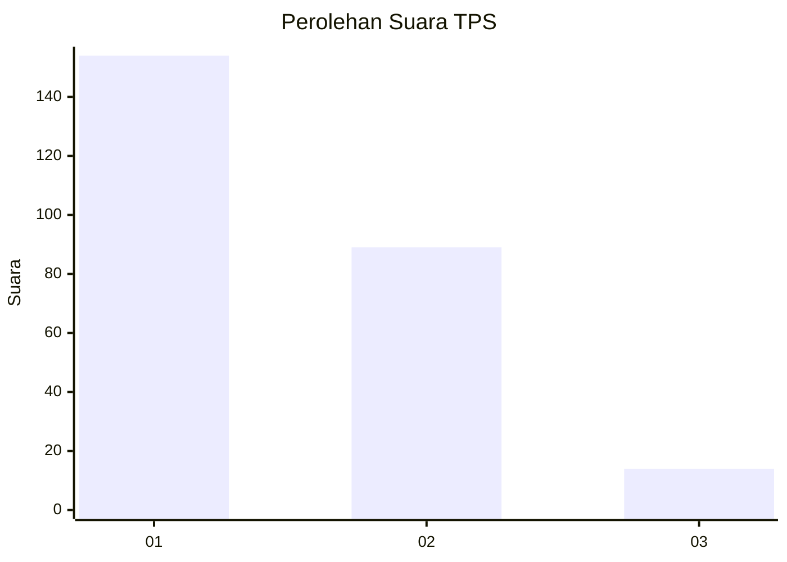
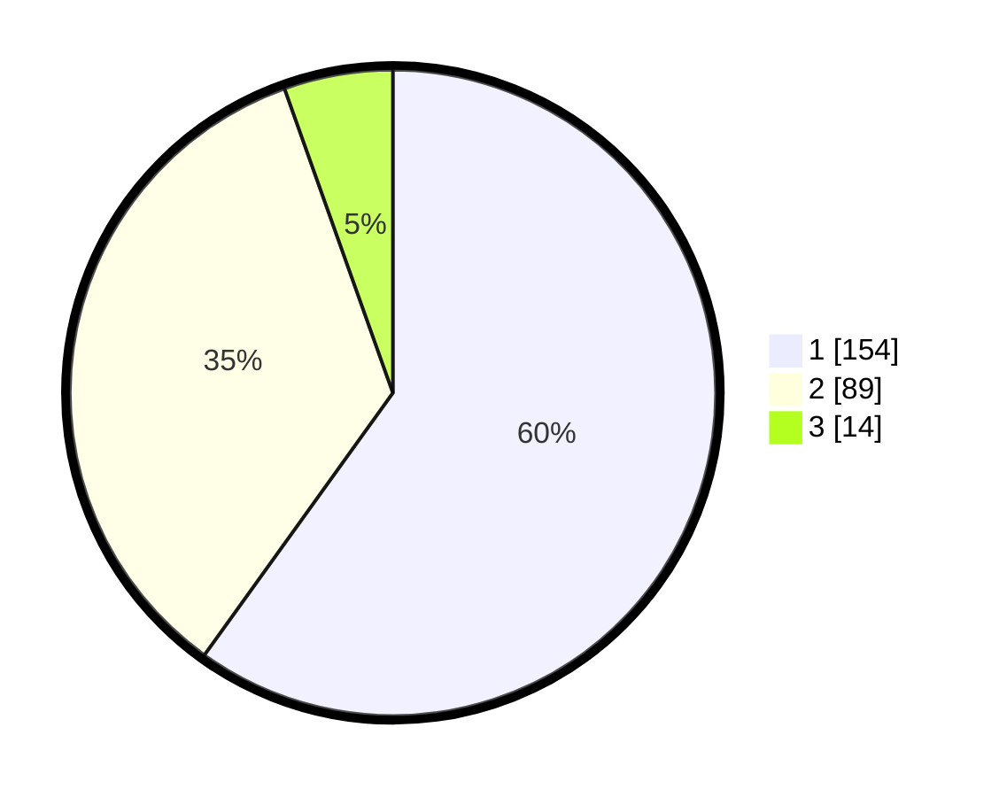

# Hasil

## Grafik

## Tabel

| No. | Nama Paslon    | Suara | Suara (raw) | Persentase |
|:--- |:-------------- | -----:| -----------:| ----------:|
| 1   | ANIES MUHAIMIN | 154   | [154][p-1]  | 59,92      |
| 2   | PRABOWO GIBRAN | 89    | [89][p-2]   | 34,63      |
| 3   | GANJAR MAHFUD  | 14    | [14][p-3]   | 5,45       |

[p-1]: https://github.com/gigit-pemilu/pemilu-2024-31-dki-jakarta/blob/main/pilpres/hitung-suara/sub/31-dki-jakarta/sub/72-jakarta-utara/sub/04-cilincing/sub/1006-rorotan/sub/064-tps/sub/paslon-1.txt
[p-2]: https://github.com/gigit-pemilu/pemilu-2024-31-dki-jakarta/blob/main/pilpres/hitung-suara/sub/31-dki-jakarta/sub/72-jakarta-utara/sub/04-cilincing/sub/1006-rorotan/sub/064-tps/sub/paslon-2.txt
[p-3]: https://github.com/gigit-pemilu/pemilu-2024-31-dki-jakarta/blob/main/pilpres/hitung-suara/sub/31-dki-jakarta/sub/72-jakarta-utara/sub/04-cilincing/sub/1006-rorotan/sub/064-tps/sub/paslon-3.txt

## Foto C Plano

https://sirekap-obj-formc.kpu.go.id/a6b6/pemilu/ppwp/31/72/04/10/06/3172041006064-20240215-010325--56c7bb89-9c4d-4b89-bfdb-60e3e10d09a2.jpg

https://sirekap-obj-formc.kpu.go.id/a6b6/pemilu/ppwp/31/72/04/10/06/3172041006064-20240214-211148--05f9cb9a-e677-4982-ae65-dca4043e9901.jpg

https://sirekap-obj-formc.kpu.go.id/a6b6/pemilu/ppwp/31/72/04/10/06/3172041006064-20240214-225857--d4e0d1e8-babe-4cbe-9bd5-ab25d592cbb8.jpg

## Metadata

| Key        | Value               |
| ---------- | ------------------- |
| Time Stamp | 2024-02-21 19:00:00 |

