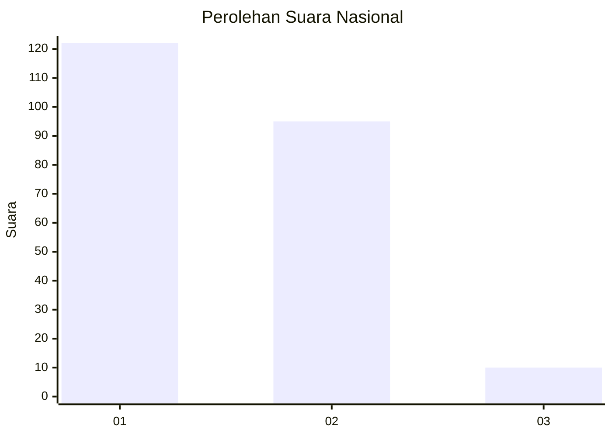
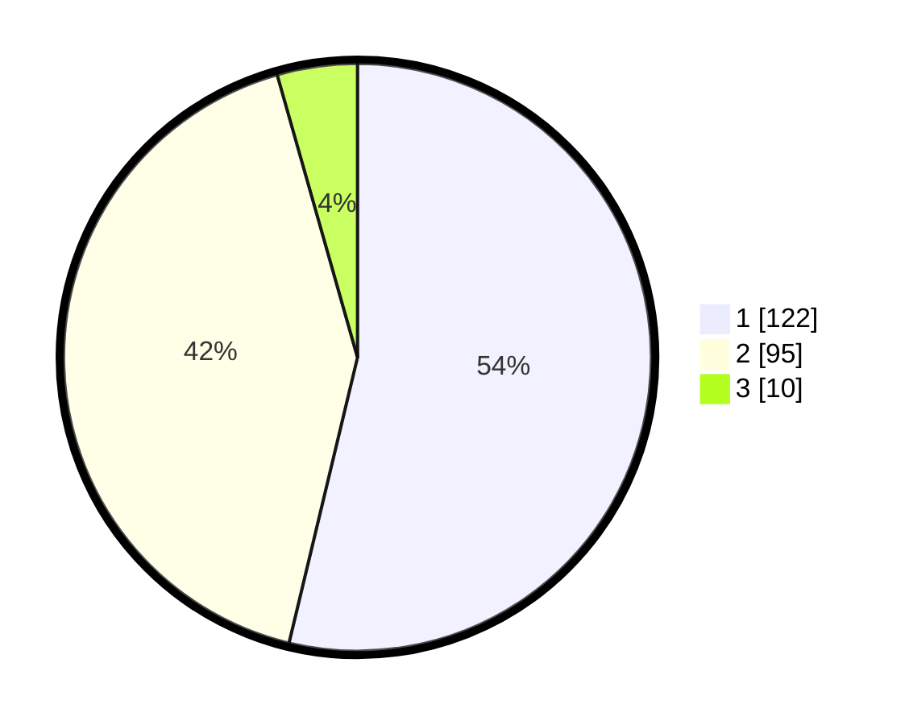

# Hasil

## Grafik

## Tabel

| No.    | Nama Paslon    | Suara | Suara (raw) | Persentase |
|:------ |:-------------- | -----:| -----------:| ----------:|
| 100025 | ANIES MUHAIMIN | 122   | [122][p-1]  | 53,74      |
| 100026 | PRABOWO GIBRAN | 95    | [95][p-2]   | 41,85      |
| 100027 | GANJAR MAHFUD  | 10    | [10][p-3]   | 4,41       |

[p-1]: https://github.com/gigit-pemilu/pemilu-2024/blob/main/pilpres/hitung-suara/sub/31-dki-jakarta/sub/72-jakarta-utara/sub/04-cilincing/sub/1006-rorotan/sub/080-tps/sub/paslon-1.txt
[p-2]: https://github.com/gigit-pemilu/pemilu-2024/blob/main/pilpres/hitung-suara/sub/31-dki-jakarta/sub/72-jakarta-utara/sub/04-cilincing/sub/1006-rorotan/sub/080-tps/sub/paslon-2.txt
[p-3]: https://github.com/gigit-pemilu/pemilu-2024/blob/main/pilpres/hitung-suara/sub/31-dki-jakarta/sub/72-jakarta-utara/sub/04-cilincing/sub/1006-rorotan/sub/080-tps/sub/paslon-3.txt

## Foto C Plano

https://sirekap-obj-formc.kpu.go.id/d51d/pemilu/ppwp/31/72/04/10/06/3172041006080-20240215-023803--32db0cfa-a5f8-475f-8237-12e9e2c43fab.jpg

https://sirekap-obj-formc.kpu.go.id/d51d/pemilu/ppwp/31/72/04/10/06/3172041006080-20240214-234641--4842d1fa-ca26-4727-b235-e36d2f4647ed.jpg

https://sirekap-obj-formc.kpu.go.id/d51d/pemilu/ppwp/31/72/04/10/06/3172041006080-20240214-234738--ec7d1b87-8a4e-4375-a370-fe73768bef47.jpg

## Metadata

| Key        | Value               |
| ---------- | ------------------- |
| Time Stamp | 2024-02-21 19:00:00 |

