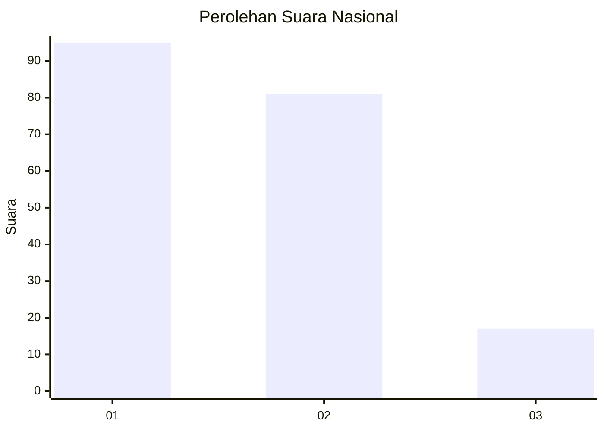
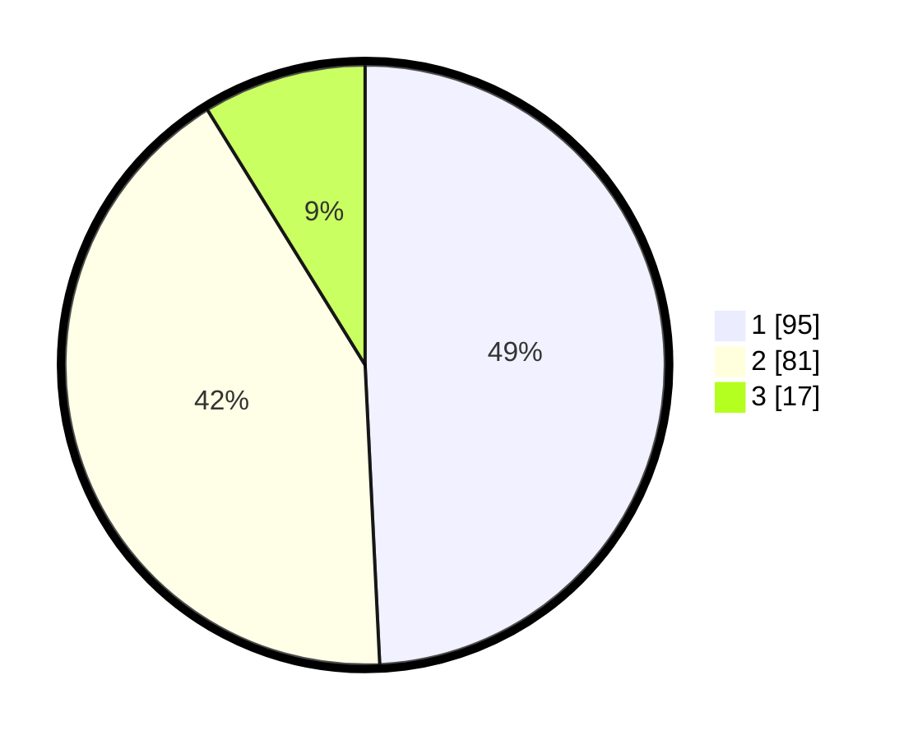

# Hasil

## Grafik

## Tabel

| No.    | Nama Paslon    | Suara | Suara (raw) | Persentase |
|:------ |:-------------- | -----:| -----------:| ----------:|
| 100025 | ANIES MUHAIMIN | 95    | [95][p-1]   | 49,22      |
| 100026 | PRABOWO GIBRAN | 81    | [81][p-2]   | 41,97      |
| 100027 | GANJAR MAHFUD  | 17    | [17][p-3]   | 8,81       |

[p-1]: https://github.com/gigit-pemilu/pemilu-2024/blob/main/pilpres/hitung-suara/sub/31-dki-jakarta/sub/72-jakarta-utara/sub/04-cilincing/sub/1006-rorotan/sub/081-tps/sub/paslon-1.txt
[p-2]: https://github.com/gigit-pemilu/pemilu-2024/blob/main/pilpres/hitung-suara/sub/31-dki-jakarta/sub/72-jakarta-utara/sub/04-cilincing/sub/1006-rorotan/sub/081-tps/sub/paslon-2.txt
[p-3]: https://github.com/gigit-pemilu/pemilu-2024/blob/main/pilpres/hitung-suara/sub/31-dki-jakarta/sub/72-jakarta-utara/sub/04-cilincing/sub/1006-rorotan/sub/081-tps/sub/paslon-3.txt

## Foto C Plano

https://sirekap-obj-formc.kpu.go.id/3fec/pemilu/ppwp/31/72/04/10/06/3172041006081-20240214-231925--2b461361-072e-41e8-aabd-26c474c7e672.jpg

https://sirekap-obj-formc.kpu.go.id/3fec/pemilu/ppwp/31/72/04/10/06/3172041006081-20240214-231747--50c8afee-3c6e-4b24-ae8a-c1dfedf85780.jpg

https://sirekap-obj-formc.kpu.go.id/3fec/pemilu/ppwp/31/72/04/10/06/3172041006081-20240214-193210--c331a444-bdb3-45b6-9642-166748c41646.jpg

## Metadata

| Key        | Value               |
| ---------- | ------------------- |
| Time Stamp | 2024-02-21 13:00:00 |

