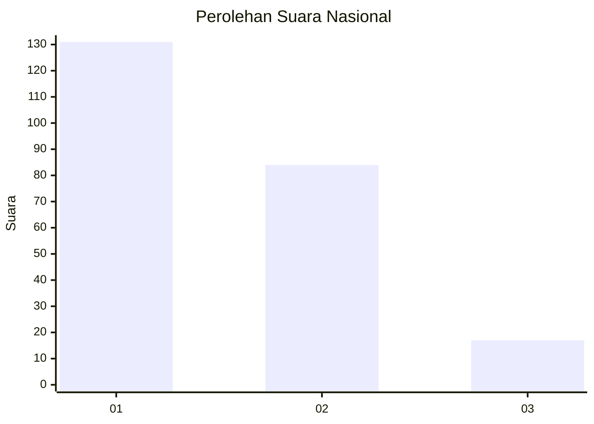
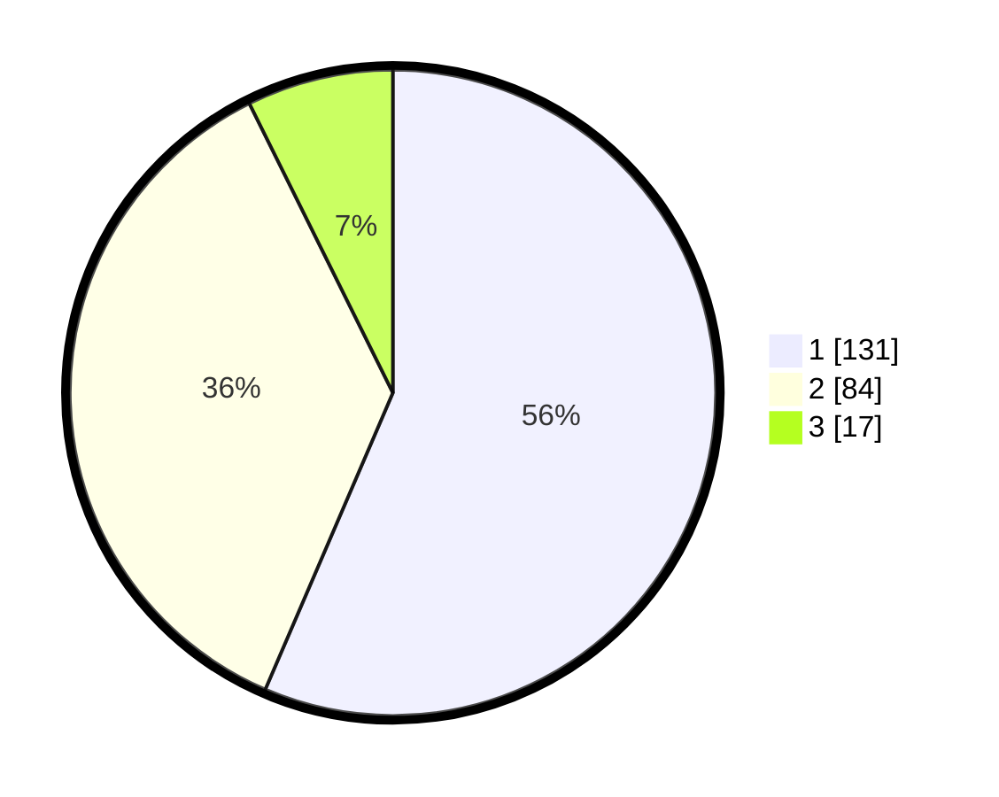

# Hasil

## Grafik

## Tabel

| No.    | Nama Paslon    | Suara | Suara (raw) | Persentase |
|:------ |:-------------- | -----:| -----------:| ----------:|
| 100025 | ANIES MUHAIMIN | 131   | [131][p-1]  | 56,47      |
| 100026 | PRABOWO GIBRAN | 84    | [84][p-2]   | 36,21      |
| 100027 | GANJAR MAHFUD  | 17    | [17][p-3]   | 7,33       |

[p-1]: https://github.com/gigit-pemilu/pemilu-2024/blob/main/pilpres/hitung-suara/sub/31-dki-jakarta/sub/72-jakarta-utara/sub/04-cilincing/sub/1006-rorotan/sub/086-tps/sub/paslon-1.txt
[p-2]: https://github.com/gigit-pemilu/pemilu-2024/blob/main/pilpres/hitung-suara/sub/31-dki-jakarta/sub/72-jakarta-utara/sub/04-cilincing/sub/1006-rorotan/sub/086-tps/sub/paslon-2.txt
[p-3]: https://github.com/gigit-pemilu/pemilu-2024/blob/main/pilpres/hitung-suara/sub/31-dki-jakarta/sub/72-jakarta-utara/sub/04-cilincing/sub/1006-rorotan/sub/086-tps/sub/paslon-3.txt

## Foto C Plano

https://sirekap-obj-formc.kpu.go.id/8c61/pemilu/ppwp/31/72/04/10/06/3172041006086-20240215-011518--6fd4256b-74f1-48b6-973c-e24d7e488fb7.jpg

https://sirekap-obj-formc.kpu.go.id/8c61/pemilu/ppwp/31/72/04/10/06/3172041006086-20240215-011826--cca496af-c83c-4059-85db-2e0f9a9cee38.jpg

https://sirekap-obj-formc.kpu.go.id/8c61/pemilu/ppwp/31/72/04/10/06/3172041006086-20240215-011944--2453cb7b-0d7a-4460-88a0-bb1167f74d55.jpg

## Metadata

| Key        | Value               |
| ---------- | ------------------- |
| Time Stamp | 2024-02-21 20:00:00 |

