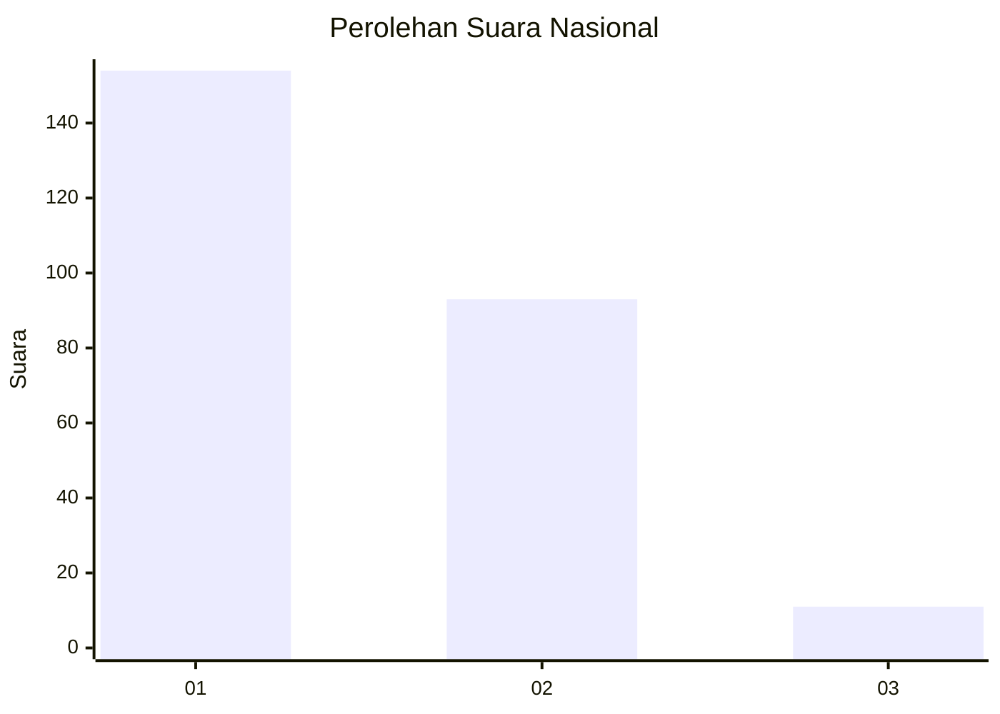
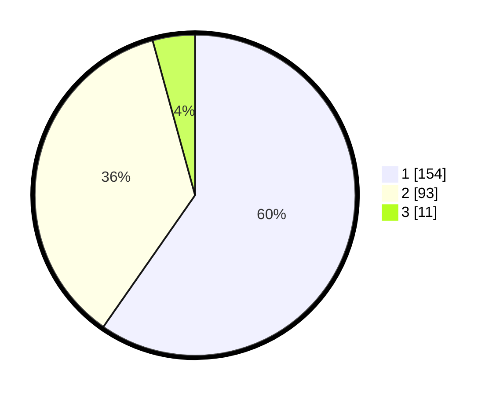

# Hasil

## Grafik

## Tabel

| No. | Nama Paslon    | Suara | Suara (raw) | Persentase |
|:--- |:-------------- | -----:| -----------:| ----------:|
| 1   | ANIES MUHAIMIN | 154   | [154][p-1]  | 59,69      |
| 2   | PRABOWO GIBRAN | 93    | [93][p-2]   | 36,05      |
| 3   | GANJAR MAHFUD  | 11    | [11][p-3]   | 4,26       |

[p-1]: https://github.com/gigit-pemilu/pemilu-2024/blob/main/pilpres/hitung-suara/sub/31-dki-jakarta/sub/72-jakarta-utara/sub/04-cilincing/sub/1006-rorotan/sub/088-tps/sub/paslon-1.txt
[p-2]: https://github.com/gigit-pemilu/pemilu-2024/blob/main/pilpres/hitung-suara/sub/31-dki-jakarta/sub/72-jakarta-utara/sub/04-cilincing/sub/1006-rorotan/sub/088-tps/sub/paslon-2.txt
[p-3]: https://github.com/gigit-pemilu/pemilu-2024/blob/main/pilpres/hitung-suara/sub/31-dki-jakarta/sub/72-jakarta-utara/sub/04-cilincing/sub/1006-rorotan/sub/088-tps/sub/paslon-3.txt

## Foto C Plano

https://sirekap-obj-formc.kpu.go.id/f973/pemilu/ppwp/31/72/04/10/06/3172041006088-20240215-010502--f927ca4b-8fbb-48f1-a835-49d32393b4c0.jpg

https://sirekap-obj-formc.kpu.go.id/f973/pemilu/ppwp/31/72/04/10/06/3172041006088-20240215-010547--40e0265c-6de4-473c-bd08-552b02e6cf31.jpg

https://sirekap-obj-formc.kpu.go.id/f973/pemilu/ppwp/31/72/04/10/06/3172041006088-20240215-010626--d7a2ed47-1c7e-48ce-bbc8-a6c1f69976f6.jpg

## Metadata

| Key        | Value               |
| ---------- | ------------------- |
| Time Stamp | 2024-02-20 22:00:00 |

