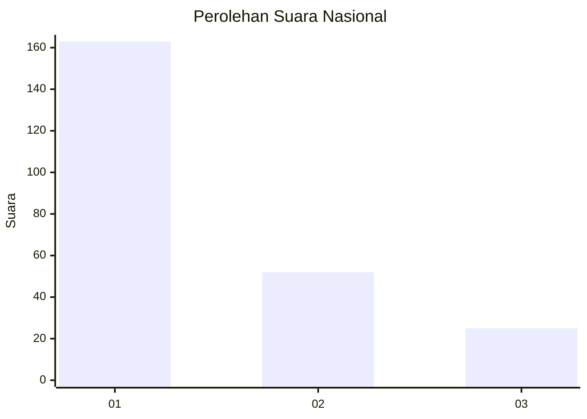
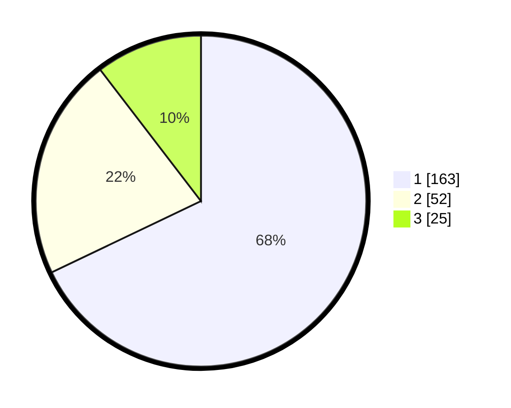

# Hasil

## Grafik

## Tabel

| No.    | Nama Paslon    | Suara | Suara (raw) | Persentase |
|:------ |:-------------- | -----:| -----------:| ----------:|
| 100025 | ANIES MUHAIMIN | 163   | [163][p-1]  | 67,92      |
| 100026 | PRABOWO GIBRAN | 52    | [52][p-2]   | 21,67      |
| 100027 | GANJAR MAHFUD  | 25    | [25][p-3]   | 10,42      |

[p-1]: https://github.com/gigit-pemilu/pemilu-2024/blob/main/pilpres/hitung-suara/sub/31-dki-jakarta/sub/72-jakarta-utara/sub/04-cilincing/sub/1006-rorotan/sub/096-tps/sub/paslon-1.txt
[p-2]: https://github.com/gigit-pemilu/pemilu-2024/blob/main/pilpres/hitung-suara/sub/31-dki-jakarta/sub/72-jakarta-utara/sub/04-cilincing/sub/1006-rorotan/sub/096-tps/sub/paslon-2.txt
[p-3]: https://github.com/gigit-pemilu/pemilu-2024/blob/main/pilpres/hitung-suara/sub/31-dki-jakarta/sub/72-jakarta-utara/sub/04-cilincing/sub/1006-rorotan/sub/096-tps/sub/paslon-3.txt

## Foto C Plano

https://sirekap-obj-formc.kpu.go.id/c7fc/pemilu/ppwp/31/72/04/10/06/3172041006096-20240214-223023--26ffe18e-aac6-4ef3-b612-103f2fc5000e.jpg

https://sirekap-obj-formc.kpu.go.id/c7fc/pemilu/ppwp/31/72/04/10/06/3172041006096-20240215-163156--cb0447b6-19c5-4cd3-b9e4-09a37f10b7c3.jpg

https://sirekap-obj-formc.kpu.go.id/c7fc/pemilu/ppwp/31/72/04/10/06/3172041006096-20240214-223120--1a7e4484-6c97-475d-876c-83cc87fb9fb1.jpg

## Metadata

| Key        | Value               |
| ---------- | ------------------- |
| Time Stamp | 2024-02-20 23:00:00 |

