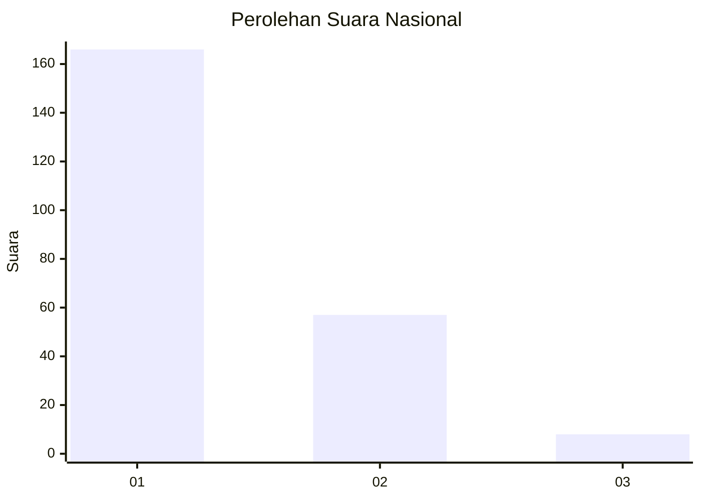
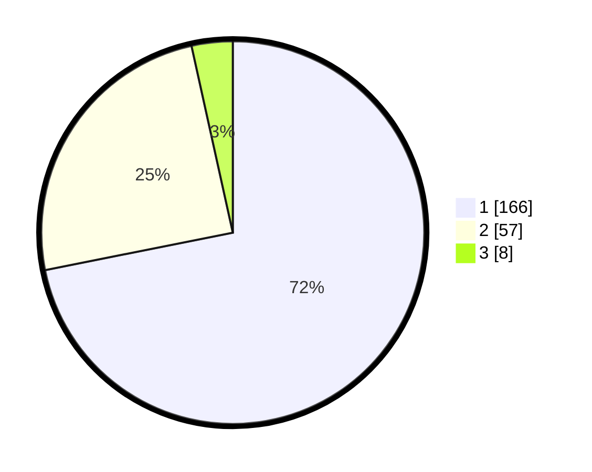

# Hasil

## Grafik

## Tabel

| No.    | Nama Paslon    | Suara | Suara (raw) | Persentase |
|:------ |:-------------- | -----:| -----------:| ----------:|
| 100025 | ANIES MUHAIMIN | 166   | [166][p-1]  | 71,86      |
| 100026 | PRABOWO GIBRAN | 57    | [57][p-2]   | 24,68      |
| 100027 | GANJAR MAHFUD  | 8     | [8][p-3]    | 3,46       |

[p-1]: https://github.com/gigit-pemilu/pemilu-2024/blob/main/pilpres/hitung-suara/sub/31-dki-jakarta/sub/72-jakarta-utara/sub/04-cilincing/sub/1006-rorotan/sub/101-tps/sub/paslon-1.txt
[p-2]: https://github.com/gigit-pemilu/pemilu-2024/blob/main/pilpres/hitung-suara/sub/31-dki-jakarta/sub/72-jakarta-utara/sub/04-cilincing/sub/1006-rorotan/sub/101-tps/sub/paslon-2.txt
[p-3]: https://github.com/gigit-pemilu/pemilu-2024/blob/main/pilpres/hitung-suara/sub/31-dki-jakarta/sub/72-jakarta-utara/sub/04-cilincing/sub/1006-rorotan/sub/101-tps/sub/paslon-3.txt

## Foto C Plano

https://sirekap-obj-formc.kpu.go.id/1c0d/pemilu/ppwp/31/72/04/10/06/3172041006101-20240214-233912--5855015e-711e-436e-a7f9-8a2e37cf2afd.jpg

https://sirekap-obj-formc.kpu.go.id/1c0d/pemilu/ppwp/31/72/04/10/06/3172041006101-20240214-234305--84040887-f9ce-489d-8196-84a2594b532a.jpg

https://sirekap-obj-formc.kpu.go.id/1c0d/pemilu/ppwp/31/72/04/10/06/3172041006101-20240214-234237--25d6deb5-a65c-4d10-aac0-7448932b6667.jpg

## Metadata

| Key        | Value               |
| ---------- | ------------------- |
| Time Stamp | 2024-02-21 20:00:00 |

