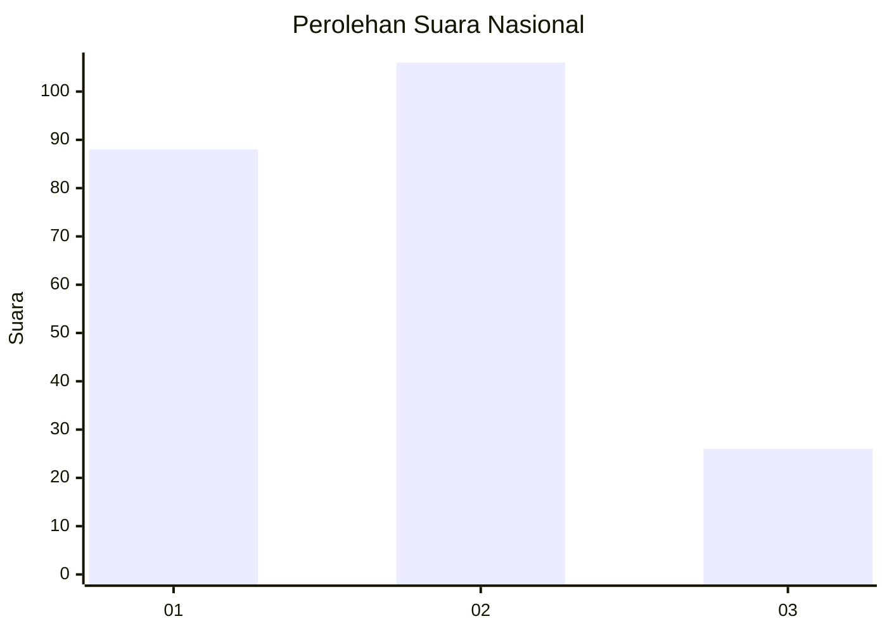
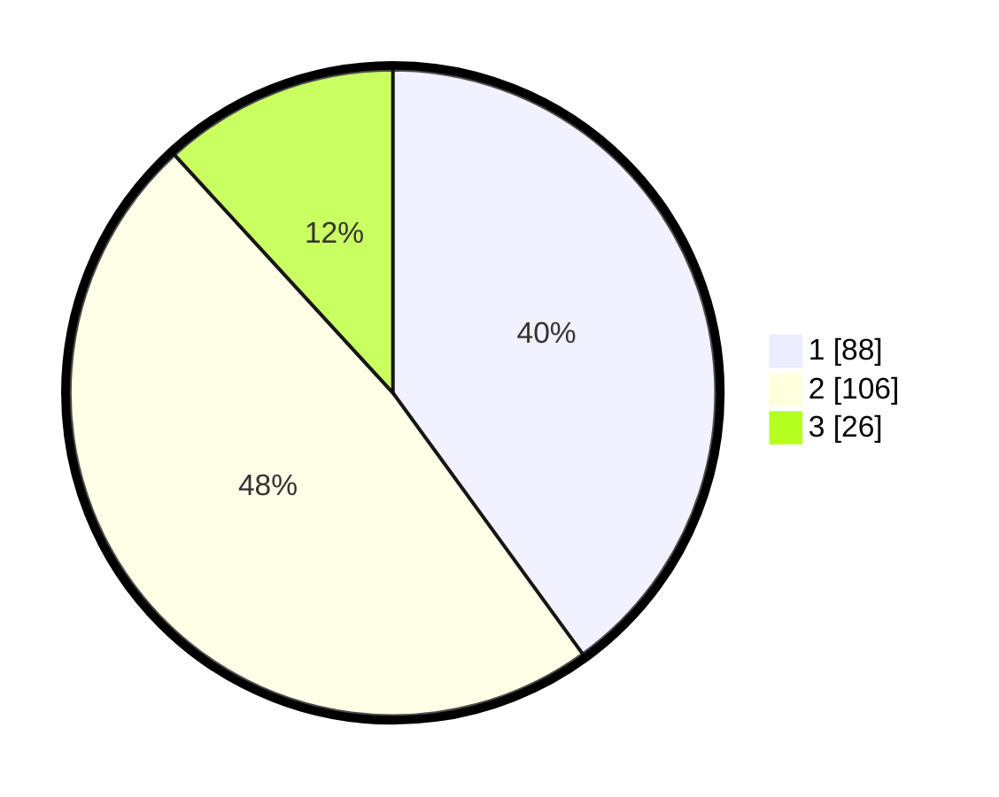

# Hasil

## Grafik

## Tabel

| No.    | Nama Paslon    | Suara | Suara (raw) | Persentase |
|:------ |:-------------- | -----:| -----------:| ----------:|
| 100025 | ANIES MUHAIMIN | 88    | [88][p-1]   | 40,00      |
| 100026 | PRABOWO GIBRAN | 106   | [106][p-2]  | 48,18      |
| 100027 | GANJAR MAHFUD  | 26    | [26][p-3]   | 11,82      |

[p-1]: https://github.com/gigit-pemilu/pemilu-2024/blob/main/pilpres/hitung-suara/sub/31-dki-jakarta/sub/72-jakarta-utara/sub/04-cilincing/sub/1006-rorotan/sub/112-tps/sub/paslon-1.txt
[p-2]: https://github.com/gigit-pemilu/pemilu-2024/blob/main/pilpres/hitung-suara/sub/31-dki-jakarta/sub/72-jakarta-utara/sub/04-cilincing/sub/1006-rorotan/sub/112-tps/sub/paslon-2.txt
[p-3]: https://github.com/gigit-pemilu/pemilu-2024/blob/main/pilpres/hitung-suara/sub/31-dki-jakarta/sub/72-jakarta-utara/sub/04-cilincing/sub/1006-rorotan/sub/112-tps/sub/paslon-3.txt

## Foto C Plano

https://sirekap-obj-formc.kpu.go.id/df26/pemilu/ppwp/31/72/04/10/06/3172041006112-20240214-210432--b628489f-74f3-414f-8ec6-b14b5c95e3cd.jpg

https://sirekap-obj-formc.kpu.go.id/df26/pemilu/ppwp/31/72/04/10/06/3172041006112-20240214-224924--7fb076d0-8703-4797-a739-aacff1ceddb2.jpg

https://sirekap-obj-formc.kpu.go.id/df26/pemilu/ppwp/31/72/04/10/06/3172041006112-20240214-224500--6245170f-4577-405f-8f8e-cefa30ff246a.jpg

## Metadata

| Key        | Value               |
| ---------- | ------------------- |
| Time Stamp | 2024-02-15 18:30:25 |

